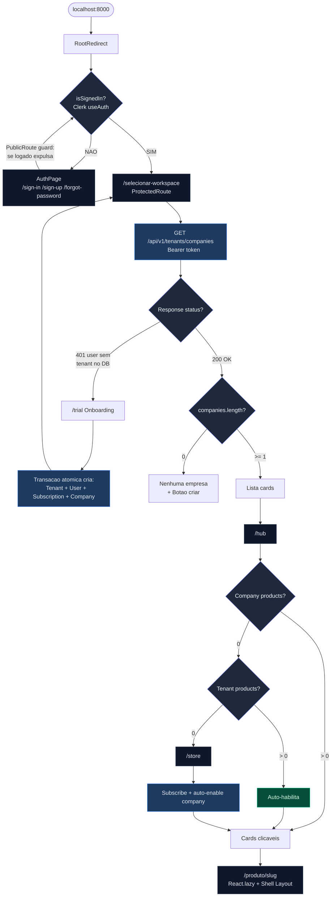
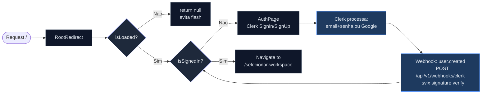
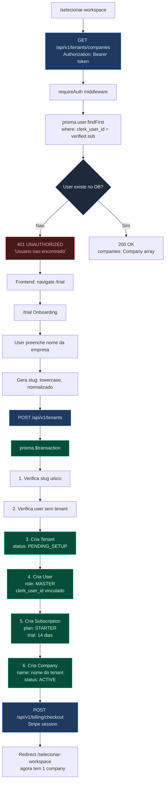
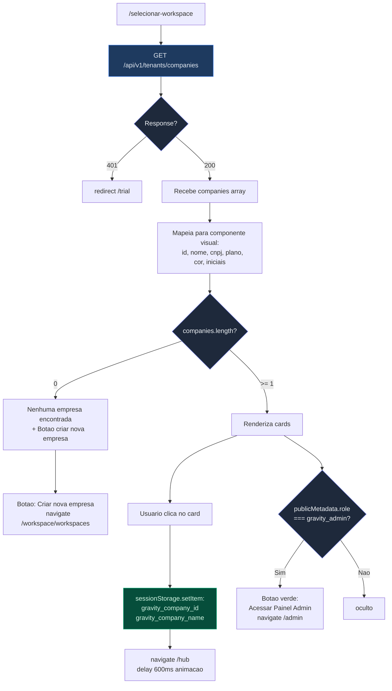
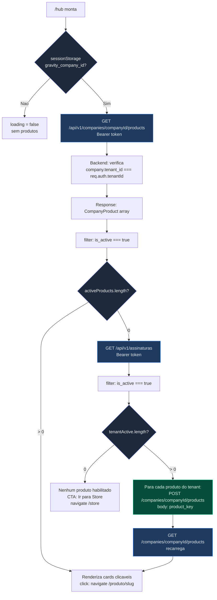
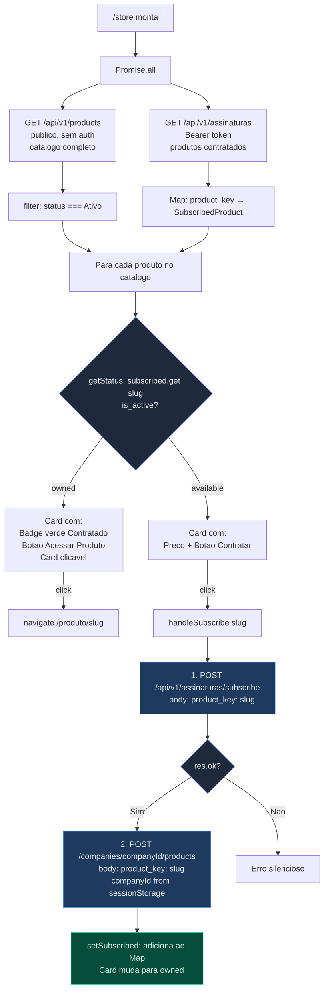
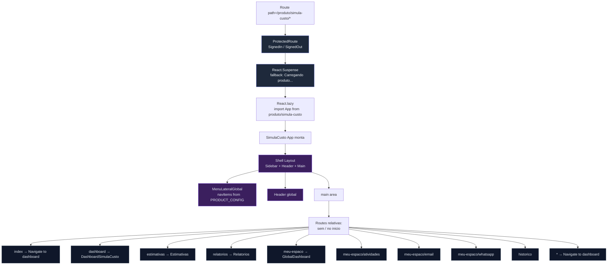
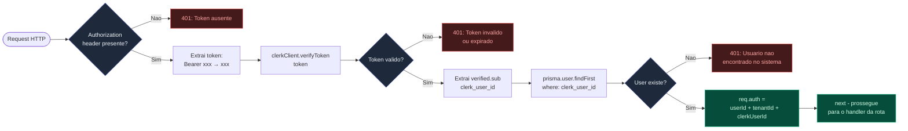
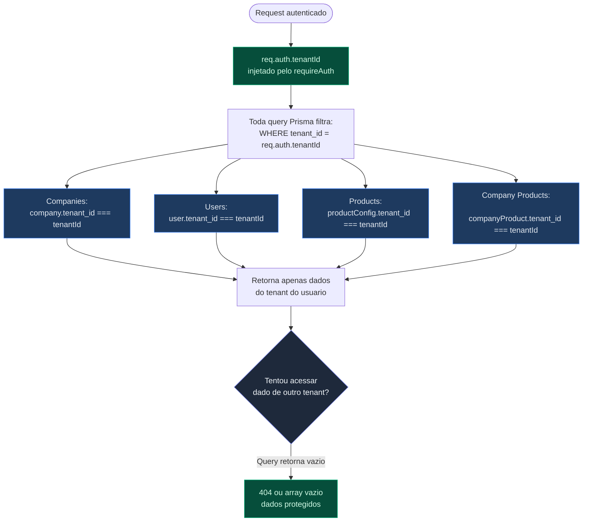
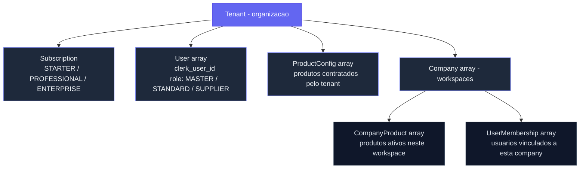

# Fluxo Tecnico Completo — Gravity Platform

Documentacao tecnica de todas as rotas, APIs, guards e branching logic da plataforma.

---

## Arquitetura de Navegacao (Visao Geral)

---

## 1. Fluxo de Autenticacao

**Guards de rota:**

| Guard | Comportamento | Usado em |
|-------|--------------|----------|
| `PublicRoute` | Se logado → redirect /selecionar-workspace | /sign-in, /sign-up, /forgot-password |
| `ProtectedRoute` | Se nao logado → RedirectToSignIn | /hub, /store, /workspace/*, /admin/* |
| `RootRedirect` | Logado → /selecionar-workspace, Nao → AuthPage | / |

---

## 2. Fluxo de Onboarding (User Novo)

**Validacoes na transacao:**

| Check | Erro se falhar |
|-------|---------------|
| Slug ja existe | 409 CONFLICT |
| clerk_user_id ja tem tenant | 409 CONFLICT |

---

## 3. Fluxo de Selecao de Workspace

---

## 4. Fluxo do Hub (Carregamento de Produtos)

---

## 5. Fluxo da Store (Contratacao)

---

## 6. Fluxo de Carregamento do Produto

**Importante — rotas relativas:**
- Todas as rotas do produto usam paths sem `/` no inicio
- React Router v6 resolve relativo ao parent match `/produto/simula-custo/*`
- `dashboard` resolve para `/produto/simula-custo/dashboard`
- Funciona igual em standalone (porta 8001) e embedded (porta 8000)

---

## 7. Fluxo de Seguranca (requireAuth)

---

## 8. Fluxo de Tenant Isolation

---

## Mapa de Rotas

### Rotas Publicas
| Rota | Componente | Guard |
|------|-----------|-------|
| `/` | RootRedirect | Nenhum — redireciona baseado em auth |
| `/sign-in/*` | AuthPage | PublicRoute (se logado → expulsa) |
| `/sign-up/*` | AuthPage | PublicRoute |
| `/forgot-password/*` | AuthPage | PublicRoute |
| `/trial` | Onboarding | Nenhum (Clerk embutido) |

### Rotas Protegidas (requer login)
| Rota | Componente | Dados |
|------|-----------|-------|
| `/selecionar-workspace` | SelecionarWorkspace | GET /tenants/companies |
| `/hub` | Hub | GET /companies/{id}/products |
| `/store` | Store | GET /products + GET /api/v1/assinaturas |
| `/produto/simula-custo/*` | SimulaCustoApp (lazy) | PRODUCT_CONFIG, rotas relativas |
| `/produto/processo/*` | ProcessoApp (lazy) | PRODUCT_CONFIG, rotas relativas |

### Rotas Workspace (requer login)
| Rota | Componente |
|------|-----------|
| `/workspace/organizacao` | Organizacao |
| `/workspace/workspaces` | Workspaces |
| `/workspace/usuarios` | Usuarios |
| `/workspace/assinaturas` | Assinaturas |
| `/workspace/financeiro` | Financeiro |
| `/workspace/api-cockpit` | ApiCockpit |
| `/workspace/conector-cargowise` | ConectorCargoWise |

### Rotas Admin (requer gravity_admin)
| Rota | Componente |
|------|-----------|
| `/admin/visao-geral` | VisaoGeralAdmin |
| `/admin/usuarios` | UsuariosGlobaisAdmin |
| `/admin/produtos` | ProdutosAdmin |
| `/admin/financeiro` | AdminFinanceiro |
| `/admin/historico` | HistoricoGlobalAdmin |
| `/admin/deploy` | DeployRailwayAdmin |
| `/admin/testes` | LogTestes |
| `/admin/apis` | MonitorApisAdmin |
| `/admin/tenants` | AdminPanel |
| `/admin/tenant/:id` | TenantDetail |

---

## APIs Backend

### Autenticacao
| Metodo | Endpoint | Auth | Descricao |
|--------|----------|------|-----------|
| POST | `/api/v1/webhooks/clerk` | svix signature | Sincroniza user.created/updated/deleted |

### Tenants
| Metodo | Endpoint | Auth | Descricao |
|--------|----------|------|-----------|
| POST | `/api/v1/tenants` | Nenhum | Cria tenant + user + subscription + company |
| GET | `/api/v1/tenants/me` | requireAuth | Dados do tenant atual |
| GET | `/api/v1/tenants/companies` | requireAuth | Lista companies do tenant |
| POST | `/api/v1/tenants/companies` | requireAuth | Cria company (limite por plano) |

### Produtos — Nivel Tenant
| Metodo | Endpoint | Auth | Descricao |
|--------|----------|------|-----------|
| GET | `/api/v1/assinaturas` | requireAuth | Lista produtos contratados |
| POST | `/api/v1/assinaturas/subscribe` | requireAuth | Contrata produto do catalogo |
| DELETE | `/api/v1/assinaturas/:key` | requireAuth | Cancela produto (soft delete) |

### Produtos — Nivel Company
| Metodo | Endpoint | Auth | Descricao |
|--------|----------|------|-----------|
| GET | `/api/v1/companies/:id/products` | requireAuth | Lista produtos do workspace |
| POST | `/api/v1/companies/:id/products` | requireAuth | Ativa produto no workspace |
| DELETE | `/api/v1/companies/:id/products/:key` | requireAuth | Desativa produto no workspace |

### Catalogo (publico)
| Metodo | Endpoint | Auth | Descricao |
|--------|----------|------|-----------|
| GET | `/api/v1/products` | Nenhum | Lista catalogo de produtos ativos |

### Acesso Interno
| Metodo | Endpoint | Auth | Descricao |
|--------|----------|------|-----------|
| GET | `/api/internal/check-access` | x-internal-key | Valida acesso do produto |

---

## Persistencia de Estado

| Local | Chave | Dado | Lifecycle |
|-------|-------|------|-----------|
| Clerk (browser) | JWT | Token de autenticacao | Por sessao, auto-refresh |
| Clerk | publicMetadata | role, tenantId | Permanente |
| sessionStorage | `gravity_company_id` | ID da company selecionada | Ate fechar aba |
| sessionStorage | `gravity_company_name` | Nome da company | Ate fechar aba |
| localStorage | `gravity-shell-state` | tema, sidebar, tooltips | Permanente |
| PostgreSQL | Tenant, User, Company | Dados de negocio | Permanente |
| PostgreSQL | ProductConfig | Produtos contratados (tenant) | Permanente |
| PostgreSQL | CompanyProduct | Produtos habilitados (workspace) | Permanente |

---

## Hierarquia de Dados

## Limites por Plano

| Plano | Max Companies | Trial |
|-------|:---:|:---:|
| STARTER | 2 | 14 dias |
| PROFESSIONAL | 20 | — |
| ENTERPRISE | 50 | — |
