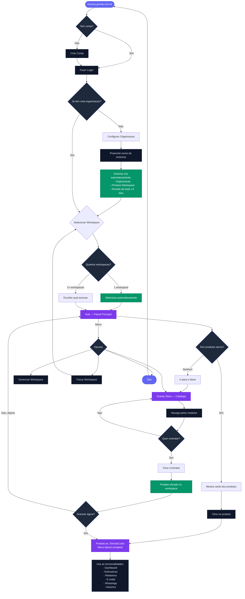
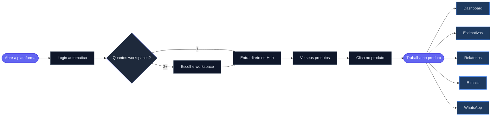
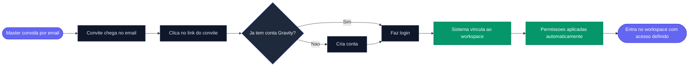
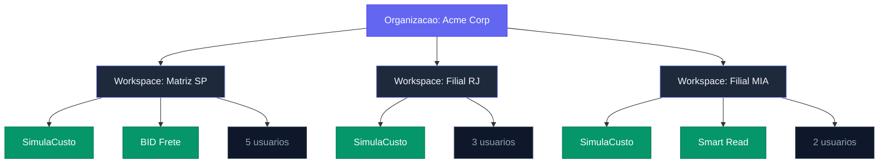
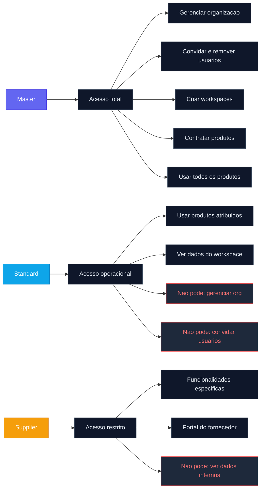
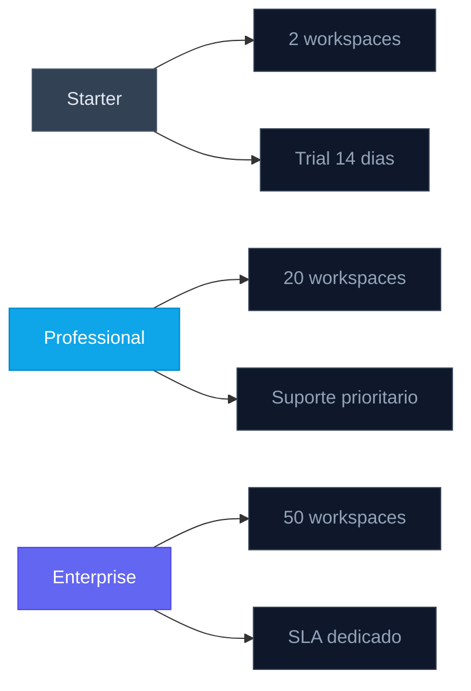

# Fluxo do Usuario — Gravity Platform

Jornada completa do usuario desde o primeiro acesso ate o uso do produto.

---

## Fluxograma Geral

---

## 1. Primeiro Acesso — Usuario Novo

```mermaid
flowchart LR
    A(["Acessa a plataforma"]) --> B["Tela de Login"]
    B --> C{"Tem conta?"}
    C -->|Nao| D["Clica em Criar Conta"]
    C -->|Sim| E["Digita email e senha"]
    D --> F["Preenche dados e cria conta"]
    F --> E
    E --> G["Login realizado"]
    G --> H{"Tem organizacao?"}
    H -->|Nao| I["Tela de Onboarding"]
    I --> J["Digita nome da empresa"]
    J --> K["Sistema cria tudo automaticamente"]
    K --> L(["Entra no Hub"])
    H -->|Sim| L

    classDef start fill:#6366f1,stroke:#4f46e5,color:#fff
    classDef auto fill:#059669,stroke:#047857,color:#fff
    classDef step fill:#0f172a,stroke:#334155,color:#e2e8f0
    classDef decision fill:#1e293b,stroke:#818cf8,color:#f1f5f9

    class A,L start
    class K auto
    class B,D,F,E,G,I,J step
    class C,H decision
```

**O que o sistema cria automaticamente no onboarding:**
- Organizacao (tenant) com status ativo
- Primeiro workspace com o nome da empresa
- Periodo de teste gratuito de 14 dias
- Usuario como Master (acesso total)

| Passo | O que acontece | O que o usuario ve |
|-------|---------------|-------------------|
| 1 | Acessa a plataforma | Tela de login com opcao de criar conta |
| 2 | Cria conta ou faz login | Formulario email + senha ou Google |
| 3 | Sistema detecta que nao tem organizacao | Redireciona para tela de configuracao |
| 4 | Preenche nome da empresa | Campo simples com nome da organizacao |
| 5 | Sistema cria tudo automaticamente | Organizacao + workspace + trial de 14 dias |
| 6 | Entra no Hub | Painel principal vazio, sem produtos ainda |

---

## 2. Contratando o Primeiro Produto

```mermaid
flowchart LR
    A(["Hub sem produtos"]) --> B["Mensagem: Nenhum produto"]
    B --> C["Clica: Ir para a Store"]
    C --> D["Gravity Store"]
    D --> E["Navega pelo catalogo"]
    E --> F["Escolhe um produto"]
    F --> G["Clica Contratar"]
    G --> H["Botao muda: Contratando..."]
    H --> I["Produto ativado"]
    I --> J{"O que fazer?"}
    J -->|"Acessar Produto"| K(["Entra no produto com menu lateral"])
    J -->|"Voltar ao Hub"| L(["Hub com card do produto"])

    classDef start fill:#6366f1,stroke:#4f46e5,color:#fff
    classDef auto fill:#059669,stroke:#047857,color:#fff
    classDef step fill:#0f172a,stroke:#334155,color:#e2e8f0
    classDef decision fill:#1e293b,stroke:#818cf8,color:#f1f5f9

    class A,K,L start
    class I auto
    class B,C,D,E,F,G,H step
    class J decision
```

**O que acontece nos bastidores ao contratar:**
- Produto e vinculado a organizacao (tenant)
- Produto e ativado automaticamente no workspace atual
- Nenhuma acao extra necessaria do usuario

| Passo | O que acontece | O que o usuario ve |
|-------|---------------|-------------------|
| 1 | Hub mostra que nao tem produtos | Mensagem com botao "Ir para a Store" |
| 2 | Clica e vai para a Store | Catalogo com todos os modulos disponiveis |
| 3 | Escolhe um produto e clica "Contratar" | Botao muda para "Contratando..." |
| 4 | Produto e ativado automaticamente | Card muda para "Contratado" com botao "Acessar" |
| 5 | Clica "Acessar Produto" | Entra no produto com menu lateral completo |

---

## 3. Uso Diario — Usuario Recorrente

| Passo | O que acontece | O que o usuario ve |
|-------|---------------|-------------------|
| 1 | Faz login | Vai direto para selecionar workspace |
| 2 | Seleciona workspace | Ve o Hub com seus produtos |
| 3 | Clica no produto | Abre com sidebar: Dashboard, Estimativas, etc. |
| 4 | Usa as funcionalidades | Tudo dentro do mesmo layout integrado |

---

## 4. Usuario Convidado

**O que o Master controla:**
- Qual role o convidado recebe (Standard ou Supplier)
- Em quais workspaces o convidado tem acesso
- Quais produtos o convidado pode usar

| Passo | O que acontece |
|-------|---------------|
| 1 | Master envia convite pelo painel de Usuarios |
| 2 | Convidado recebe email com link |
| 3 | Clica no link e cria conta (ou faz login) |
| 4 | Sistema vincula automaticamente ao tenant |
| 5 | Entra no workspace com as permissoes atribuidas |

---

## 5. Gerenciando a Organizacao

```mermaid
flowchart TD
    HUB(["Hub — Menu do Workspace"]) --> A["Gerenciar Workspace"]
    HUB --> B["Workspaces"]
    HUB --> C["Usuarios"]
    HUB --> D["Gravity Store"]
    HUB --> E["Trocar Workspace"]
    HUB --> F["Sair"]

    A --> A1["Ver dados da organizacao"]
    A --> A2["Assinaturas e plano"]
    A --> A3["Financeiro e faturas"]
    A --> A4["API Cockpit"]
    A --> A5["Conector ERP"]

    B --> B1["Ver workspaces existentes"]
    B --> B2["Criar novo workspace"]

    C --> C1["Ver usuarios do workspace"]
    C --> C2["Convidar novo usuario"]
    C --> C3["Alterar permissoes"]

    D --> D1["Navegar catalogo"]
    D --> D2["Contratar novo produto"]

    E --> E1["Voltar para selecao de workspace"]
    F --> F1["Logout e voltar ao login"]

    classDef hub fill:#6366f1,stroke:#4f46e5,color:#fff
    classDef section fill:#1e293b,stroke:#818cf8,color:#f1f5f9
    classDef action fill:#0f172a,stroke:#334155,color:#e2e8f0

    class HUB hub
    class A,B,C,D,E,F section
    class A1,A2,A3,A4,A5,B1,B2,C1,C2,C3,D1,D2,E1,F1 action
```

| Acao | Onde encontrar | Quem pode |
|------|---------------|-----------|
| Convidar usuarios | Hub > Menu > Usuarios | Master |
| Criar novo workspace | Hub > Menu > Workspaces | Master |
| Ver assinaturas | Hub > Menu > Gerenciar Workspace > Assinaturas | Master |
| Contratar mais produtos | Hub > Menu > Gravity Store | Master, Admin |
| Trocar de workspace | Hub > Menu > Trocar Workspace | Todos |
| Alterar permissoes | Hub > Menu > Usuarios > Editar | Master |

---

## 6. Multiplos Workspaces

- Cada workspace tem seus proprios produtos e dados isolados
- Usuario pode trocar de workspace a qualquer momento pelo menu
- Cada workspace pode ter produtos diferentes habilitados
- Dados nunca se misturam entre workspaces

---

## 7. Roles e Permissoes

| Role | Gerenciar Org | Convidar | Criar Workspace | Contratar Produto | Usar Produto |
|------|:---:|:---:|:---:|:---:|:---:|
| **Master** | Sim | Sim | Sim | Sim | Todos |
| **Standard** | - | - | - | - | Atribuidos |
| **Supplier** | - | - | - | - | Portal especifico |

---

## Limites por Plano

| Plano | Workspaces | Trial | Ideal para |
|-------|:---:|:---:|------------|
| **Starter** | 2 | 14 dias | Pequenas empresas testando a plataforma |
| **Professional** | 20 | - | Empresas em crescimento com filiais |
| **Enterprise** | 50 | - | Grandes operacoes com multiplas unidades |
