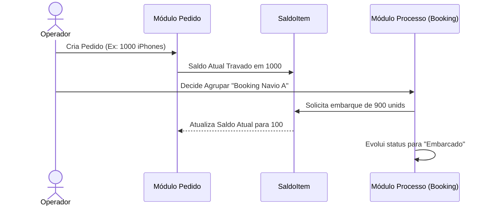
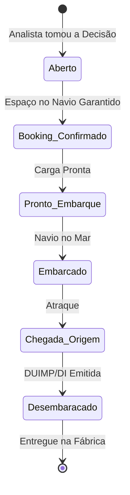

# Arquitetura 3-Tier: Módulos Standalone, Hierarquia de Pedidos e Processo Core

Este documento é a "Constituição" do Backend da Plataforma Gravity na sua essência logística. Ele dita como os módulos interagem sem dependência travada, como a Hierarquia 3-Tier garante o rastreamento em nível de linha (Item), e a Matemática Universal que fundamenta embarques parciais/consolidados.

## 1. O Ecossistema "Lego" (Desacoplamento de Módulos)
Os módulos/produtos da Gravity (SimulaCusto, Bid Frete, Bid Câmbio, Gestão de Pedidos) têm a capacidade arquitetural de funcionar **sozinhos**. 
- Um usuário pode cotar um Frete Avulso. Um usuário pode simular um Custo sem que exista um pedido formal.
- **Herança de Dados (Zero Digitação):** O `Processo` logístico possui "engates" magnéticos (`estimativa_base_id` e `cotacao_frete_id`). Se um processo real é gerado a partir de um desses módulos soltos, ele automaticamente preenche suas colunas (Porto, NCMs, Valor Estimado). O módulo "Doador" permanece intacto como documento histórico da simulação.

## 2. O Escudo Anti-Conflito de Parceiros (Inversão Semântica)
Como a plataforma suporta tanto *Importação* quanto *Exportação* sob as mesmas tabelas (Pedido e Processo), os papéis "Importador" e "Exportador" se invertem em relação ao Workspace. Para impedir a morte do UX, implementamos a técnica de **Prefixo Restritivo Operacional**:
- Em nenhuma tabela relacional existe a coluna solta `importador_id`.
- Existe a coluna `importacao_exportador_id`. Se The `tipo_operacao == importacao`, esse ID representa o Fornecedor (Fabricante Exterior). Sabemos que o importador somos nós (`company_id`).
- Existe a coluna `exportacao_importador_id`. Se The `tipo_operacao == exportacao`, esse ID representa o Cliente Final no exterior. Sabemos que o exportador somos nós.

## 3. A Hierarquia 3-Tier (O Fluxo Real do ERP)
Jamais misturemos as camadas de Negociação Comercial (`Pedido`) com a Execução Física do Embarque (`Processo`). O fluxo operacional linear funciona como as engrenagens de um relógio:

### 2.1 Camada 1: O Pedido (`Pedido`)
Nível Comercial. A Purchase Order (Importação) ou Sales Order (Exportação).
- Representa a intenção de negociação (Incoterm acordado, Moeda transacionada).
- A tabela `Pedido` agrupa dezenas de Linhas Físicas (`PedidoItem`).
- **Natureza Híbrida:** Uma simples flag `tipo_operacao String (importacao | exportacao)` muda toda a visão do sistema.

### 2.2 Camada 2: O Rastreador de Saldo (`PedidoItem`)
Esta é a tabela mais crítica do sistema. O Embarque Parcial e Cargas Fatiadas (Consolidações e Backorders) não amarram no Pedido, mas na Linha do Item.
- **A Matemática de Saldo (Balance Tracking):**
  - `quantidade_inicial`: O que o chinês prometeu (Ex: 1000 pares). Imutável.
  - `quantidade_atual`: Saldo Vivo. 
  - `quantidade_pronta`: O que a fábrica produziu e que subirá no próximo Container.
  - `quantidade_transferida`: Desmembrado (fatiado em Backorder num navio futuro).
  - `quantidade_cancelada`: Itens suprimidos por quebra de fabricação.
*Regra de Ouro:* A somatória da base e suas perdas sempre deve refletir o saldo ativo.

### 2.3 Camada 3: A Execução "Logística" (`Processo`)
Representa um **Evento Decisório e de Planejamento Logístico**.
Um `Processo` não é estritamente "um navio". Ele nasce no milissegundo em que o analista toma a decisão: *"Vou agrupar estes pedidos e iniciar a operação"*, ou quando inicia um processo avulso do zero. Ele começa como uma intenção (booking/prontidão) e evolui ganhando dados do navio somente depois.

**Fluxo de Status de um Processo Padrão:**

- **A Linha do Tempo (Master Comex Tracking):** Um `Processo` não guarda datas genéricas. Ele abriga uma Linha do Tempo cronológica estrita de mais de 30 eventos (Ex: `data_previsao_embarque_origem_etd`, `data_registro_duimp`, `data_deferimento_lpco`). O desenvolvedor jamais deve criar variáveis de data soltas; deve usar a esteira referencial.
- **Granularidade Documental & Parceiros:** O Processo possui "Engates" explícitos para dezenas de Parceiros Logísticos (Armador, Agente, Securadora, Corretora de Câmbio). A documentação primária não é mesclada: cada documento do globo possui sua coluna independente (`numero_bl`, `numero_awb`, `numero_crt`, `numero_duimp`).
- **Single Source of Truth (DRY):** A tabela mestre e o nome oficial de todas essas dezenas de variáveis de Tracking e Documentos existem em **um único lugar no código fonte** para evitar colisão. A fronteira de dados definitiva reside fisicamente em: `servicos-global/tenant/processos-core/prisma/fragment.prisma`.
- Pode carregar carga mista de Pedidos Diferentes.

## 4. O Fiel da Balança (Casamento Processo x Pedido)
Quando o analista concretiza a decisão de Booking (ou seja, quando o `Pedido` vira um `Processo`), a tabela `ProcessoItem` grava a porção fatiada daquele bem. Ela possui o elo sagrado `pedido_item_id String?`.
Desta forma, os robôs e as consultas conseguem buscar aquele Item Embarcado e abater `10 unidades` da `quantidade_atual` do respectivo Pedido lá na primeira camada, garantindo Rastreabilidade Irrefutável.

## 5. O Escudo (Zero-Trust Tier 1)
Nenhuma dessas transações, de Simulação a Faturamento, consegue rodar no Prima sem ser blindada por Isolamento de Acesso Transacional:
1. Todos os IDs usam radical amigável referencial restrito a 4 caracteres (`pedi_id_.../26`, `proc_id_.../26`).
2. O "Locking" Universal: Toda query e insert precisa assinar com `company_id`. Um workspace nunca pode invadir a hierarquia logística do outro.

---
_Gravity - Architected for Extreme Traceability_
