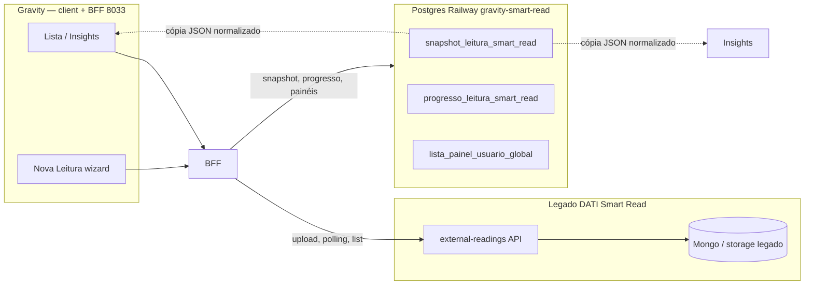

# Persistência de dados — Smart Read (arquitetura híbrida)

> **SSOT desta doc:** onde vive cada dado do Smart Read no Gravity vs no legado DATI.  
> **Código:** `servicos-global/produto/smart-read/` · BFF porta **8033** · Postgres Gravity **Railway** (`gravity-smart-read-*`)

---

## 1. Resumo em uma frase

O **banco de verdade das leituras** — PDFs, fila de processamento, status (`PROCESSING` / `COMPLETED`), `processingResult` / `finalProcessingResult` e todo o histórico operacional — **fica no legado DATI Smart Read** (microserviço `import-control-center` / `external-readings`, tipicamente Mongo + storage do DATI). O **Postgres Gravity** (`SMART_READ_DATABASE_URL`, Railway `gravity-smart-read`) **não é** esse banco: é um **espelho operacional** da UI Gravity — snapshots congelados, progresso do wizard e preferências de lista — para Lista e Insights responderem rápido sem ir ao DATI a cada clique. **Se o DATI apagar uma leitura, o Gravity não recupera o PDF nem a extração bruta**; só o que foi copiado para `snapshot_leitura_smart_read` ou `progresso_leitura_smart_read` permanece no Railway.

---

## 2. Dois backends, duas responsabilidades

| O quê | Onde fica | Quem escreve | Quem lê (Gravity) |
|-------|-----------|--------------|-------------------|
| Arquivo PDF / binário | **Legado DATI** | Upload via BFF → legado | Legado (Gravity não armazena PDF) |
| Fila e status de processamento (`PROCESSING`, `COMPLETED`, …) | **Legado DATI** | Motor OCR/extração do legado | BFF `GET /leituras/:id` (polling) |
| `processingResult` / `finalProcessingResult` (JSON bruto) | **Legado DATI** | Legado após IA + conferência no legado | BFF normaliza → `LeituraSchema` |
| Nome comercial escolhido no wizard | **Gravity** (`progresso_leitura_smart_read`) | `PATCH /progresso` | Lista (prioridade sobre nome genérico do legado) |
| Passo 2–4 + sessão da conferência | **Gravity** (`progresso_leitura_smart_read`) | `PATCH /progresso` | Retomar wizard (`GET /progresso`) |
| **Status de fluxo** (wizard) | **Gravity** (`status_fluxo_*` em progresso + snapshot) | *Pendente* — `PATCH /progresso` + snapshot (§14.3) | Colunas existem; pill **Status** na Lista ainda usa `status_leitura` legado |
| **Snapshot** da leitura (extração + métricas) | **Gravity** (`snapshot_leitura_smart_read`) | BFF ao concluir/conferir | Lista, Insights, `GET /leituras/:id` |
| Painéis/colunas/filtros da lista | **Gravity** (`lista_painel_usuario_global`) | API `/lista/paineis` | Lista |

**Não confundir:** `SMART_READ_DATABASE_URL` (Railway Postgres Gravity) **≠** banco do DATI. São instâncias separadas, em servidores diferentes. O vínculo org Gravity → company legado é resolvido via Configurador (`resolverCompanyLegado`). O Gravity **nunca** grava PDF nem substitui o motor OCR do DATI — apenas **lê** o legado via REST e **copia** JSON normalizado para o snapshot quando elegível.

---

## 3. O que é o snapshot (`snapshot_leitura_smart_read`)

Snapshot **não** é print de tela nem cópia do PDF. É um **registro imutável lógico** (re-snapshot na conferência **atualiza** a mesma linha) com:

1. **`dados_extracao_snapshot_leitura_smart_read` (JSONB)** — payload validado pelo contrato bilateral `LeituraSchema` (arquivos + `resultado_extracao` já normalizado pelo BFF, incluindo `dados_original` quando o legado enviou).
2. **Colunas denormalizadas** — totais de campos, acertos/erros, `media_acertos`, datas, `status_leitura` (IA legado), **`status_fluxo_snapshot_leitura_smart_read`**, **`passo_atual_snapshot_leitura_smart_read`** (migration `20260625120000`; backfill — ver [LISTA-E-PROGRESSO-TECNICO.md](./LISTA-E-PROGRESSO-TECNICO.md) §14.1), origem — para Lista e Insights consultarem sem reparsear o JSON nem chamar o legado de novo.

| Atributo | Valor |
|----------|-------|
| Model Prisma | `SnapshotLeituraSmartRead` |
| Tabela PG | `snapshot_leitura_smart_read` |
| Fragment | `prisma/fragment.prisma` |
| Migration | `20260623180000_create_snapshot_leitura_smart_read` (+ `20260625120000_add_status_fluxo_leitura_smart_read` — colunas de fluxo) |
| Unique | `(id_organizacao, id_leitura_legado_snapshot_leitura_smart_read)` |
| Referência legado | `id_leitura_legado_snapshot_leitura_smart_read` = `_id` da leitura no DATI |

**Versão do contrato:** `versao_contrato_snapshot_leitura_smart_read` (inteiro; hoje `1`).

**Motivo do congelamento (`motivo_congelamento_snapshot_leitura_smart_read`):**

| Valor | Quando |
|-------|--------|
| `extracao_concluida` | Leitura `COMPLETED`/`FAILED` com extração — após `GET /leituras/:id` ou enriquecimento da lista |
| `conferencia_usuario` | Usuário salvou passo/conferência — `PATCH /progresso` |

Implementação BFF: `server/src/lib/snapshot-leitura-smart-read.ts`.

---

## 4. Fluxo operacional (o que o desenvolvedor precisa saber)

### 4.1 Nova leitura (upload)

1. Client → `POST /api/v1/smart-read/leituras` (multipart).
2. BFF → **cria leitura no legado** + envia arquivo + **vínculo workspace** (`registrar-vinculo-leitura-usuario-smart-read.ts`, `id_workspace` = `resolverIdWorkspaceLeituraSmartRead`).
3. Resposta `202` com `id_leitura` legado. **Nenhuma linha em `snapshot_leitura_smart_read` ainda.**

### 4.2 Wizard e conferência

1. Client faz polling `GET /leituras/:id` → BFF resolve na ordem abaixo (§4.6).
2. Ao avançar passos, `PATCH /progresso` grava em **`progresso_leitura_smart_read`** (scoped por `id_usuario`).
3. No mesmo `PATCH`, se a leitura tem dados de extração, BFF **upsert snapshot** (`motivo: conferencia_usuario`).

### 4.3 Lista

1. `GET /leituras` monta merge por **workspace ativo** (`x-id-workspace`, fallback `x-id-organizacao`): intersecta legado com ids de **progresso** + **snapshots** da filial (`escopo-workspace-leitura-smart-read.ts`).
2. Se o mesmo `id_leitura` existe no snapshot, a linha do snapshot **prevalece** (métricas já calculadas).
3. Linhas `COMPLETED` sem métricas ainda são enriquecidas via batch snapshot; legado item-a-item só fora da lista paginada.

### 4.4 Insights

1. Hook `use-dados-insights-leitura-smart-read.ts` consome a **mesma lista** (`GET /leituras`) e, em paralelo (`Promise.allSettled`), `GET /leituras/:id` por transação `COMPLETED`/`PROCESSING`.
2. `GET /leituras/:id` segue a cadeia do §4.6 — após snapshot existir, Insights lê do **Postgres Gravity** sem chamar o DATI.
3. **Modo degradado (client):** se nenhum detalhe vier (legado indisponível e sem snapshot), KPIs e gráfico de evolução usam métricas já presentes na linha da lista (`TransacaoLeitura`: `total_campos_*`, `saving_total_*`, `data_envio`). Rankings por participante e BL/AWB **exigem** `leiturasDetalhe` com `resultado_extracao` — ficam vazios nesse modo.
4. Métricas de acerto/erro na UI Insights continuam pela regra de **campo editado** (ver [INSIGHTS-TECNICO.md](./INSIGHTS-TECNICO.md) §2), não por `accuracy` do legado.

### 4.5 O legado continua obrigatório para

- Upload de arquivo
- Processamento assíncrono (IA)
- Primeira leitura de uma leitura nova (até o snapshot existir)
- Company id / vínculo organização (Configurador + `SMART_READ_LEGADO_*`)

### 4.6 Cadeia `GET /leituras/:id` (BFF)

Ordem **fixa** em `server/src/routes/leituras-smart-read.ts`:

| Passo | Fonte | Quando retorna |
|-------|--------|----------------|
| 0 | **Vínculo workspace** | Antes do legado: `404` se leitura não está em progresso/snapshot do workspace ativo |
| 1 | `snapshot_leitura_smart_read` | Linha no Postgres Gravity (filtro workspace + legado `id_workspace` null) |
| 2 | **Legado DATI** (`obterLeituraLegado`) | Snapshot ausente e leitura vinculada — **SSOT da extração**; ao sucesso, BFF grava snapshot |
| 3 | `progresso_leitura_smart_read` | **Somente no `catch`** após falha do legado — sessão do **mesmo** `id_usuario` e `id_workspace` |

**Importante:** progresso **não** substitui legado no fluxo feliz — evita devolver sessão parcial do wizard quando o DATI já tem a leitura `COMPLETED`. Implementação: `obterLeituraDoProgresso` em `server/src/lib/snapshot-leitura-smart-read.ts`.

---

## 5. Variáveis de ambiente

| Variável | Sistema | Função |
|----------|---------|--------|
| `SMART_READ_DATABASE_URL` | **Gravity Railway** | Postgres: snapshot, progresso, painéis |
| `SMART_READ_LEGADO_URL` | **DATI** | Base da API `external-readings` |
| `SMART_READ_LEGADO_CHAVE_GRAVITY` | **DATI** | Header `x-gravity-api-key` |
| `SMART_READ_ID_COMPANY_LEGADO_PADRAO` / de-para org | **DATI** | `x-company-id` no legado |

Dev sem legado: `SMART_READ_MOCK_LEGADO=1` simula extração no BFF — snapshots **ainda** gravam no Gravity se `SMART_READ_DATABASE_URL` estiver configurado.

---

## 6. Roadmap (não implementado)

- Backfill em massa de leituras antigas do legado → snapshot Gravity.
- Lista/Insights ler **somente** snapshots (legado só como motor de OCR).
- Colunas de saving/tempo na tabela snapshot (hoje calculadas em `shared/metricas-transacao-leitura-smart-read.ts` na leitura da linha).
- **Wiring status de fluxo** — BFF + Lista com `status_fluxo_leitura` (fundação já no Postgres; checklist em [LISTA-E-PROGRESSO-TECNICO.md](./LISTA-E-PROGRESSO-TECNICO.md) §14.3).

---

## 7. Testes

| Arquivo | Cobertura |
|---------|-----------|
| `testes/testes-unitarios/smart-read/snapshot-leitura-smart-read.test.ts` | Elegibilidade, parse JSON snapshot, `obterLeituraDoProgresso` (exige `id_usuario`) |
| `testes/testes-unitarios/smart-read/progresso-leitura-smart-read.test.ts` | Sessão do wizard |
| `testes/testes-unitarios/smart-read/fixtures/transacoes-fixture-insights-smart-read.ts` | SSOT de `TransacaoLeitura` para testes Insights (path completo + fallback) |
| `testes/testes-unitarios/smart-read/calcular-metricas-insights-leitura.test.ts` | Métricas completas + fallback por transação |
| `testes/testes-unitarios/smart-read/agrupar-campos-por-dia-insights.test.ts` | Série temporal + fallback por transação |
| `testes/testes-unitarios/smart-read/status-fluxo-leitura.test.ts` | Derivação `status_fluxo_leitura` (SSOT `shared/status-fluxo-leitura-smart-read.ts`) |

---

## 8. Documentos relacionados

| Doc | Conteúdo |
|-----|----------|
| [LISTA-E-PROGRESSO-TECNICO.md](./LISTA-E-PROGRESSO-TECNICO.md) | Rotas BFF, progresso, nome do wizard, painéis |
| [INSIGHTS-TECNICO.md](./INSIGHTS-TECNICO.md) | Regras de acerto/erro, rankings, savings |
| [README.md](./README.md) | Índice do produto |
