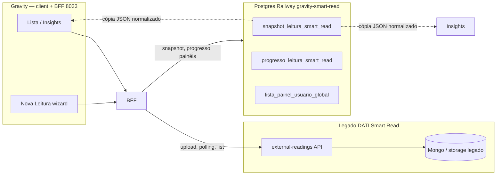

# Persistência de dados — Smart Read (arquitetura híbrida)

> **SSOT desta doc:** onde vive cada dado do Smart Read no Gravity vs no legado DATI.  
> **Código:** `servicos-global/produto/smart-read/` · BFF porta **8033** · Postgres Gravity **Railway** (`gravity-smart-read-*`)

---

## 1. Resumo em uma frase

O **banco de verdade das leituras** (PDF, fila de processamento, extração bruta, `processingResult` / `finalProcessingResult`) continua no **legado DATI Smart Read** (microserviço `import-control-center` / `external-readings`). O **Postgres Gravity** (`SMART_READ_DATABASE_URL`) **não substitui** esse banco: guarda só **estado da UI Gravity** e **snapshots congelados** para Lista e Insights funcionarem sem depender do legado a cada clique.

---

## 2. Dois backends, duas responsabilidades

| O quê | Onde fica | Quem escreve | Quem lê (Gravity) |
|-------|-----------|--------------|-------------------|
| Arquivo PDF / binário | **Legado DATI** | Upload via BFF → legado | Legado (Gravity não armazena PDF) |
| Fila e status de processamento (`PROCESSING`, `COMPLETED`, …) | **Legado DATI** | Motor OCR/extração do legado | BFF `GET /leituras/:id` (polling) |
| `processingResult` / `finalProcessingResult` (JSON bruto) | **Legado DATI** | Legado após IA + conferência no legado | BFF normaliza → `LeituraSchema` |
| Nome comercial escolhido no wizard | **Gravity** (`progresso_leitura_smart_read`) | `PATCH /progresso` | Lista (prioridade sobre nome genérico do legado) |
| Passo 2–4 + sessão da conferência | **Gravity** (`progresso_leitura_smart_read`) | `PATCH /progresso` | Retomar wizard (`GET /progresso`) |
| **Snapshot** da leitura (extração + métricas) | **Gravity** (`snapshot_leitura_smart_read`) | BFF ao concluir/conferir | Lista, Insights, `GET /leituras/:id` |
| Painéis/colunas/filtros da lista | **Gravity** (`lista_painel_usuario_global`) | API `/lista/paineis` | Lista |

**Não confundir:** `SMART_READ_DATABASE_URL` (Railway) **≠** banco do DATI. São instâncias separadas. O vínculo org Gravity → company legado é resolvido via Configurador (`resolverCompanyLegado`).

---

## 3. O que é o snapshot (`snapshot_leitura_smart_read`)

Snapshot **não** é print de tela nem cópia do PDF. É um **registro imutável lógico** (re-snapshot na conferência **atualiza** a mesma linha) com:

1. **`dados_extracao_snapshot_leitura_smart_read` (JSONB)** — payload validado pelo contrato bilateral `LeituraSchema` (arquivos + `resultado_extracao` já normalizado pelo BFF, incluindo `dados_original` quando o legado enviou).
2. **Colunas denormalizadas** — totais de campos, acertos/erros, `media_acertos`, datas, status, origem — para Lista e Insights consultarem sem reparsear o JSON nem chamar o legado de novo.

| Atributo | Valor |
|----------|-------|
| Model Prisma | `SnapshotLeituraSmartRead` |
| Tabela PG | `snapshot_leitura_smart_read` |
| Fragment | `prisma/fragment.prisma` |
| Migration | `20260623180000_create_snapshot_leitura_smart_read` |
| Unique | `(id_organizacao, id_leitura_legado_snapshot_leitura_smart_read)` |
| Referência legado | `id_leitura_legado_snapshot_leitura_smart_read` = `_id` da leitura no DATI |

**Versão do contrato:** `versao_contrato_snapshot_leitura_smart_read` (inteiro; hoje `1`).

**Motivo do congelamento (`motivo_congelamento_snapshot_leitura_smart_read`):**

| Valor | Quando |
|-------|--------|
| `extracao_concluida` | Leitura `COMPLETED`/`FAILED` com extração — após `GET /leituras/:id` ou enriquecimento da lista |
| `conferencia_usuario` | Usuário salvou passo/conferência — `PATCH /progresso` |

Implementação BFF: `server/src/lib/snapshot-leitura-smart-read.ts`.

---

## 4. Fluxo operacional (o que o desenvolvedor precisa saber)

### 4.1 Nova leitura (upload)

1. Client → `POST /api/v1/smart-read/leituras` (multipart).
2. BFF → **cria leitura no legado** + envia arquivo (`criarLeituraLegado`, `enviarArquivoLegado`).
3. Resposta `202` com `id_leitura` legado. **Nenhuma linha em `snapshot_leitura_smart_read` ainda.**

### 4.2 Wizard e conferência

1. Client faz polling `GET /leituras/:id` → BFF lê **legado**, normaliza, retorna `LeituraSchema`.
2. Ao avançar passos, `PATCH /progresso` grava em **`progresso_leitura_smart_read`**.
3. No mesmo `PATCH`, se a leitura tem dados de extração, BFF **upsert snapshot** (`motivo: conferencia_usuario`).

### 4.3 Lista

1. `GET /leituras` monta merge: **legado** (primário) + **progresso** + **snapshots** (`montar-lista-transacoes-leitura-smart-read.ts`).
2. Se o mesmo `id_leitura` existe no snapshot, a linha do snapshot **prevalece** (métricas já calculadas).
3. Linhas `COMPLETED` sem métricas ainda são enriquecidas via legado; ao enriquecer, o BFF **grava snapshot**.

### 4.4 Insights

1. Hook `use-dados-insights-leitura-smart-read.ts` usa a **mesma lista** + `GET /leituras/:id` por transação.
2. Após o primeiro snapshot, `GET /leituras/:id` **lê do Postgres** (não vai ao legado) enquanto o registro existir.
3. Métricas de acerto/erro na UI Insights continuam pela regra de **campo editado** (ver [INSIGHTS-TECNICO.md](./INSIGHTS-TECNICO.md) §1), não por `accuracy` do legado.

### 4.5 O legado continua obrigatório para

- Upload de arquivo
- Processamento assíncrono (IA)
- Primeira leitura de uma leitura nova (até o snapshot existir)
- Company id / vínculo organização (Configurador + `SMART_READ_LEGADO_*`)

---

## 5. Variáveis de ambiente

| Variável | Sistema | Função |
|----------|---------|--------|
| `SMART_READ_DATABASE_URL` | **Gravity Railway** | Postgres: snapshot, progresso, painéis |
| `SMART_READ_LEGADO_URL` | **DATI** | Base da API `external-readings` |
| `SMART_READ_LEGADO_CHAVE_GRAVITY` | **DATI** | Header `x-gravity-api-key` |
| `SMART_READ_ID_COMPANY_LEGADO_PADRAO` / de-para org | **DATI** | `x-company-id` no legado |

Dev sem legado: `SMART_READ_MOCK_LEGADO=1` simula extração no BFF — snapshots **ainda** gravam no Gravity se `SMART_READ_DATABASE_URL` estiver configurado.

---

## 6. Roadmap (não implementado)

- Backfill em massa de leituras antigas do legado → snapshot Gravity.
- Lista/Insights ler **somente** snapshots (legado só como motor de OCR).
- Colunas de saving/tempo na tabela snapshot (hoje calculadas em `shared/metricas-transacao-leitura-smart-read.ts` na leitura da linha).

---

## 7. Testes

| Arquivo | Cobertura |
|---------|-----------|
| `testes/testes-unitarios/smart-read/snapshot-leitura-smart-read.test.ts` | Elegibilidade e parse do JSON snapshot |
| `testes/testes-unitarios/smart-read/progresso-leitura-smart-read.test.ts` | Sessão do wizard |

---

## 8. Documentos relacionados

| Doc | Conteúdo |
|-----|----------|
| [LISTA-E-PROGRESSO-TECNICO.md](./LISTA-E-PROGRESSO-TECNICO.md) | Rotas BFF, progresso, nome do wizard, painéis |
| [INSIGHTS-TECNICO.md](./INSIGHTS-TECNICO.md) | Regras de acerto/erro, rankings, savings |
| [README.md](./README.md) | Índice do produto |
