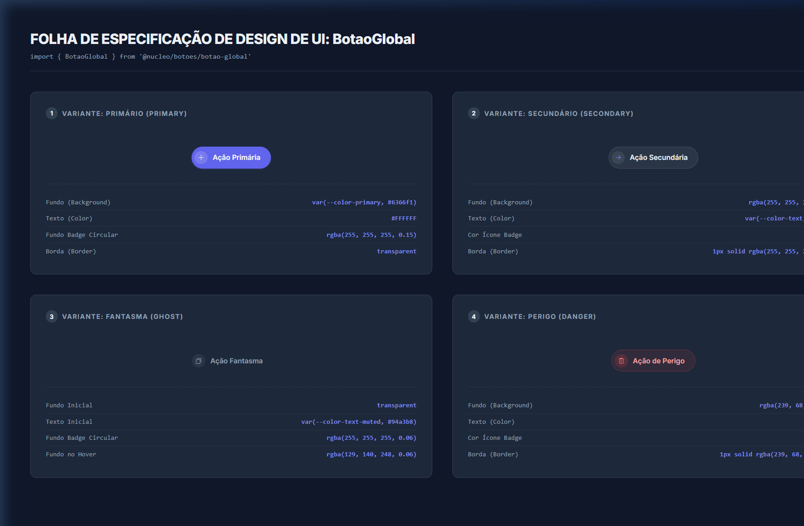
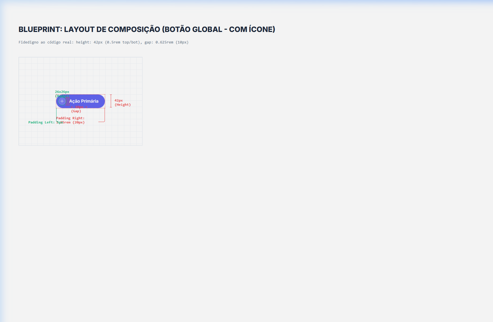
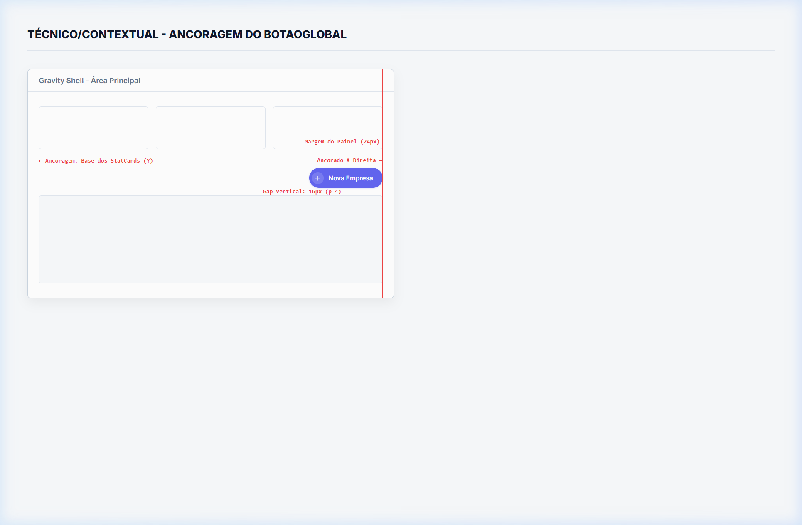

# Documentação Visual — BotaoGlobal

Referência definitiva e literal dos botões do Gravity Design System. Este documento foi gerado através de instrumentação direta do DOM, garantindo que as imagens e especificações sejam **100% fiéis ao código CSS**.

## 1. Folha de Especificação Técnica de UX
Apresenta os estados reais das variantes `primario`, `secundario`, `fantasma` e `perigo`. Códigos hexadecimais, opacidades e bordas são extraídos diretamente de `botao.css`.



## 2. Blueprint: Layout de Composição
Mapeamento milimétrico da anatomia do botão com ícone. Todas as setas e dimensões foram desenhadas sobre a caixa do componente no navegador. 



| Medida Relevante | Verificação Técnica no CSS (Real) |
| :--- | :--- |
| **Altura Total (Height)** | O padding `0.5rem` (top/bottom) + `line-height: 1` e a fonte `0.875rem` totalizam sempre `42px` cravados na tela. |
| **Espaçamento Central (Gap)** | Diferente de rascunhos visuais, o gap oficial que afasta o texto do bloco verde do ícone é garantido por `gap: 0.625rem` (10px). |
| **Dimensão do Badge (Ícone)** | A elipse transparente fixa possui largura e altura definidas de forma estática em `1.625rem` (26x26px), flex-shrink 0. |

---

## 3. Composição de Ancoragem Global (Contexto)
Diretrizes matemáticas de tela (Layout Constraints) determinando exatamente como esse botão se posiciona na macro-estrutura de uma página (painel de métricas/tabulares).



| Regra de Ancoragem | Referência Técnica |
| :--- | :--- |
| **Alinhamento do Bloco (X)** | Ponto extremo à direita, limitado pela `padding/margin` direita do container principal da página (`24px`). |
| **Referência Vertical Superior** | Base inferior horizontal (Y final) dos `StatCards`. |
| **Distanciamento Inferior (Tabela)** | Gap obrigatório de exatos `16px` distanciando a base do botão do topo da tabela. |

---

## Exemplo de Uso (Código)

```tsx
import { BotaoGlobal } from '@nucleo/botoes/botao-global'
import { Plus } from '@phosphor-icons/react'

<BotaoGlobal icone={<Plus weight="bold" size={14} />}>
  Nova Empresa
</BotaoGlobal>
```
