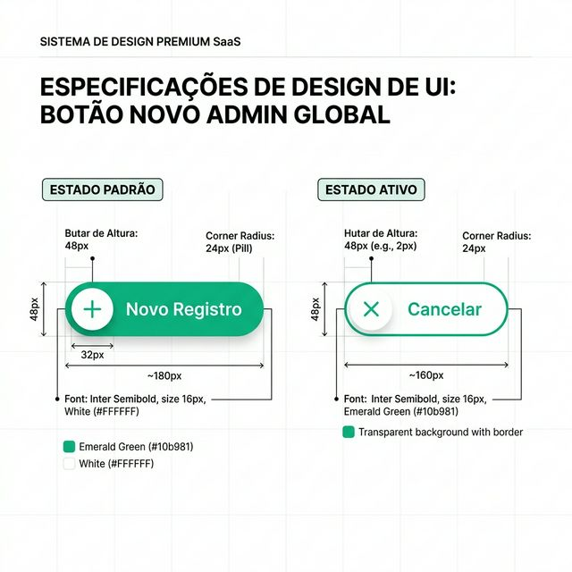
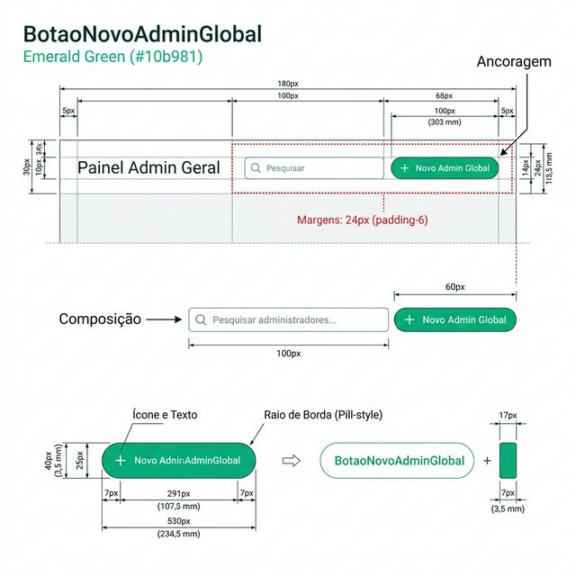
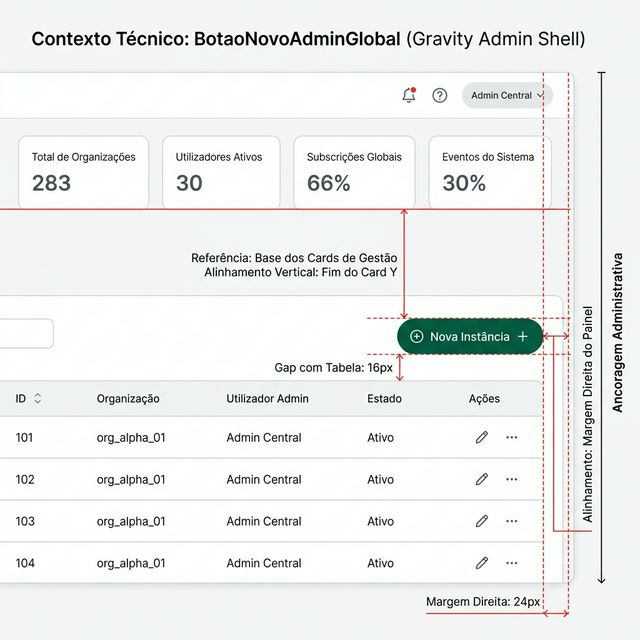

# Documentação Visual — BotaoNovoAdminGlobal

Referência de criação exclusiva para o ambiente administrativo (**Verde Emerald #10b981**).

## 1. Folha de Especificação Técnica de UX
Definição visual do estado Padrão e Ativo no Verde Emerald Gravity.



---

## 2. Especificação de Composição
Blueprint técnico com medidas do botão admin e do seu badge circular.



---

## 3. Composição de Ancoragem Global
Blueprint de posicionamento estratégico no Painel Admin (HQ).



| Regra de Ancoragem | Referência Técnica |
| :--- | :--- |
| **Referência Vertical (Y)** | Alinhado à base inferior dos StatCards de topo. |
| **Referência Horizontal (X)** | Ponto extremo à direita (Margem Lateral de 24px). |
| **Espaçamento Relacional** | Manter **16px** (p-4) de distância do topo da Tabela. |
| **Relacional (Cards)** | O botão serve como limite visual final da seção de status. |

---

## Exemplo de Uso (Código)

```tsx
import { BotaoNovoAdminGlobal } from '@nucleo/botoes/botao-novo-admin-global'

<CabecalhoGlobal
  titulo="Gestão de Instâncias"
  acoes={
    <BotaoNovoAdminGlobal 
      rotulo="Nova Instância" 
      onClick={() => setAbrirModal(true)} 
    />
  }
/>
```
