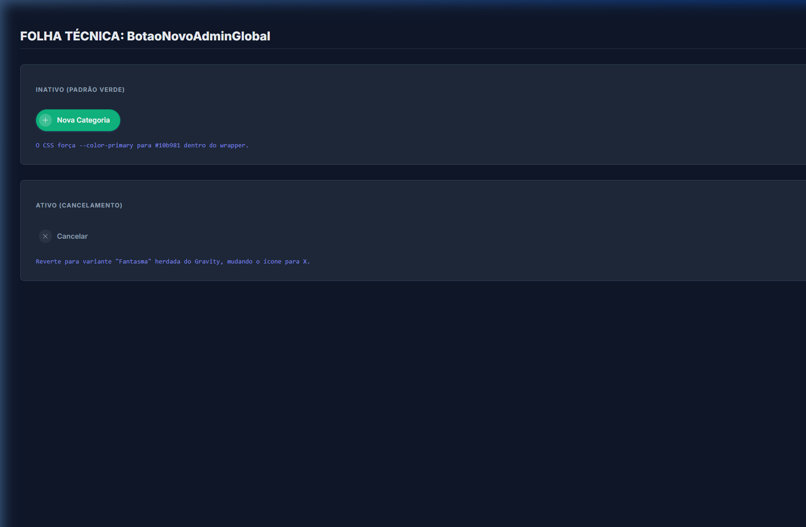
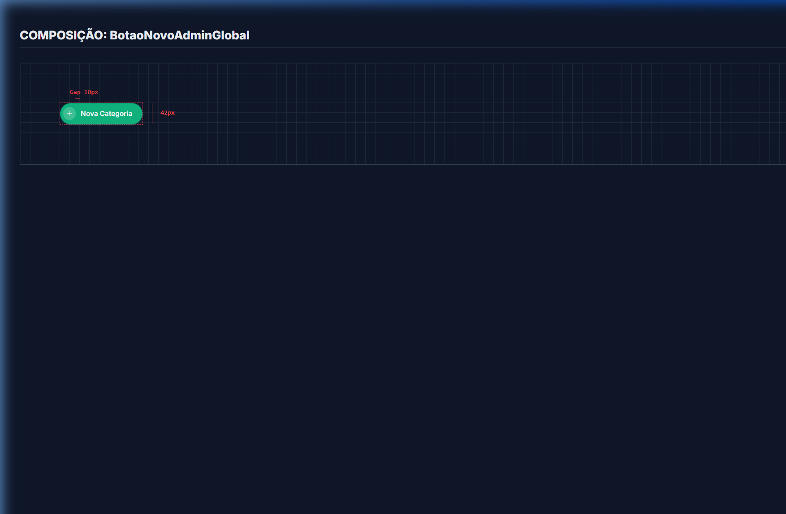
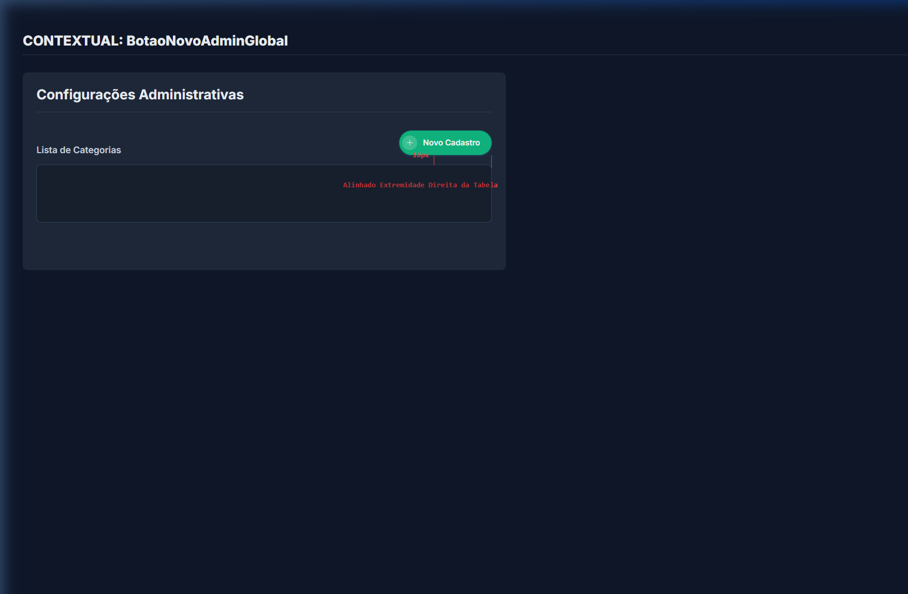

# Documentação Visual — BotaoNovoAdminGlobal

Referência definitiva e literal para o botão de ação principal do Painel de Administração Gravity, baseada fisicamente na `div.bng-admin-wrapper` herdando do `BotaoGlobal`. As imagens abaixos são relatórios exatos do DOM.

## 1. Folha Técnica: Estados Reais

Abaixo estão as variantes deste escopo. Ele não implementa CSS reativo customizado extenso, apenas sobrescreve a variável de escopo `--color-primary` para se moldar ao `BotaoGlobal`.



## 2. Blueprint: Layout de Composição

O Layout comprova que, com a adoção do `bng-admin-wrapper` como base em vez de um botão cru, as dimensões físicas como "42px" e o espaçamento da elipse de "10px" permanecem intactas (herdadas de forma modular).



---

## 3. Composição de Ancoragem Global (Contexto)

Na interface Desktop / Gravity Shell, o Botão de Administração Novo localiza-se estritamente no topo direito da tabela-alvo, alinhado à sua margem direita.



| Medida Relevante | Verificação Técnica no CSS (Real) |
| :--- | :--- |
| **Alinhamento Direita** | Limite absoluto direito ancorado junto com o painel tabular principal. |
| **Abertura Vertical** | 16px (`mt-4`) de distância limpa para a caixa da Tabela, permitindo respiração visual. |

---

## Exemplo de Uso (Código)

```tsx
import { BotaoNovoAdminGlobal } from '@nucleo/botoes/botao-novo-admin-global'

<BotaoNovoAdminGlobal
  rotulo="Nova Categoria"
  ativo={false}
  onClick={() => console.log('Novo')}
/>
```
