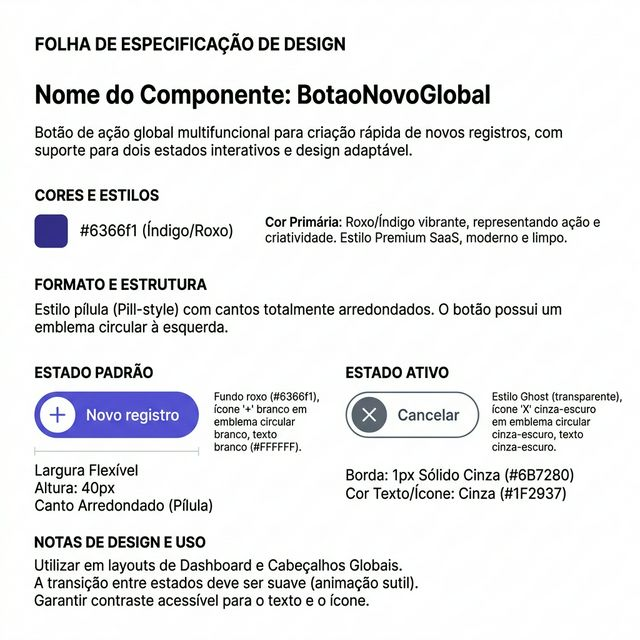
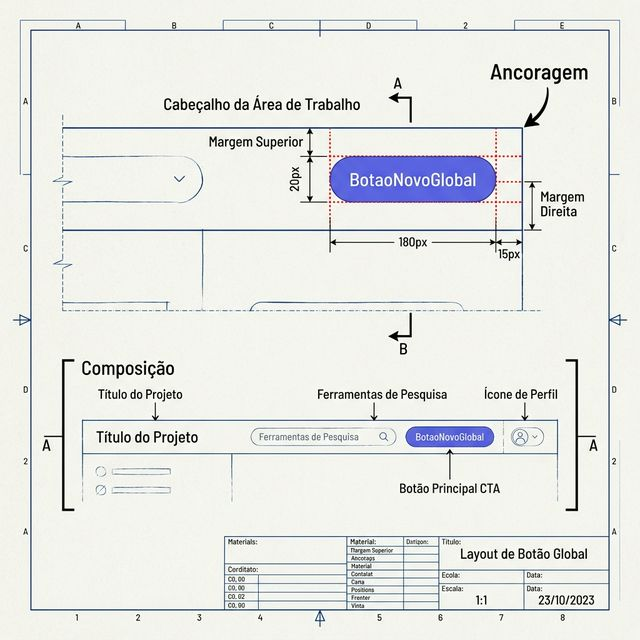
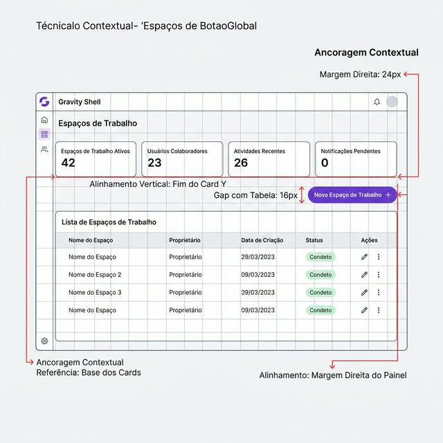

# Documentação Visual — BotaoNovoGlobal

Referência de criação (Padrão Workspace — Roxo).

## 1. Folha de Especificação Técnica de UX
Definição visual do estado Padrão (+) e Ativo (X) com as cores Gravity.



---

## 2. Especificação de Composição
Blueprint técnico do componente pill e do badge circular embutido.



---

## 3. Composição de Ancoragem Global
Blueprint de contexto e slot de ações no cabeçalho do Workspace.



| Regra de Ancoragem | Referência Técnica |
| :--- | :--- |
| **Referência Vertical (Y)** | Alinhado à base inferior da seção de Stats Cards. |
| **Referência Horizontal (X)** | Ponto fixo no Canto Superior Direito (24px de margem). |
| **Espaçamento Relacional** | **16px** (gap-4) de distância vertical do topo da Tabela. |
| **Slot de Injeção** | Slot `acoes` do CabecalhoGlobal. |

---

## Exemplo de Uso (Código)

```tsx
import { BotaoNovoGlobal } from '@nucleo/botoes/botao-novo-global'
import { useState } from 'react'

<CabecalhoGlobal
  titulo="Workspaces"
  acoes={
    <BotaoNovoGlobal 
      rotulo="Novo Workspace"
      onClick={() => setExibirForm(true)} 
      ativo={exibirForm}
    />
  }
/>
```
