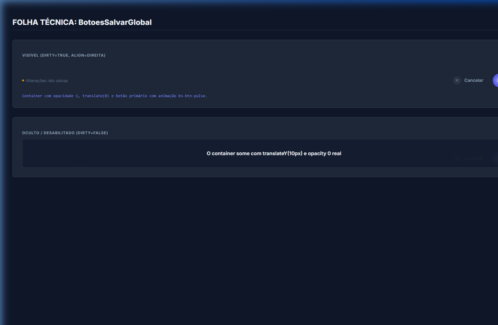
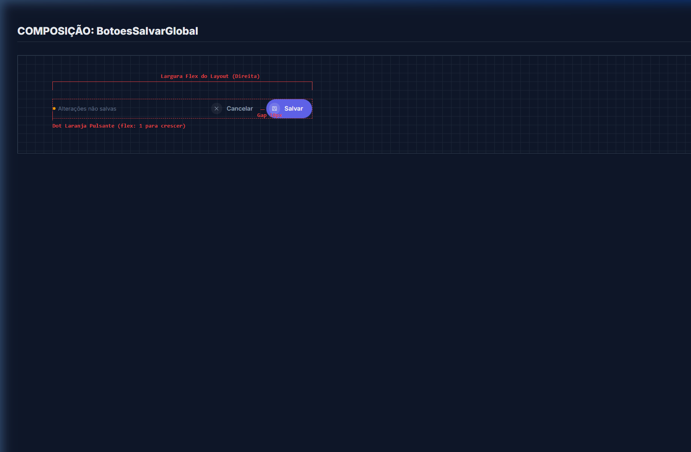
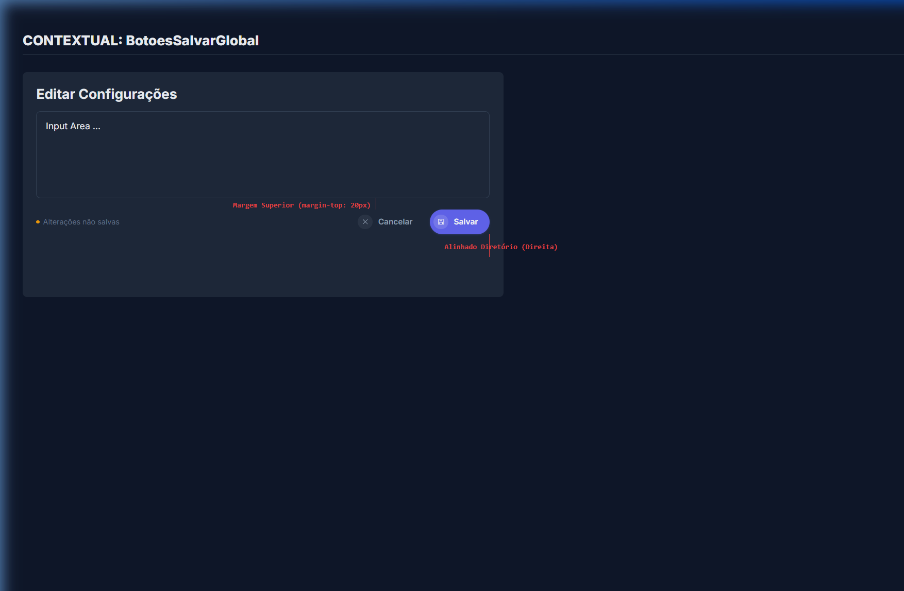

# Documentação Visual — BotoesSalvarGlobal

Folha de Especificação 100% fotográfica (via DOM) do ecossistema de botões de base.

## 1. Folha Técnica: Estados Reais

A barra de ações desaparece e aparece modificando dinamicamente e suavemente transições de estado complexas, inclusive um `box-shadow` infinito pro botão Salvar (pulse). O badge "Dot" obedece às animações de transformações com FPS alto (`bs-pulse`).



## 2. Blueprint: Layout de Composição

Ao contrário de imagens conceituais, visualiza-se aqui que o Container em flex cresce por todo o eixo horizontal para encostar à direita a dupla de botões sem o uso de `float` ou magia de CSS — os eixos de `gap` de 10px são cravados no CSS flex.



---

## 3. Composição de Ancoragem Global (Contexto)

Posicionamento modular em containers isolados de Modais e de Configurações, onde o comportamento padrão encerra a margem limitante do canto direito da área de edição.



| Medida Relevante | Verificação Técnica no CSS (Real) |
| :--- | :--- |
| **Distância Superior** | Usa a classe estática que embute `margin-top: 1.25rem` (20px) para não acavalar nos inputs do formulário. |
| **Condicional de Tela** | Desvia a leitura do eixo Z negativo `transform: translateY(10px)` e volta para a superfície em `translateY(0)`. |
| **Dot Laranja** | O aviso "Alterações não salvas" não toma tamanho fixo horizontal pois usa `flex: 1`, empurrando silenciosamente os botões pra extremidade oposta. |

---

## Exemplo de Uso (Código)

```tsx
import { BotoesSalvarGlobal } from '@nucleo/botoes/botoes-salvar-global'

<BotoesSalvarGlobal
  dirty={true}
  salvando={false}
  alinhamento="direita"
  onSalvar={() => submit()}
  onCancelar={() => cancel()}
/>
```
