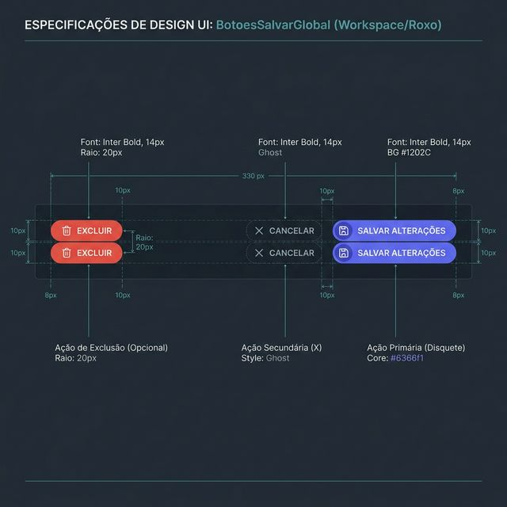
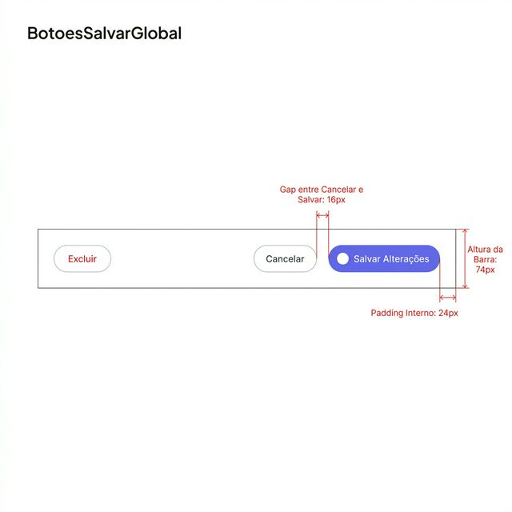
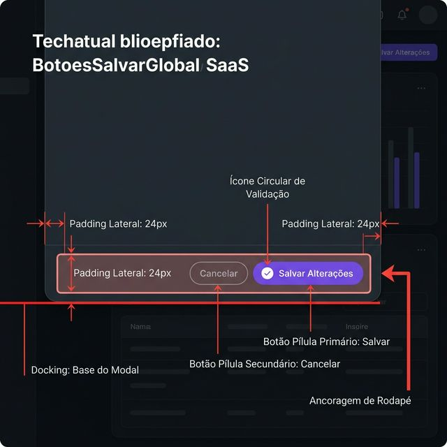

# Documentação Visual — BotoesSalvarGlobal

Referência definitiva do conjunto de ações de rodapé (Padrão Workspace — Roxo).

## 1. Folha de Especificação Técnica de UX
Detalhamento de estados, cores e botões de ação para persistência de dados.



---

## 2. Especificação de Composição
Anatomia técnica da barra de rodapé com medidas, gaps e hierarquia de botões.



---

## 3. Composição de Ancoragem Global
Blueprint de posicionamento final (Docking) em rodapés de Modais ou Páginas.



| Regra de Ancoragem | Referência Técnica |
| :--- | :--- |
| **Ponto Base (Y)** | Ancorado no fundo do Modal ou a **24px** da base da janela. |
| **Ponto Terminal (X)** | Alinhado à margem direita da área útil (**24px**). |
| **Relacional (Excluir)** | Botão de exclusão isolado à **Extrema Esquerda** (Ação Perigosa). |
| **Gap de Ações** | Espaçamento de **16px** (p-4) entre Cancelar e Salvar. |

---

## Exemplo de Uso (Código)

```tsx
import { BotoesSalvarGlobal } from '@nucleo/botoes/botoes-salvar-global'

<BotoesSalvarGlobal
  dirty={dirty}
  salvando={salvando}
  onSalvar={handleSalvar}
  onCancelar={handleCancelar}
  alinhamento="direita"
/>
```
