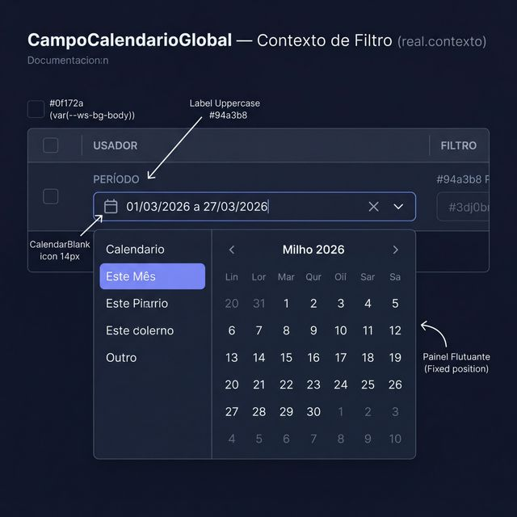
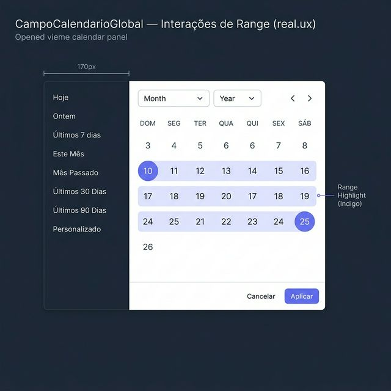
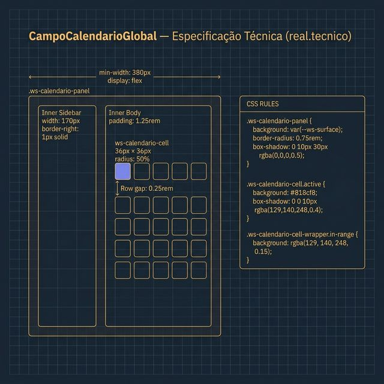

# Documentação Visual — CampoCalendarioGlobal

Referência visual baseada 100% no código `CalendarioCampoGlobal.tsx` + `calendario.css`.

---

## 1. Contexto de Filtro

Visualização do campo de data sendo usado como filtro de período em tabelas.
- **Visual**: Campo com ícone de calendário à esquerda e Chevron à direita.
- **Painel**: Flutuante (`position: fixed`) com sidebar de atalhos temporais.

---

## 2. Interações de Range (UX)

Comportamento de seleção de período:
- **Range Highlight**: Destaque Indigo sutil entre a data de início e fim.
- **Presets**: Atalhos rápidos na esquerda para "Hoje", "Últimos 7 dias", etc.
- **Seletores**: Mês e ano selecionáveis via selects minimalistas no topo.

---

## 3. Especificação Técnica

Blueprint das medidas do componente:
- **Painel**: Largura mínima de `380px`.
- **Célula de Data**: `36px × 36px` com bordas arredondadas (circle).
- **Highlights**: Gradient Indigo para início/fim do range.

