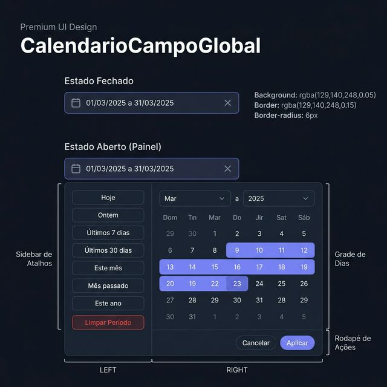
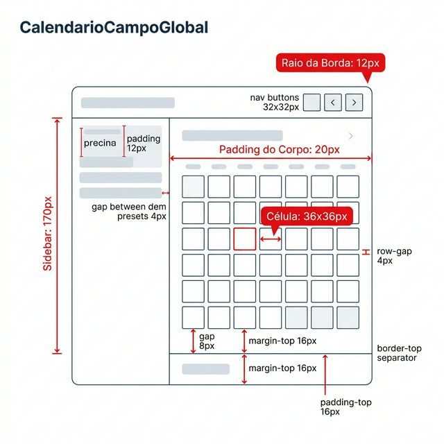
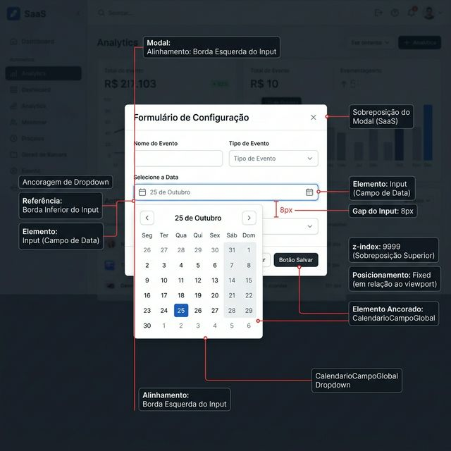

# Documentação Visual — CalendarioCampoGlobal

Seletor de intervalo de datas (Date Range Picker) do Gravity Design System.

## 1. Folha de Especificação Técnica de UX
Estados do componente: campo fechado (input compacto) e painel aberto (sidebar + grade + rodapé).



---

## 2. Especificação de Composição
Anatomia técnica do painel: sidebar de atalhos (170px), grade 7×6 (células 36×36px), rodapé com botões pill.



---

## 3. Composição de Ancoragem Global
Posicionamento do painel de calendário em relação ao campo e ao formulário.



| Regra de Ancoragem | Referência Técnica |
| :--- | :--- |
| **Referência Vertical (Y)** | O painel abre **8px** abaixo da borda inferior do input. |
| **Referência Horizontal (X)** | Alinhado à borda esquerda do input pai. |
| **Posicionamento** | `position: fixed` com `z-index: 9999` (sobrepõe modais). |
| **Largura Mínima** | `min-width: 380px` ou a largura do input, o que for maior. |

---

## Anatomia do Componente

| Área | Medida / Valor |
| :--- | :--- |
| **Input Fechado** | `border-radius: 6px`, fundo `rgba(129,140,248,0.05)`, borda `rgba(129,140,248,0.15)` |
| **Sidebar de Atalhos** | Largura fixa **170px**, presets: Hoje, Ontem, 7 dias, 30 dias, Este mês, Mês passado, Este ano |
| **Grade de Dias** | 7 colunas (Dom–Sáb), células **36×36px**, `border-radius: 50%` |
| **Seleção Ativa** | Fundo `#818cf8`, sombra `0 0 10px rgba(129,140,248,0.4)` |
| **Range Highlight** | Fundo `rgba(129,140,248,0.15)` com gradiente nas pontas |
| **Rodapé** | Botões Pill: "Cancelar" (fantasma) + "Aplicar" (primário roxo) |

---

## Exemplo de Uso (Código)

```tsx
import { CalendarioCampoGlobal } from '@nucleo/campo-calendario-global'

<CalendarioCampoGlobal
  rotulo="Período de Análise"
  valor={{ inicio: dataInicio, fim: dataFim }}
  aoMudarValor={({ inicio, fim }) => {
    setDataInicio(inicio)
    setDataFim(fim)
  }}
/>
```
