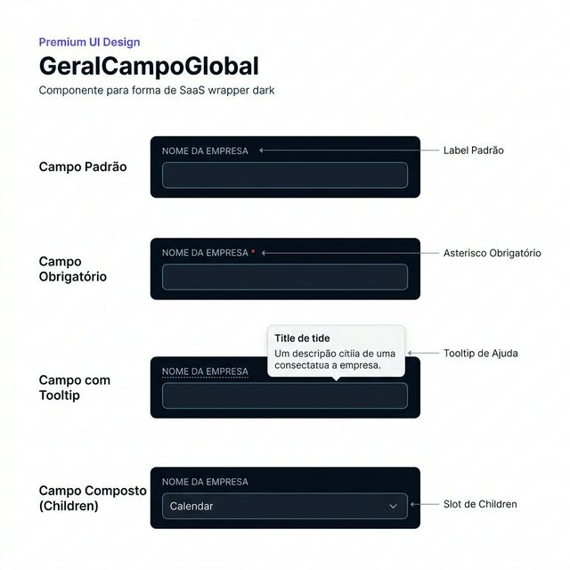
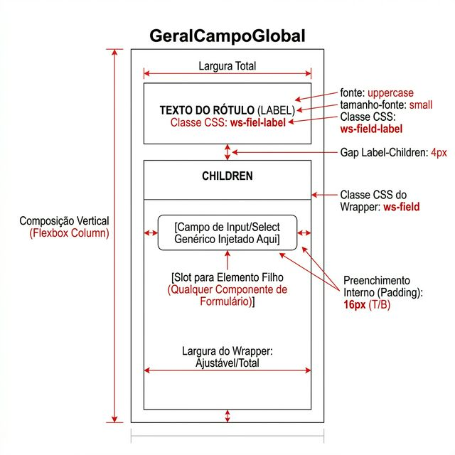
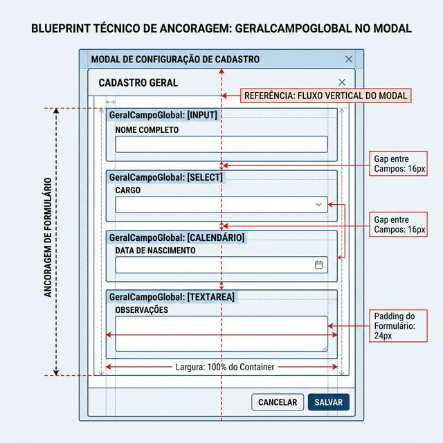

# Documentação Visual — GeralCampoGlobal

Componente-base (wrapper) que envolve todos os campos de formulário do Gravity Design System.

## 1. Folha de Especificação Técnica de UX
Estados do componente: campo padrão, campo obrigatório (*), campo com tooltip de ajuda e campo composto (children).



---

## 2. Especificação de Composição
Anatomia técnica: stack vertical com label no topo e slot de children abaixo.



---

## 3. Composição de Ancoragem Global
Posicionamento do wrapper dentro de formulários e modais.



| Regra de Ancoragem | Referência Técnica |
| :--- | :--- |
| **Referência Vertical (Y)** | Fluxo vertical natural do formulário (empilhamento). |
| **Referência Horizontal (X)** | Largura **100%** do container pai. |
| **Gap entre Campos** | **16px** (gap-4) de espaçamento vertical entre instâncias. |
| **Padding do Container** | Respeitar o padding do formulário pai: **24px** (p-6). |

---

## Anatomia do Componente

| Propriedade | Valor / Descrição |
| :--- | :--- |
| **Classe CSS** | `ws-field` |
| **Label** | Texto uppercase com fonte pequena, opcional |
| **Obrigatório** | Adiciona `*` em vermelho ao final do label |
| **Tooltip** | Envolve o label com `TooltipGlobal` quando `tooltipTitulo` e `tooltipDescricao` são definidos |
| **Children** | Slot genérico para qualquer input, select, calendário ou componente customizado |

---

## Exemplo de Uso (Código)

```tsx
import { GeralCampoGlobal } from '@nucleo/campo-geral-global'

<GeralCampoGlobal
  label="Nome da Empresa"
  obrigatorio
  tooltipTitulo="Razão Social"
  tooltipDescricao="Informe o nome oficial da empresa conforme CNPJ."
>
  <input type="text" placeholder="Ex: Acme Importações" />
</GeralCampoGlobal>
```
