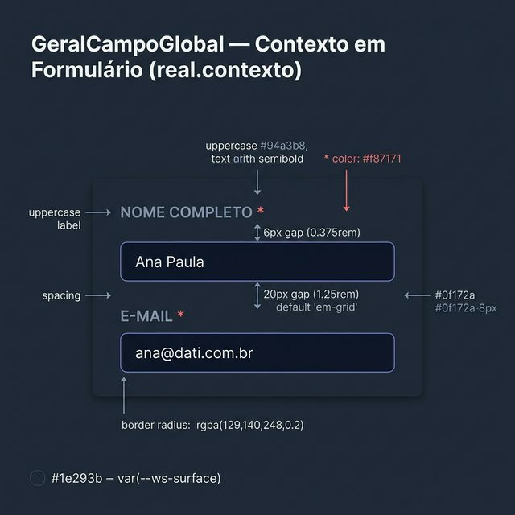
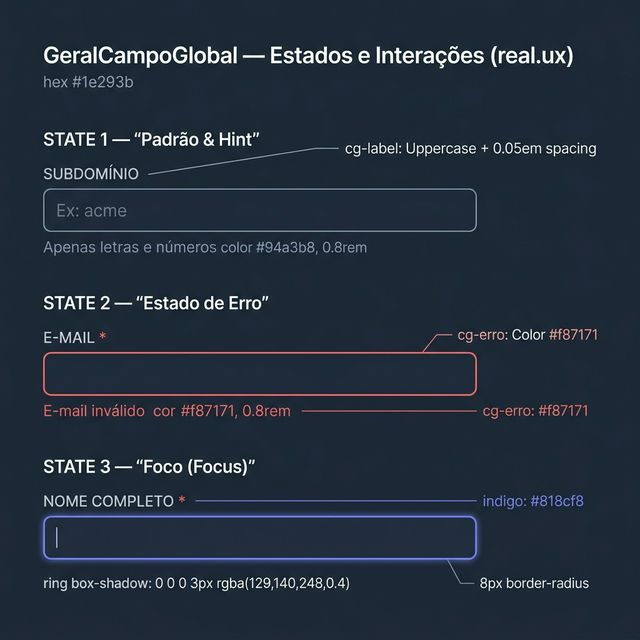
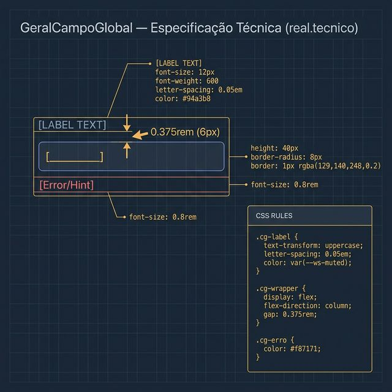

# Documentação Visual — CampoGeralGlobal

Referência visual baseada 100% no código `CampoGeralGlobal.tsx` + `campo-geral.css`. Garantia de 0 erros com a realidade.

---

## 1. Contexto em Formulário

Visualização do comportamento de empilhamento do wrapper dentro de modais.
- **Label**: Sempre acima do input.
- **Gap**: `0.375rem` (6px) fixo entre label e campo.
- **Margem**: Geralmente `1.25rem` (20px) entre linhas de campos (grid).

---

## 2. Estados e Interações UX

Aparência real dos estados de erro, obrigatório e foco:
- **Erro**: Borda vermelha `#f87171` e mensagem abaixo.
- **Obrigatório**: Asterisco vermelho injetado via código (`label *`).
- **Foco**: Anel de foco Indigo sutil.

---

## 3. Especificação Técnica

Blueprint das medidas exatas do CSS:
- **cg-label**: `font-size: 0.75rem`, `font-weight: 600`, `text-transform: uppercase`, `letter-spacing: 0.05em`.
- **cg-wrapper**: `display: flex`, `flex-direction: column`, `gap: 0.375rem`.
- **cg-erro**: `font-size: 0.8rem`, `color: #f87171`.

