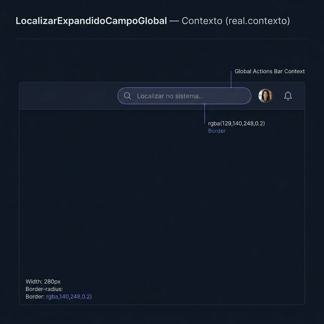
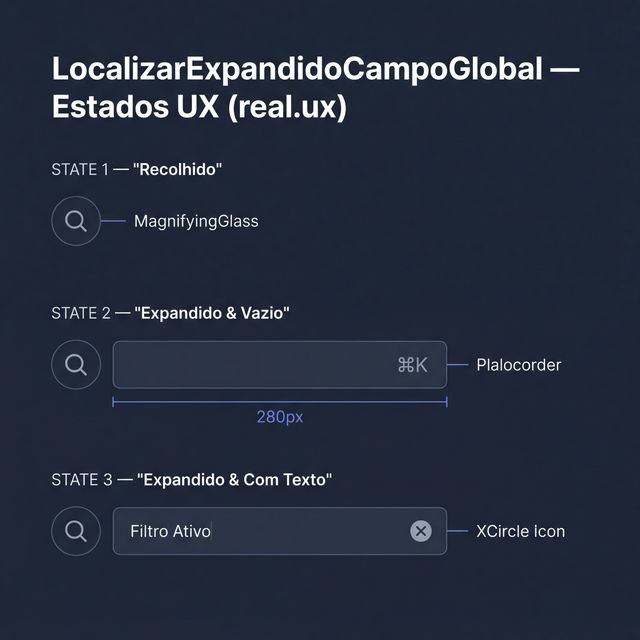
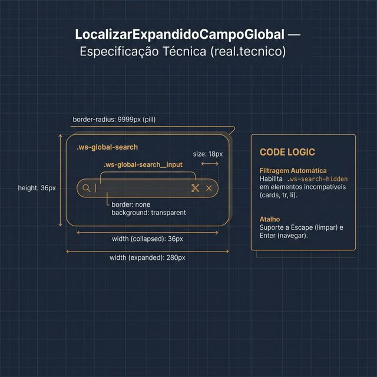

# Documentação Visual — CampoLocalizarExpandidoGlobal

Referência visual baseada 100% no CSS do `workspace.css` e lógica do `LocalizarExpandidoCampoGlobal.tsx`.

---

## 1. Contexto Global (Shell)

Uso típico do campo de busca na barra de ações global do Gravity.
- **Visual**: Integrado à direita do cabeçalho, com expansão horizontal suave.
- **Ancoragem**: Mantém o alinhamento com os botões de ação e perfil do usuário.

---

## 2. Estados UX (Dinâmica de Expansão)

- **Recolhido**: Apenas um botão circular de 36px com ícone de lupa.
- **Expandido (Vazio)**: Mostra o placeholder e a dica de atalho `⌘K`.
- **Com Texto**: O atalho é substituído pelo botão de limpar (`XCircle`).

---

## 3. Especificação Técnica (Anatomia do Shell)

Blueprint das medidas do `workspace.css`:
- **Dimensões**: 36px (col) para 280px (exp).
- **Radius**: `9999px` (Pill).
- **Input**: Sem bordas internas, utiliza o `box-shadow` do container no foco.
- **Lógica**: Filtragem automática de DOM via classe `.ws-search-hidden`.

