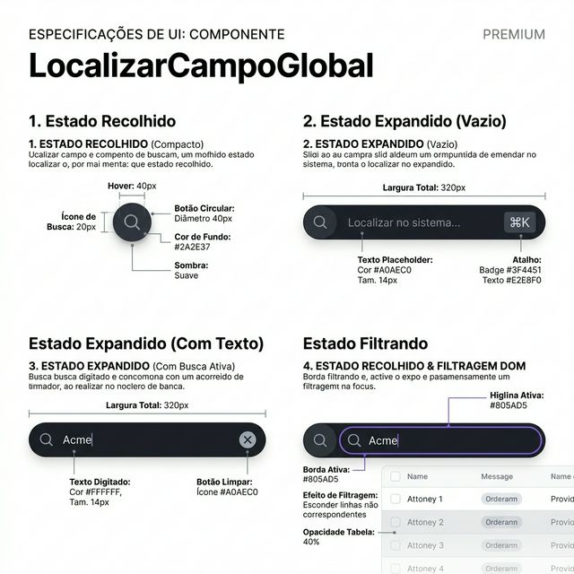
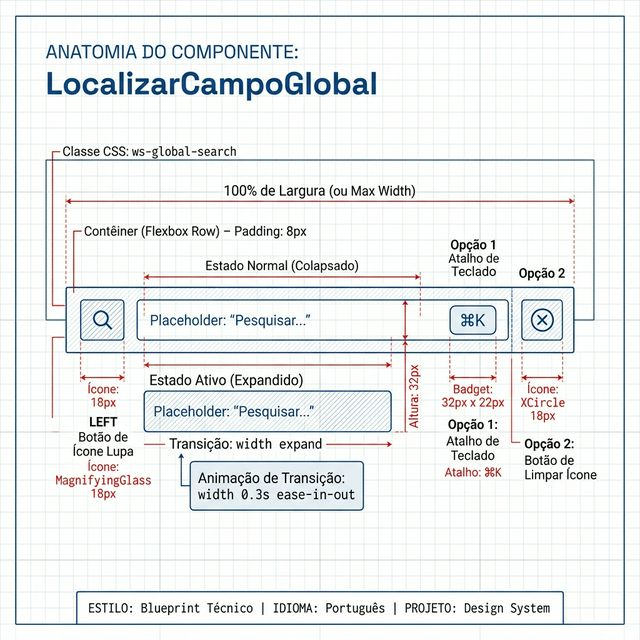
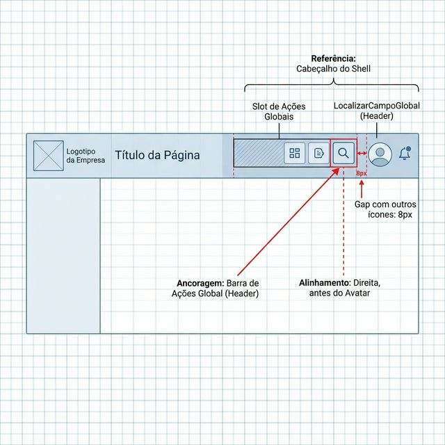

# Documentação Visual — LocalizarExpandidoCampoGlobal

Barra de busca global com filtragem DOM ao vivo e expansão animada.

## 1. Folha de Especificação Técnica de UX
Estados do componente: recolhido, expandido vazio (⌘K), com busca ativa (X) e filtragem DOM.



---

## 2. Especificação de Composição
Anatomia técnica: flexbox horizontal com ícone de lupa, input expansível e ação contextual (⌘K ou XCircle).



---

## 3. Composição de Ancoragem Global
Posicionamento no cabeçalho do Shell (Barra de Ações Globais).



| Regra de Ancoragem | Referência Técnica |
| :--- | :--- |
| **Referência Vertical (Y)** | Centralizado verticalmente no cabeçalho do Shell. |
| **Referência Horizontal (X)** | Slot de ações globais, à esquerda do avatar do usuário. |
| **Gap com Ícones** | **8px** de espaçamento entre ícones adjacentes na barra. |
| **Expansão** | Expande para a esquerda via transição CSS de largura. |

---

## Anatomia do Componente

| Propriedade | Valor / Descrição |
| :--- | :--- |
| **Classe CSS** | `ws-global-search` (+ `.expanded` quando aberto) |
| **Ícone de Busca** | `MagnifyingGlass` (Phosphor), 18px, weight bold |
| **Placeholder** | `"Localizar no sistema..."` |
| **Atalho** | Badge `⌘K` exibido quando expandido e vazio |
| **Botão Limpar** | `XCircle` (Phosphor), 18px, aparece quando há texto |
| **Filtragem DOM** | Oculta elementos não correspondentes via classe `ws-search-hidden` |
| **Reset Automático** | Limpa o termo ao trocar de rota (`location.pathname`) |

---

## Exemplo de Uso (Código)

```tsx
import { LocalizarExpandidoCampoGlobal } from '@nucleo/campo-localizar-expandido-global'

// Modo autônomo (filtra o DOM automaticamente)
<LocalizarExpandidoCampoGlobal />

// Modo controlado (busca via API)
<LocalizarExpandidoCampoGlobal
  value={termoBusca}
  onChange={setTermoBusca}
  disableGlobalDOMFilter
  onBuscarNavigate={(termo) => navigate(`/busca?q=${termo}`)}
  alwaysExpanded
/>
```
