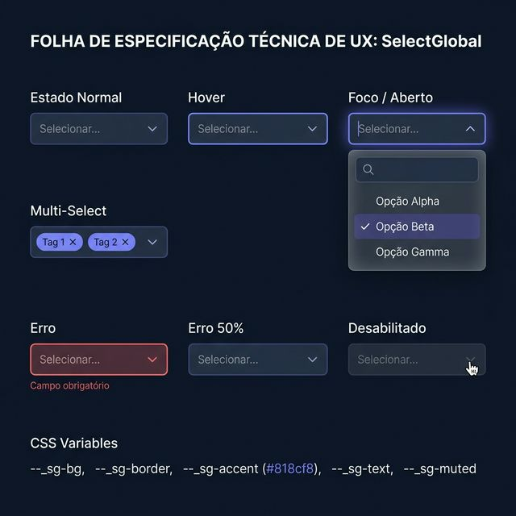
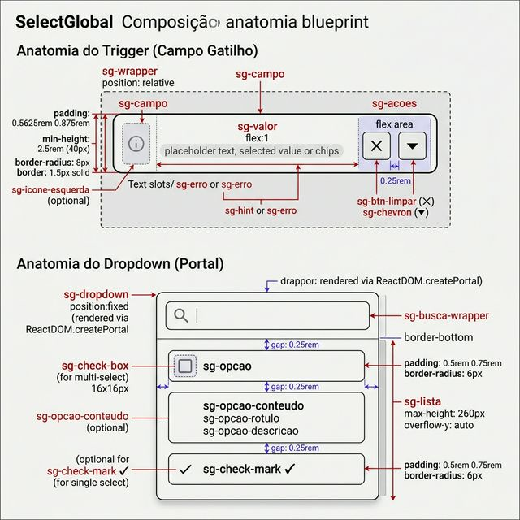
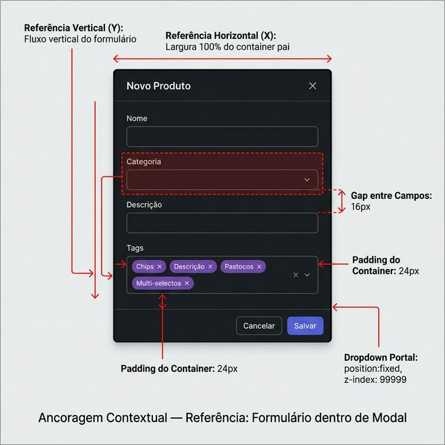

# Documentação Visual — SelectGlobal

Select customizado (nunca usa `<select>` nativo) com suporte a single/multi select, busca interna, grupos e dropdown via portal.

## 1. Folha de Especificação Técnica de UX
Estados do componente: normal, hover, foco/aberto com dropdown, multi-select com chips, erro e desabilitado.



---

## 2. Especificação de Composição
Anatomia técnica: wrapper com label, campo-gatilho (flexbox horizontal com ícone, valor/chips e ações) e dropdown portal (busca + lista de opções).



---

## 3. Composição de Ancoragem Global
Posicionamento dentro de formulários e modais. Dropdown escapa do stacking context via `ReactDOM.createPortal` com `position: fixed`.



| Regra de Ancoragem | Referência Técnica |
| :--- | :--- |
| **Referência Vertical (Y)** | Fluxo vertical natural do formulário (empilhamento). |
| **Referência Horizontal (X)** | Largura **100%** do container pai. |
| **Gap entre Campos** | **16px** (gap-4) de espaçamento vertical entre instâncias. |
| **Dropdown Portal** | `position: fixed`, `z-index: 99999`, renderizado em `document.body` via `createPortal`. |

---

## Anatomia do Componente

| Propriedade | Valor / Descrição |
| :--- | :--- |
| **Classe CSS (wrapper)** | `sg-wrapper input-group` |
| **Classe CSS (campo)** | `sg-campo` (+ `.sg-campo--aberto`, `.sg-campo--desabilitado`, `.sg-campo--carregando`) |
| **Label** | Texto com fonte 0.8125rem, peso 600, cor muted. Suporte a `obrigatorio` (*). |
| **Placeholder** | `"Selecionar..."` (customizável via prop) |
| **Ícone Esquerda** | Slot opcional via prop `iconeEsquerda` (ReactNode) |
| **Chevron** | SVG inline 14×14px, rotaciona 180° quando aberto |
| **Botão Limpar** | `✕` aparece quando há seleção ativa |
| **Chips (multi)** | Pills com `border-radius: 9999px`, fundo accent translúcido, botão `✕` de remoção |
| **Dropdown** | Portal fixed, glassmorphism (`backdrop-filter: blur(12px)`), animação de entrada 140ms |
| **Busca Interna** | Input com ícone de lupa, filtra opções em tempo real por rótulo e descrição |
| **Lista de Opções** | `max-height: 260px`, scroll interno, suporte a grupos com rótulo uppercase |
| **Opção Selecionada** | Fundo accent translúcido + checkmark `✓` (single) ou checkbox preenchido (multi) |
| **Hint** | Texto auxiliar abaixo do campo, cor muted |
| **Erro** | Texto vermelho `#f87171` abaixo do campo + borda vermelha no trigger |
| **Acessibilidade** | `role="combobox"`, `aria-haspopup="listbox"`, `aria-expanded`, keyboard (Enter/Space/Escape) |

---

## Exemplo de Uso (Código)

```tsx
import { SelectGlobal } from '@nucleo/campo-select-global'

// Single select
<SelectGlobal
  label="Categoria"
  opcoes={[
    { valor: 'tech', rotulo: 'Tecnologia' },
    { valor: 'fin', rotulo: 'Financeiro', descricao: 'Serviços bancários' },
    { valor: 'saude', rotulo: 'Saúde', desabilitada: true },
  ]}
  valor={categoria}
  aoMudarValor={setCategoria}
  placeholder="Selecione uma categoria..."
  obrigatorio
/>

// Multi-select com grupos
<SelectGlobal
  label="Tags"
  multiplo
  buscavel
  grupos={[
    { rotulo: 'Prioridade', opcoes: [
      { valor: 'alta', rotulo: 'Alta' },
      { valor: 'media', rotulo: 'Média' },
    ]},
    { rotulo: 'Status', opcoes: [
      { valor: 'ativo', rotulo: 'Ativo' },
      { valor: 'inativo', rotulo: 'Inativo' },
    ]},
  ]}
  valores={tagsSelecionadas}
  aoMudarValores={setTagsSelecionadas}
/>
```
