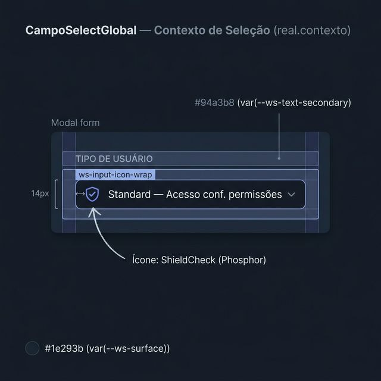
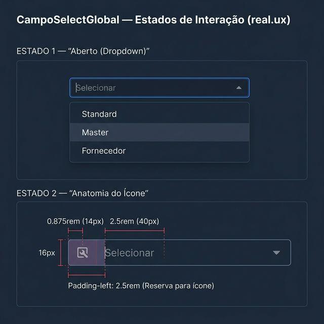
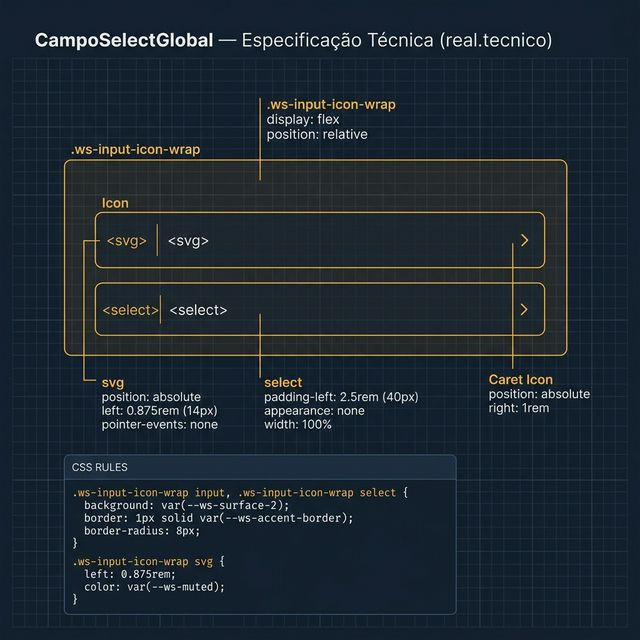

# Documentação Visual — CampoSelectGlobal

Referência visual baseada 100% no código real de uso e integração com `workspace.css` (.ws-input-icon-wrap) e `select.css`.

---

## 1. Contexto de Seleção

Uso típico do select com ícone lateral dentro de Modais de edição.
- **Ícone**: ShieldCheck (Phosphor) ou similares.
- **Visual**: Fundo escuro integrado, borda sutil Indigo.

---

## 2. Estados de Interação (UX)

Comportamento do select com ícones customizados:
- **Anatomia do Ícone**: O ícone fica flutuando à esquerda, enquanto o texto do select tem um recuo obrigatório de **40px** (`2.5rem`) para não sobrepor o ícone.
- **Dropdown**: Menu nativo estilizado pelo browser no tema escuro.

---

## 3. Especificação Técnica (Shell Real)

Blueprint das propriedades do `select.css`:
- **Min-Height**: `2.5rem` (40px).
- **Border**: `1.5px solid rgba(129,140,248,0.20)`. 
- **Radius**: `8px`.
- **Gap Interno**: `0.5rem` (8px entre ícone e texto).

