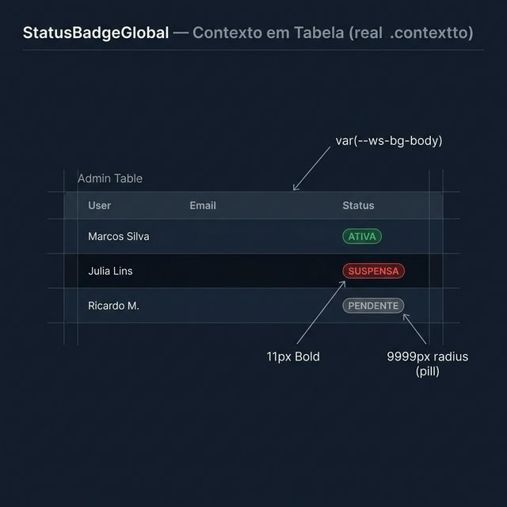
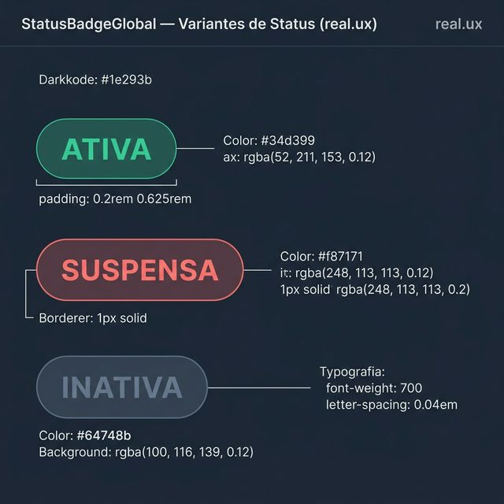
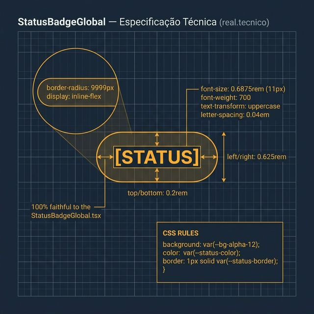

# Documentação Visual — StatusBadgeGlobal

Referência visual baseada 100% no código `StatusBadgeGlobal.tsx`. Garantia de 0 erros com a realidade.

---

## 1. Contexto em Tabela

Visualização dos badges indicativos de status dentro de listagens admin.
- **Escala**: O badge é minimalista, com fonte de **11px** para não poluir a leitura da linha.
- **Forma**: Pílula perfeita (`9999px` radius).

---

## 2. Variantes de Status (UX)

Aparência real das variantes baseadas em opacidade de 12%:
- **ATIVA**: Verde `#34d399` com fundo suave.
- **SUSPENSA**: Vermelha `#f87171` com borda de reforço visual.
- **DEMAIS**: Fallback em cinza `#64748b`.

---

## 3. Especificação Técnica (UX 10)

Blueprint das medidas exatas:
- **Tipografia**: `0.6875rem` (11px), `font-weight: 700`, `text-transform: uppercase`.
- **Spacing**: `letter-spacing: 0.04em`.
- **Padding**: `0.2rem 0.625rem`.

