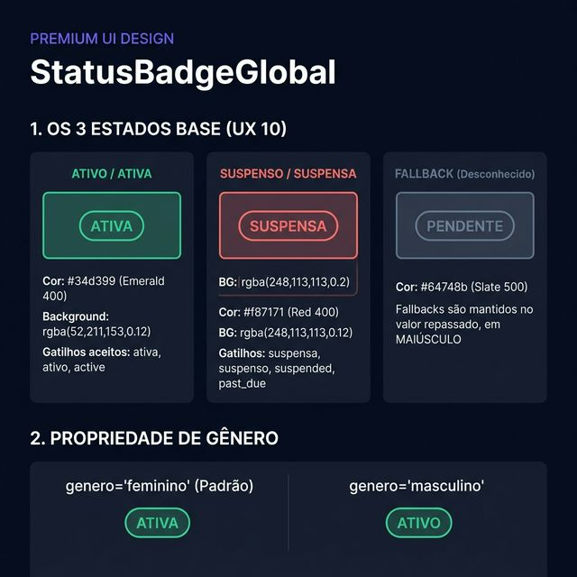
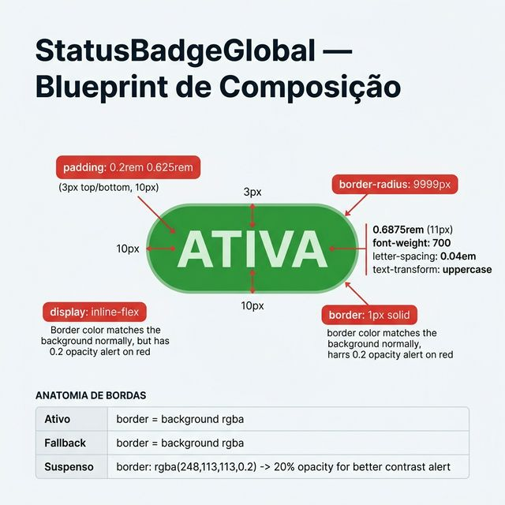
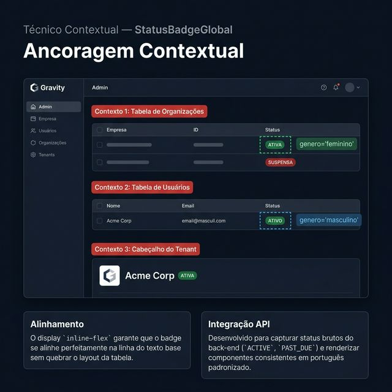

# Documentação Visual — StatusBadgeGlobal

Componente de etiqueta de status em formato *pill* — unificado e com processamento léxico automático para traduções de retornos do servidor.

## 1. Folha de Especificação Técnica de UX
Documentação do padrão visual para identificação de entidades ativas e suspensas e respectiva parametrização de gênero linguístico.



---

## 2. Especificação de Composição
Blueprint da arquitetura do componente com especificações de raio, bordas compensadas para visibilidade em *dark mode*, margens e tipografia reduzida.



---

## 3. Composição de Ancoragem Global
Comportamento de fluxo inline para integração orgânica em células de tabelas, cartões e faixas de títulos sem distorção das linhas de grid.



| Regra de Ancoragem | Referência Técnica |
| :--- | :--- |
| **Comportamento de Display** | Usa `display: inline-flex` para nunca quebrar blocos onde for injetado. |
| **Parsing Seguro** | Processa e converte strings brutas via regex simplificado (`active`, `ATIVA`, `suspended`) para português limpo. |
| **Tratamento de Exceções** | Em strings não mapeadas (ex: `TRIAL_PERIOD`), reverte para letras em caixa alta como fallback (slate/cinza). |
| **Alerta Tátil** | Somente o modelo de "Suspenso" injeta uma opacidade dobrada na sua cor de borda (`rgba(248...0.2)`) para forçar um contraste visível de atenção. |

---

## Anatomia do Componente

| Área / Propriedade | Medida / Valor |
| :--- | :--- |
| **Corpo (Pílula)** | `padding: 0.2rem 0.625rem` (3px / 10px respect.), `border-radius: 9999px`. |
| **Tipografia (Label)** | `font-size: 0.6875rem (11px)`, `font-weight: 700`, `text-transform: uppercase`, `letter-spacing: 0.04em`. |
| **Paleta "ATIVO"** | Texto `#34d399` / Fundo e borda `rgba(52,211,153,0.12)`. |
| **Paleta "SUSPENSO"** | Texto `#f87171` / Fundo `rgba(248,113,113,0.12)` / Borda `rgba(248,113,113,0.2)`. |
| **Paleta "FALLBACK"** | Texto `#64748b` / Fundo e borda `rgba(100,116,139,0.12)`. |

---

## Exemplo de Uso (Código)

```tsx
import { StatusBadgeGlobal } from '@nucleo/feedback/status-badge-global'

{/* Contexto feminino (Padrão) -> Organizações e Faturas */}
<StatusBadgeGlobal valor="ACTIVE" /> {/* Exibe: ATIVA */}

{/* Contexto masculino -> Usuários e Produtos */}
<StatusBadgeGlobal valor={usuario.status} genero="masculino" /> {/* Exibe: ATIVO ou SUSPENSO */}

{/* Fallback transparente -> exibe a string como recebida */}
<StatusBadgeGlobal valor="Processando" /> {/* Exibe: PROCESSANDO */}
```
