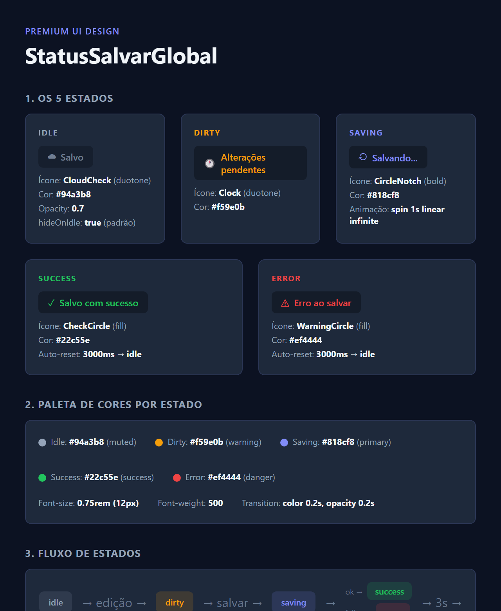
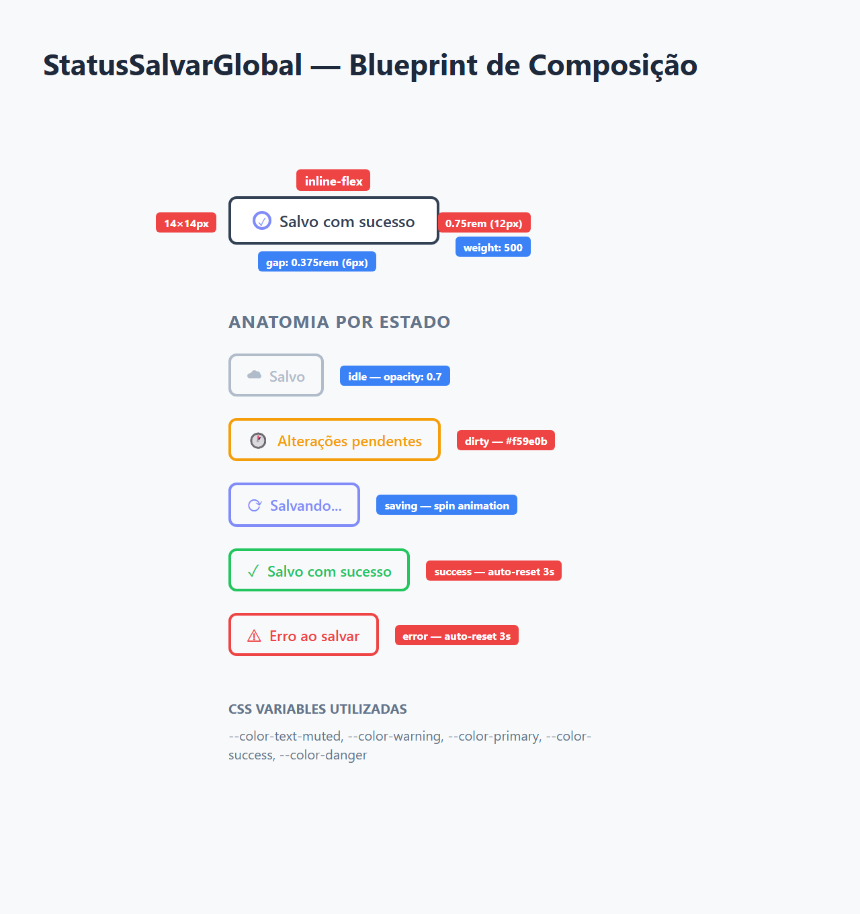
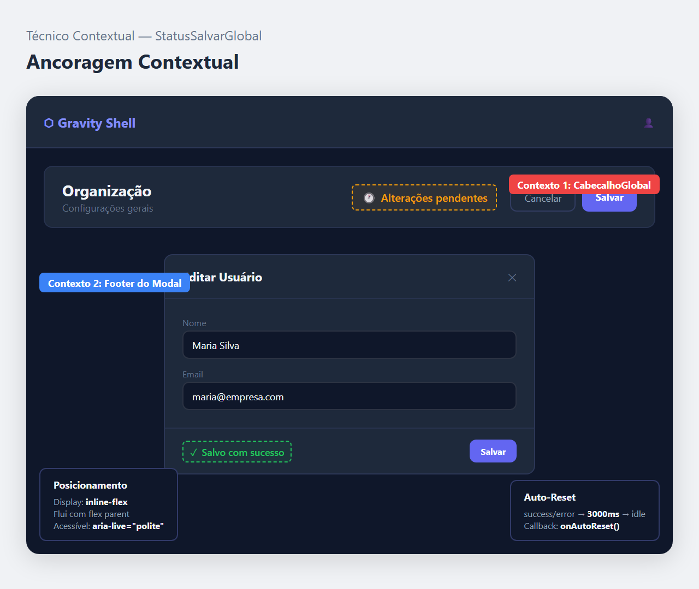

# Documentação Visual — StatusSalvarGlobal

Referência definitiva do indicador de status de salvamento (Padrão Workspace — Roxo).

## 1. Folha de Especificação Técnica de UX
Detalhamento de todos os 5 estados visuais: idle, dirty, saving, success e error — com ícones, cores e textos padrão.



---

## 2. Especificação de Composição
Blueprint técnico do componente inline com medidas, gaps, tamanhos de fonte e ícones.



---

## 3. Composição de Ancoragem Global
Blueprint de posicionamento do status dentro de barras de ação, cabeçalhos e modais.



| Regra de Ancoragem | Referência Técnica |
| :--- | :--- |
| **Display** | `inline-flex` — flui junto com outros elementos. |
| **Posição Típica** | Ao lado dos BotoesSalvarGlobal ou no CabecalhoGlobal. |
| **Auto-Reset** | Retorna a `idle` após **3000ms** (success/error). |
| **Hide on Idle** | Por padrão oculto quando `idle` (`hideOnIdle: true`). |
| **Acessibilidade** | `aria-live="polite"` + `role="status"`. |

---

## Exemplo de Uso (Código)

```tsx
import { StatusSalvarGlobal } from '@nucleo/feedback/status-salvar-global'

<StatusSalvarGlobal
  status={statusAtual}
  autoResetMs={3000}
  onAutoReset={() => setStatus('idle')}
/>
```
