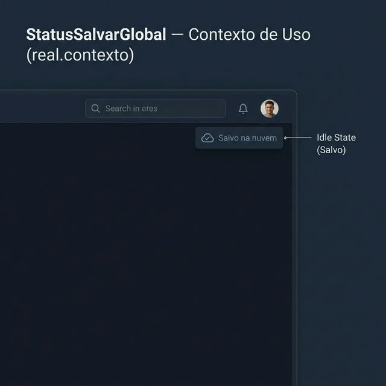
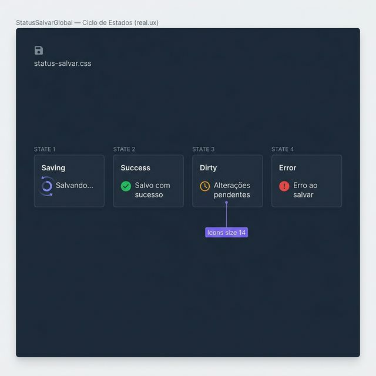
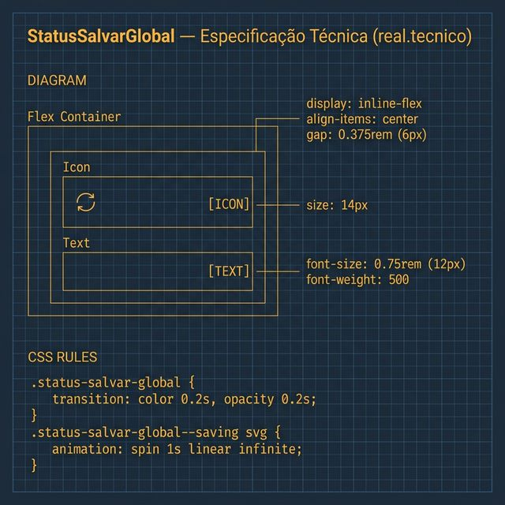

# Documentação Visual — StatusSalvarGlobal

Referência visual baseada 100% no código `StatusSalvarGlobal.tsx` + `status-salvar.css`.

---

## 1. Contexto de Uso

Exibição sutil do estado de sincronização com a na nuvem no cabeçalho ou rodapés de ação.
- **Estado Idle**: Mensagem "Salvo na nuvem" com opacidade `0.7`.

---

## 2. Ciclo de Estados (UX)

Feedback em tempo real das ações do usuário:
- **Saving**: Indigo `#818cf8` com animação de spin no ícone.
- **Success**: Verde `#22c55e` (sucesso imediato).
- **Dirty**: Amber `#f59e0b` indicando alterações pendentes.
- **Error**: Alerta vermelho `#ef4444`.

---

## 3. Especificação Técnica

Blueprint das medidas e animações:
- **Tipografia**: `0.75rem` (12px), `font-weight: 500`.
- **Ícones**: Size `14` Phosphor (duotone/fill).
- **Animação**: `spin 1s linear infinite`.
- **Gap**: `0.375rem` (6px).

