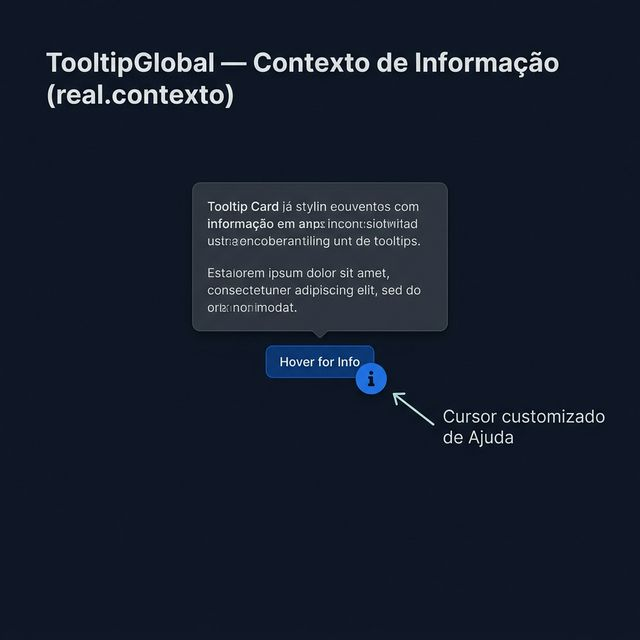
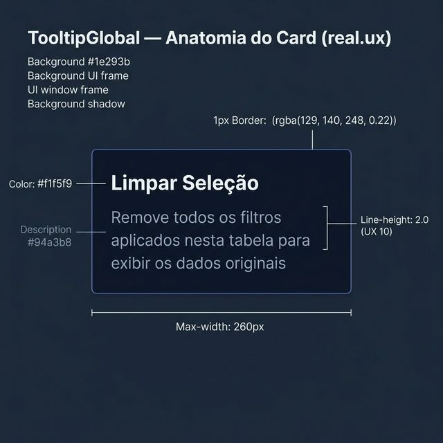
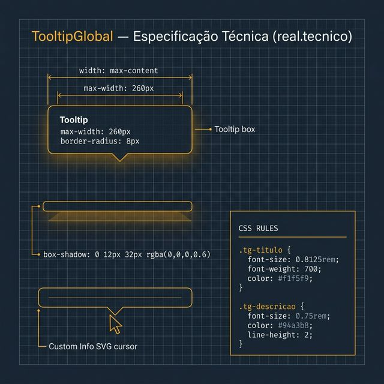

# Documentação Visual — TooltipGlobal

Referência visual baseada 100% no código `tooltip.tsx` + `tooltip.css`.

---

## 1. Contexto de Informação

Comportamento de descoberta UX via cursor customizado.
- **Cursor**: Ao passar o mouse em elementos com tooltip, o Gravity injeta um cursor SVG ('i') indicando ajuda disponível.
- **Posicionamento**: Portal fixo acima ou abaixo do elemento conforme o espaço.

---

## 2. Anatomia do Card (UX)

Estilo minimalista focado em leitura densa:
- **Max-Width**: Limitado a **260px**.
- **Line-height**: Altura de linha de **2.0** na descrição (UX 10) para máxima clareza.
- **Background**: Fundo escuro `#0f172a`.

---

## 3. Especificação Técnica

Blueprint das medidas do componente:
- **Bordas**: `1px solid rgba(129, 140, 248, 0.22)`.
- **Shadow**: `rgba(0, 0, 0, 0.6)` (profundo).
- **Tipografia**: Título 13px bold, Descrição 12px muted.

