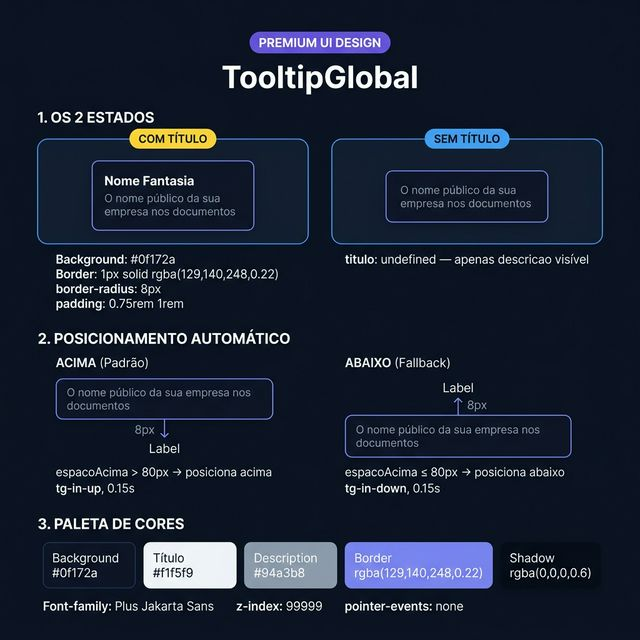
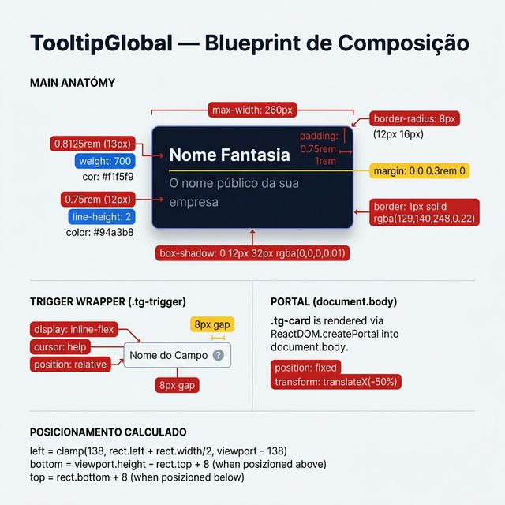
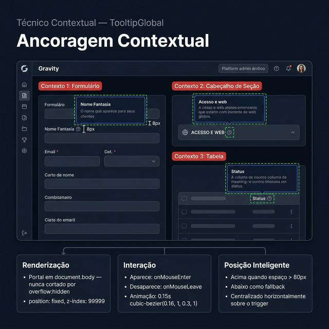

# Documentação Visual — TooltipGlobal

Tooltip unificada da plataforma Gravity — card minimalista renderizado via portal com posicionamento automático.

## 1. Folha de Especificação Técnica de UX
Estados visuais (com título / sem título), posicionamento automático (acima/abaixo) e paleta de cores do componente.



---

## 2. Especificação de Composição
Blueprint técnico com medidas do card (padding, max-width, border-radius, font-sizes), trigger wrapper e lógica de posicionamento via portal.



---

## 3. Composição de Ancoragem Global
Contextos reais de uso: labels de formulário, cabeçalhos de seção e colunas de tabela.



| Regra de Ancoragem | Referência Técnica |
| :--- | :--- |
| **Renderização** | `ReactDOM.createPortal` em `document.body` — nunca cortado por `overflow: hidden`. |
| **Posição (fixed)** | `position: fixed`, `z-index: 99999`, `pointer-events: none`. |
| **Posição Vertical** | Acima quando `espacoAcima > 80px`; abaixo como fallback. Gap de **8px**. |
| **Posição Horizontal** | Centralizado: `left = clamp(138, rect.center, viewport − 138)`. |
| **Animação** | `0.15s cubic-bezier(0.16, 1, 0.3, 1)` — `tg-in-up` (acima) ou `tg-in-down` (abaixo). |
| **Interação** | Aparece em `onMouseEnter`, desaparece em `onMouseLeave`. |

---

## Anatomia do Componente

| Área / Propriedade | Medida / Valor |
| :--- | :--- |
| **Card (`.tg-card`)** | `background: #0f172a`, `border: 1px solid rgba(129,140,248,0.22)`, `border-radius: 8px` |
| **Padding** | `0.75rem 1rem` (12px 16px) |
| **Max-width** | `260px` (`width: max-content`) |
| **Sombra** | `0 12px 32px rgba(0,0,0,0.6)` |
| **Título (`.tg-titulo`)** | `font-size: 0.8125rem (13px)`, `font-weight: 700`, `color: #f1f5f9`, `margin-bottom: 0.3rem` |
| **Descrição (`.tg-descricao`)** | `font-size: 0.75rem (12px)`, `color: #94a3b8`, `line-height: 2` |
| **Font-family** | `var(--font, 'Plus Jakarta Sans', sans-serif)` |
| **Trigger (`.tg-trigger`)** | `display: inline-flex`, `cursor: help` |

---

## Exemplo de Uso (Código)

```tsx
import { TooltipGlobal } from '@nucleo/tooltip-global'

<TooltipGlobal
  titulo="Nome Fantasia"
  descricao="O nome público da sua empresa nos documentos"
>
  <label>Nome Fantasia</label>
</TooltipGlobal>
```
