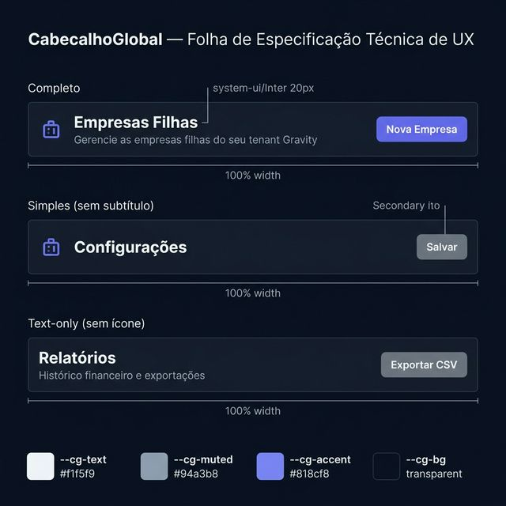
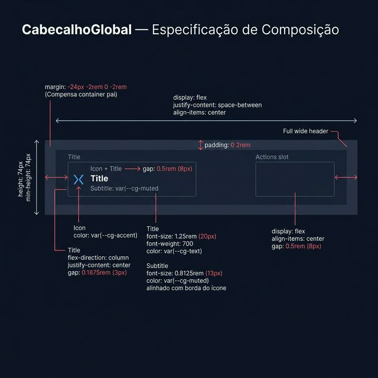
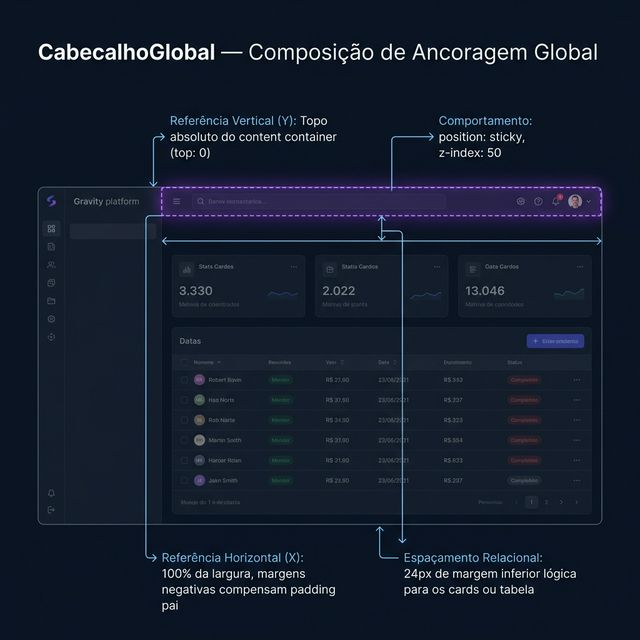

# Documentação Visual — CabecalhoGlobal

Cabeçalho padrão do Gravity Design System, responsável por introduzir a identidade e ações globais de uma página.

## 1. Folha de Especificação Técnica de UX
Demonstra as três variações principais: (1) Completo com ícone e subtítulo, (2) Simples com título e ícone, (3) Apenas texto.



---

## 2. Especificação de Composição
Anatomia detalhada apontando compensações de margem negativa e alinhamento do bloco esquerdo (título e subtítulo).



---

## 3. Composição de Ancoragem Global
Posicionamento sticky (`z-index: 50`) preso ao topo do container de conteúdo principal.



| Regra de Ancoragem | Referência Técnica |
| :--- | :--- |
| **Referência Vertical (Y)** | Prende ao topo lógico com `position: sticky; top: 0`. |
| **Referência Horizontal (X)** | Usa compensação `margin: -24px -2rem 0 -2rem` para anular o padding restritivo do pai (`ws-content`), ocupando 100% da visualização e mantendo `padding: 0 2rem` para alinhar com o conteúdo. |
| **Espaçamento Relacional** | O layout natural abaixo (ex: `StatCardGlobal` ou `TabelaGlobal`) herdará as margens definidas em `PaginaGlobal` (normalmente 24px de gap). |

---

## Anatomia do Componente

| Propriedade | Valor / Descrição |
| :--- | :--- |
| **Altura** | Fixa em `74px` (`min-height: 74px`). |
| **Borda / Sombra** | Apenas fundo liso transparente ou de superfície (`var(--cg-bg)` / `var(--ws-bg-body)`). |
| **Display Base** | `flex`, `justify-content: space-between`, `align-items: center`. |
| **Ícone** | ReactNode injetado colorizado com `var(--cg-accent)`. |
| **Título principal** | Tag `<h1>`, 1.25rem (20px), peso 700, cor `var(--cg-text)`. |
| **Subtítulo** | Tag `<p>`, 0.8125rem (13px), cor `var(--cg-muted)`. O padding mantém o subtítulo **alinhado perfeitamente sob o início do bloco ícone+título**, garantindo ritmo vertical (1.4 de entrelinha). |
| **Slot "Ações"** | Espaço de contenção à direita (`gap: 0.5rem`) reservado estritamente para CTAs primárias (ex: `BotaoNovoAdminGlobal` ou `BotaoGlobal`). |

---

## Exemplo de Uso (Código)

```tsx
import { CabecalhoGlobal } from '@nucleo/cabecalho-global'
import { BotaoGlobal } from '@nucleo/botoes/botao-global'
import { Buildings, Plus } from '@phosphor-icons/react'

<CabecalhoGlobal
  icone={<Buildings weight="duotone" size={22} />}
  titulo="Empresas Filhas"
  subtitulo="Gerencie as empresas filhas do seu tenant Gravity."
  acoes={
    <BotaoGlobal
      variante="primario"
      icone={<Plus weight="bold" size={14} />}
    >
      Nova Empresa
    </BotaoGlobal>
  }
/>
```
