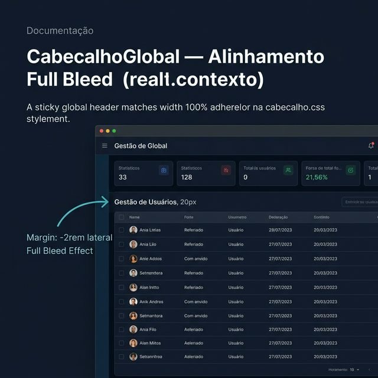
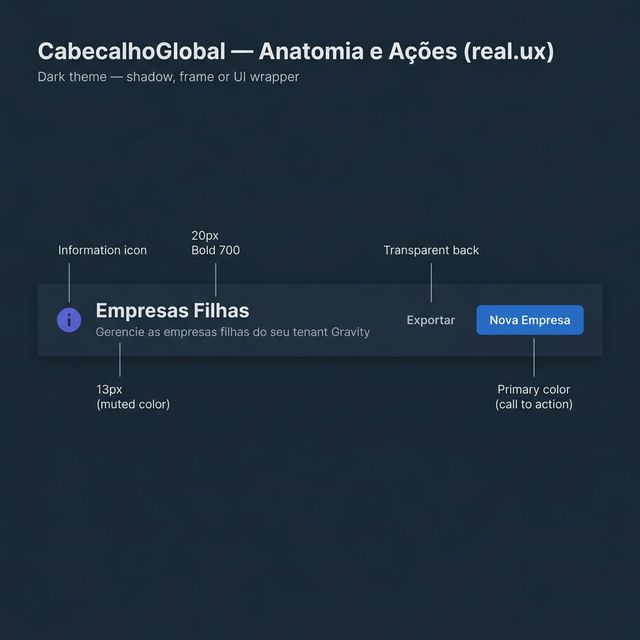
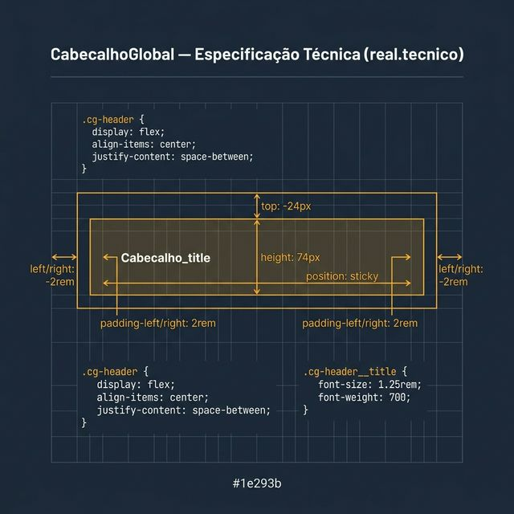

# Documentação Visual — CabecalhoGlobal

Referência visual baseada 100% no código `cabecalho.tsx` + `cabecalho.css`.

---

## 1. Alinhamento Full Bleed

Visualização do cabeçalho colado nas bordas laterais do conteúdo, com o título alinhado à tabela abaixo.
- **Margens**: Uso de margens negativas de `-2rem` laterais para o efeito full-bleed.
- **Ancoragem**: Sticky no topo da página.

---

## 2. Anatomia e Ações (UX)

Componentes fundamentais do cabeçalho:
- **Tipografia**: Título em **20px** (1.25rem) bold + Subtítulo em **13px** (0.8125rem).
- **Slot de Ações**: Flex container à direita com botões globais.

---

## 3. Especificação Técnica

Blueprint das medidas exatas:
- **Altura**: Cravada em **74px**.
- **Padding**: `Margin: -24px -2rem 0 -2rem`, `Padding: 0 2rem`.

