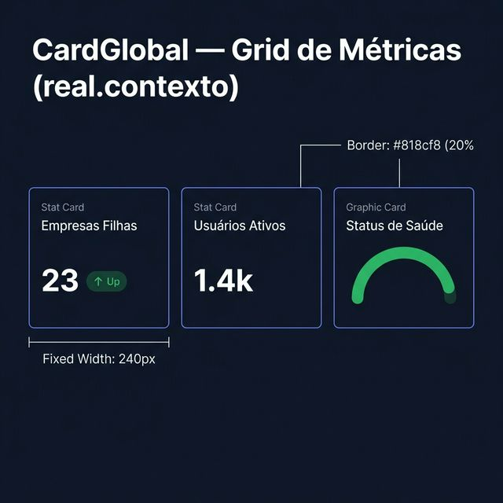
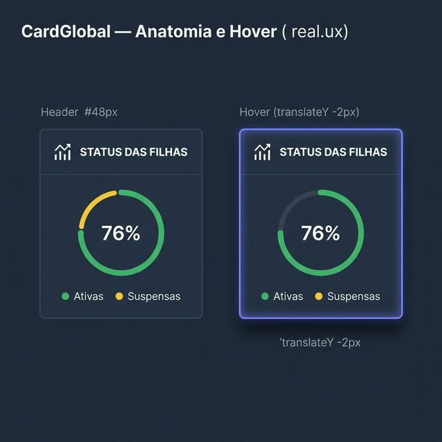
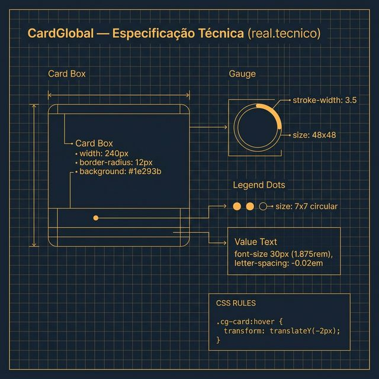

# Documentação Visual — CardGlobal

Referência visual baseada 100% no código `CardBasicoGlobal.tsx`, `CardGraficoGlobal.tsx` e `card.css`.

---

## 1. Grid de Métricas

Visualização dos cards organizados em um dashboard.
- **Dimensões**: Largura fixa de **240px**.
- **Fidelidade**: Borda Indigo 20% com fundo `#1e293b`.

---

## 2. Anatomia e Hover (UX)

Comportamento real dos componentes de card:
- **Métricas**: Valor de destaque em **30px** (`1.875rem`).
- **Anéis**: Gauge circular de 48px com preenchimento semântico.
- **Interação**: Efeito de elevação (`translateY -2px`) e borda realçada ao hover.

---

## 3. Especificação Técnica

Blueprint das medidas exatas:
- **Borda**: `12px` de radius.
- **Gauge**: `stroke-width: 3.5`.
- **Labels**: `12px` (0.75rem), uppercase com `0.06em` spacing.

