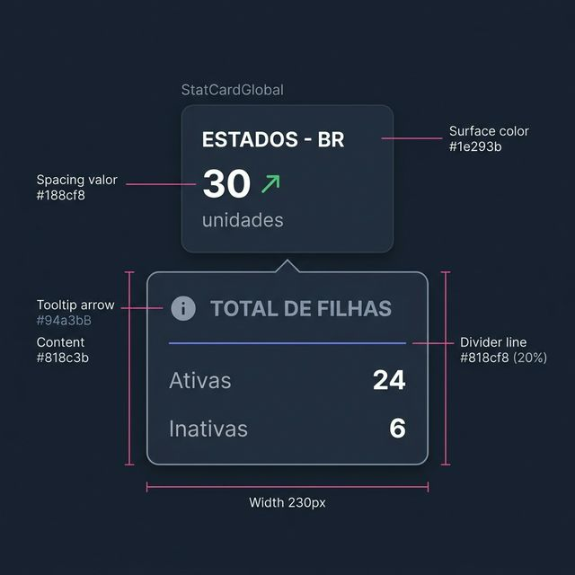
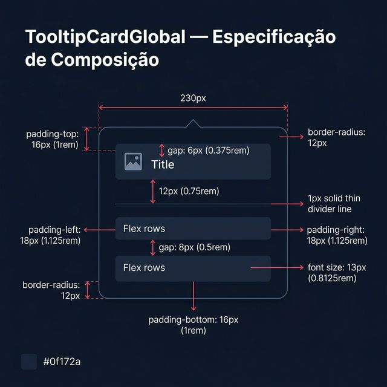
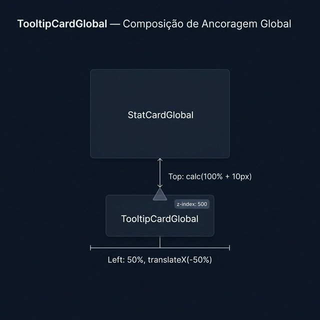

# Documentação Visual — TooltipStatCardGlobal

Sub-componente exclusivo (Compound Component) desenhado para ancoragem ao `StatCardGlobal`. Este balão exibe microdados correlacionados sem que a interface principal perca elegância e espaço.

## 1. Folha de Especificação Técnica de UX
Balão dark surface (230px de largura) que mimetiza o title e ícone do componente Pai (Card) e entrega data rows customizáveis. Funciona debaixo do motor de overlay/hover.



---

## 2. Especificação de Composição
Anatomia técnica do componente e suas linhas e espaçamentos.



| Elemento | Medida e Anatomia |
| :--- | :--- |
| **Largura Total (Box)** | Fixo `230px`, `padding: 1rem 1.125rem` |
| **Ponteiro Direcional (Seta)** | Criado via CSS `::after`, borda sólida transparente nas laterais e cor border na base. Fica 100% no `bottom` apontando para cima. |
| **Título Mimetizado** | Cor mutada (`--ws-muted`), font size `0.6875rem`, letter spacing de `0.06em` e fonte com peso `bold`. |
| **Divisor (Divider)** | Altura `1px`, cor baseada em variação de opacidade primária (`rgba`). |
| **Sombra/Glow Elevada** | `box-shadow: 0 16px 40px rgba(0, 0, 0, 0.55)` para garantir que salte da interface e crie a percepção de volume absoluto Z-index (500). |

---

## 3. Composição de Ancoragem Global
O componente está intimamente acoplado ao seu container pai (`StatCardGlobal`).



| Regra de Ancoragem | Referência Técnica |
| :--- | :--- |
| **Referência Vertical (Y)** | Abaixo do card via `top: calc(100% + 10px)` somado de overlay transitório de hover (`translateY-6px` a `0`). |
| **Referência Horizontal (X)** | Centralizado perfeitamente no meio do card (`left: 50%; transform: translateX(-50%)`). |

---

## Exemplo de Uso (Código Injetado)

No `nucleo-global/Layout/stat-card-global/src/stat-card.tsx`, este componente é chamado automaticamente quando o dev insere children propétrica dentro da chave de `tooltip`. O Payload é:

```tsx
<TooltipStatCardGlobal icone={iconeClonado} titulo={tituloClonado}>
  <div className="scg-tooltip__row">
    <span>Lojas Habilitadas</span>
    <strong>145</strong>
  </div>
  <div className="scg-tooltip__row">
    <span>Em Risco de Churn</span>
    <strong>2</strong>
  </div>
</TooltipStatCardGlobal>
```
