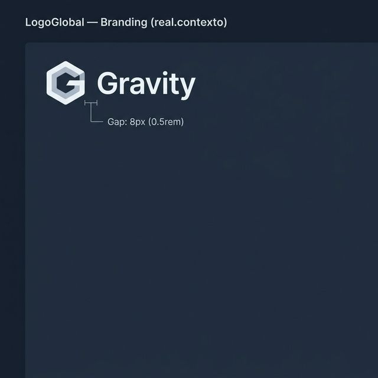
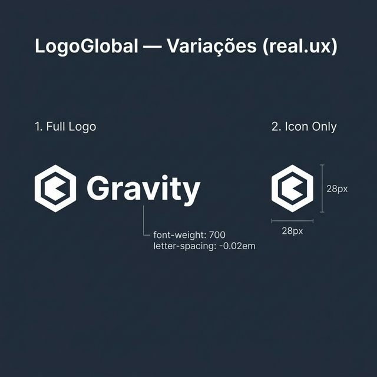
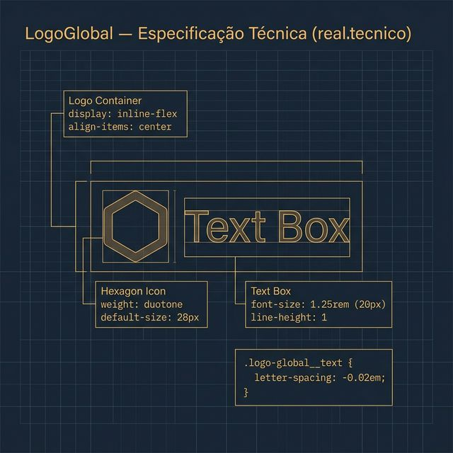

# Documentação Visual — LogoGlobal

Referência visual baseada 100% no código `logo-global.tsx` + `logo-global.css`.

---

## 1. Branding Integrado

Visualização do logo no contexto real de shell (geralmente menu lateral).
- **Fidelidade**: Espaçamento de **8px** (`0.5rem`) entre ícone e texto.
- **Ícone**: Hexágono em estilo duotone.

---

## 2. Variações UX

Aparência real dos modos de exibição:
- **Full View**: Exibe "Gravity" em bold 700.
- **Icon Only**: Recolhido para ícone de 28px.
- **Micro-ajuste**: Letter-spacing negativo de `-0.02em` para legibilidade premium.

---

## 3. Especificação Técnica

Blueprint das medidas do CSS:
- **Tipografia**: `font-size: 1.25rem` (20px).
- **Ícone**: Phosphor Hexagon, `weight: duotone`.

