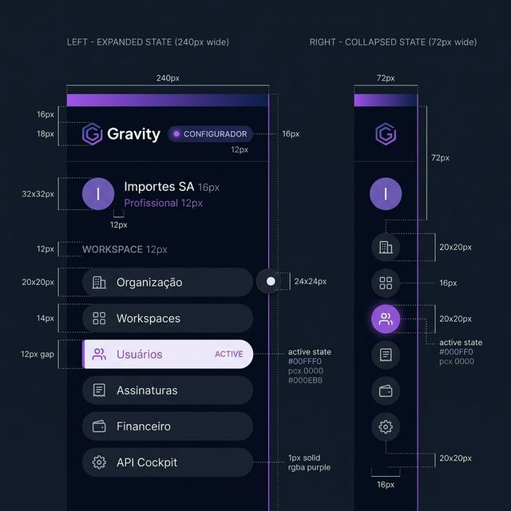
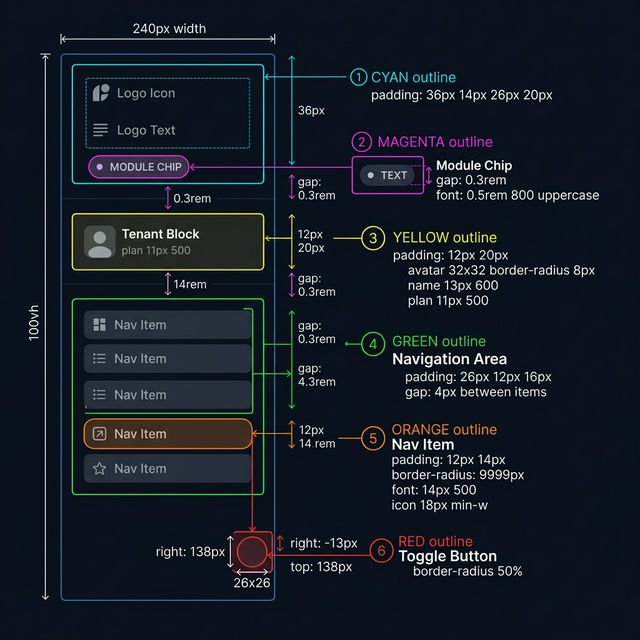
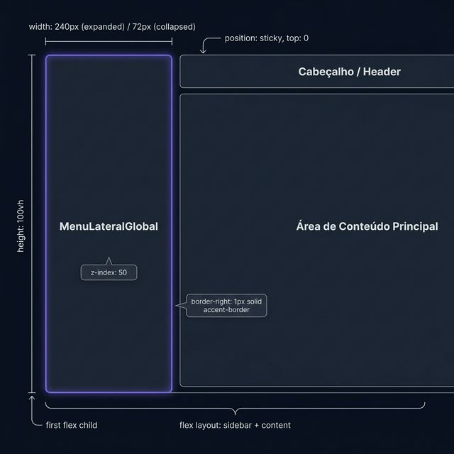

# Documentação Visual — MenuLateralGlobal

Componente de navegação primária (sidebar) do Gravity Design System, projetado para alocação no lado esquerdo da aplicação.

## 1. Folha de Especificação Técnica de UX
Layout de navegação mostrando os estados *Expandido* (240px) e *Recolhido* (72px).



---

## 2. Especificação de Composição
Anatomia técnica do componente, incluindo espaçamentos verticais, posicionamento do botão de alternância (toggle) e seções de informação de contexto.



---

## 3. Composição de Ancoragem Global
Posicionamento fixo lateral ocupando toda a altura da viewport da aplicação.



| Regra de Ancoragem | Referência Técnica |
| :--- | :--- |
| **Referência Vertical (Y)** | `top: 0`, estendendo-se por `height: 100vh` do viewport. |
| **Referência Horizontal (X)** | Posição fixa à esquerda do container flex principal. |
| **Largura (Expandido)** | `240px` (min-width: 240px). |
| **Largura (Recolhido)** | `72px` (min-width: 72px). |
| **Z-Index** | `50` para sobrepor conteúdos rolantes do corpo da página. |

---

## Anatomia do Componente

| Área | Medida / Comportamento Técnica |
| :--- | :--- |
| **Área do Logo** | Padding `36px 0.875rem 26px 1.25rem`, contém Hexágono Gravity + Chip do Módulo (ex: "CONFIGURADOR"). |
| **Bloco do Tenant** | Exibe Avatar Organizacional + Nome + Plano (fundo escurecido). No estado recolhido, centraliza o avatar. |
| **Navegação (Itens)** | Items `border-radius: 9999px` com ícone esquerdo. Item ativo usa `--mlg-accent` como cor de fundo translúcida e highlight visual (borda direita interna simulada com box-shadow). |
| **Botão Toggle** | Fixado visualmente entre o Bloco do Tenant e a Navegação (`right: -13px`, `top: 138px / 82px`). Recolhe/expande o menu com animação suave de 0.3s. |
| **Comportamento Scroll** | Barra de rolagem nativa ocultada (`::-webkit-scrollbar { width: 0px }`), preservando rolagem funcional sem poluição na interface. |

---

## Exemplo de Uso (Código)

```tsx
import { MenuLateralGlobal } from '@nucleo/menu-lateral-global'
import { Buildings, Users } from '@phosphor-icons/react'

const itensDeNavegacao = [
  { to: '/workspace/organizacao', label: 'Organização', icon: <Buildings size={18} /> },
  { to: '/workspace/usuarios', label: 'Usuários', icon: <Users size={18} /> }
]

<MenuLateralGlobal
  tenantName="Importes SA"
  tenantPlan="Profissional"
  navItems={itensDeNavegacao}
  moduleName="CONFIGURADOR"
  moduleColor="#818cf8"
  defaultCollapsed={false}
/>
```
