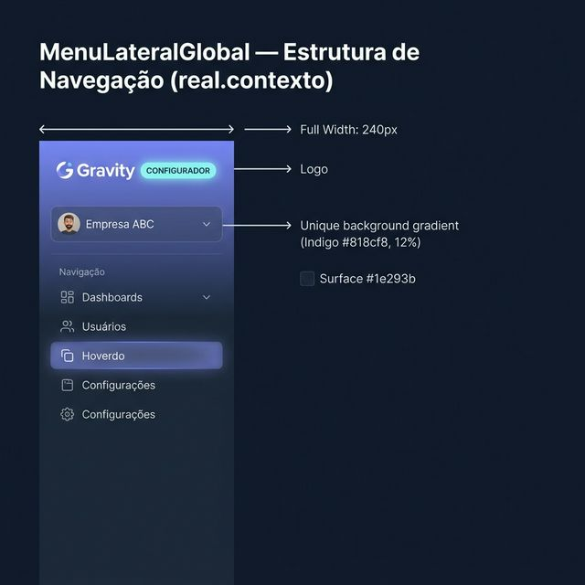
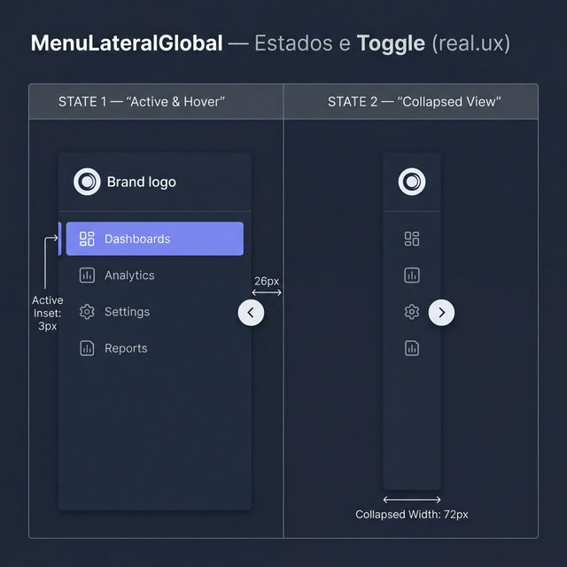
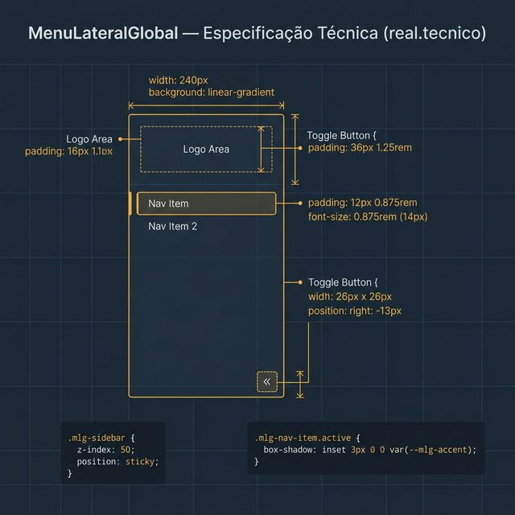

# Documentação Visual — MenuLateralGlobal

Referência visual baseada 100% no código `MenuLateralGlobal.tsx` + `menu-lateral.css`.

---

## 1. Estrutura de Navegação

Visualização do sidebar em sua largura padrão de 240px integrado ao resto do sistema.
- **Fidelidade**: Gradiente começando com a cor do módulo (ex: Indigo `#818cf8` com 12% alpha).
- **Hierarquia**: Logo > Tenant > Navigation.

---

## 2. Estados e Toggle (UX)

Aparência real das interações:
- **Collapsed View**: Largura reduzida para **72px**.
- **Item Ativo**: Fundo Indigo suave e a barra de **3px** à esquerda (`inset shadow`).
- **Toggle**: Botão flutuante de **26px** no limite do sidebar.

---

## 3. Especificação Técnica

Blueprint das medidas do CSS:
- **Largura**: 240px (fixo), 72px (col).
- **Nav Item**: Padding `12px 0.875rem`, `font-size: 0.875rem`.
- **Logo Area**: Padding `36px 1.25rem`.

