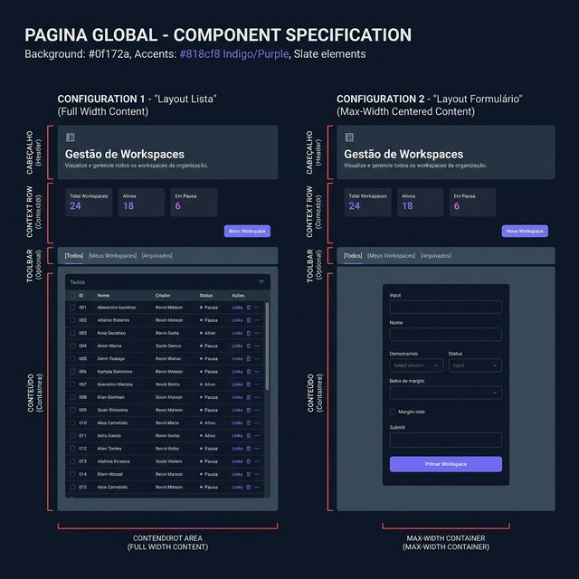
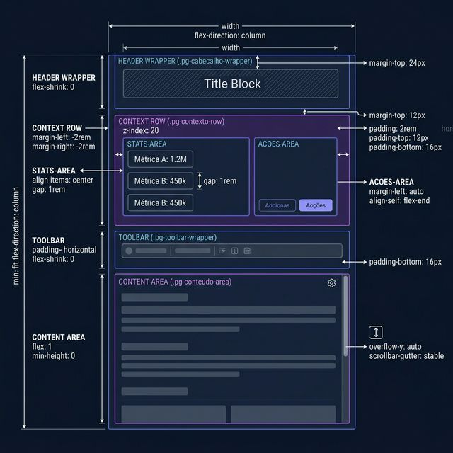
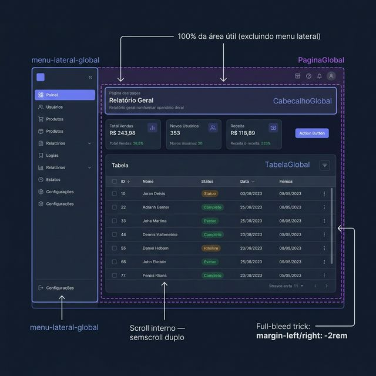

# Documentação Visual — PaginaGlobal

Container base arquitetural do Gravity Design System. Define o grid de topo a base, organizando cabeçalho, métricas, ações e conteúdo para garantir padronização, comportamentos de full-bleed e scroll isolado.

## 1. Folha de Especificação Técnica de UX
Layout flexível que suporta "lista" (ocupando 100% da largura, típico para Tabelas) e "formulario" (centralizado). A imagem demonstra as principais zonas do componente.



---

## 2. Especificação de Composição
Anatomia técnica de grid baseada em `flex-direction: column`. O componente abstrai comportamentos complexos como altura `100%` da página com scroll seguro.



---

## 3. Composição de Ancoragem Global
Posicionamento nativo. O `PaginaGlobal` assume e gerencia a área principal da interface excluindo apenas a barra lateral principal e o topo da janela caso seja global. 



| Regra de Ancoragem | Referência Técnica |
| :--- | :--- |
| **Referência Vertical (Y)** | Preenche nativamente os `100%` ou até onde as amarras do Layout pai permitirem com flex. |
| **Referência Horizontal (X)** | Preenche horizontalmente, controlando internamente o alinhamento. |
| **Overflow & Scroll** | O container restringe sua própria altura (`min-height: 0`) para injetar scroll **apenas** no bloco principal se necessário, não em toda a janela. |
| **Trick Full-Bleed** | Elementos como o container de stats assumem as margens laterais cancelando o gap do layout global de `2rem`. |

---

## Anatomia do Componente (Props e Slots)

| Propriedade / Slot | Valor / Descrição |
| :--- | :--- |
| **`cabecalho`** | Slot para `CabecalhoGlobal`. Fica fixado ou no fluxo base, mas sem scroll injetado. (`flex-shrink: 0`) |
| **`stats`** e **`acoes`** | Área para blocos informativos menores (stats) e botões globais de criar/exportar. Ambos habitam a `.pg-contexto-row` em row-reverse ao depender ou flex completo. |
| **`toolbar`** | Faixa persistente e sem height fluida para filtros tabulares ou switches. Fica entre as estatísticas e os children. |
| **`layout`** | `'lista'` *(Padrão, 100% da largura)* ou `'formulario'` *(Máx 800-1200px tipicamente formatação encurtada e espaçamento com padding-top ajustado internamente)*. |
| **`children`** | O principal ponto de ancoragem para as páginas. Pode conter dezenas de tabelas ou blocos. |

---

## Exemplo de Uso (Código)

```tsx
import { PaginaGlobal } from '@nucleo/pagina-global'
import { CabecalhoGlobal } from '@nucleo/cabecalho-global'
import { BotaoGlobal } from '@nucleo/botoes/botao-global'
import { Plus } from '@phosphor-icons/react'

export default function PaginaWorkspaces() {
  return (
    <PaginaGlobal
      layout="lista"
      cabecalho={
        <CabecalhoGlobal
          titulo="Gestão de Workspaces"
          subtitulo="Consulte ou adicione novos espaços de trabalho"
        />
      }
      stats={[<StatCard key="1" titulo="Total" valor="4" />]}
      acoes={
        <BotaoGlobal icone={<Plus size={14} weight="bold" />}>
          Novo Workspace
        </BotaoGlobal>
      }
    >
      <TabelaGlobal dados={[]} colunas={[]} />
    </PaginaGlobal>
  )
}
```
