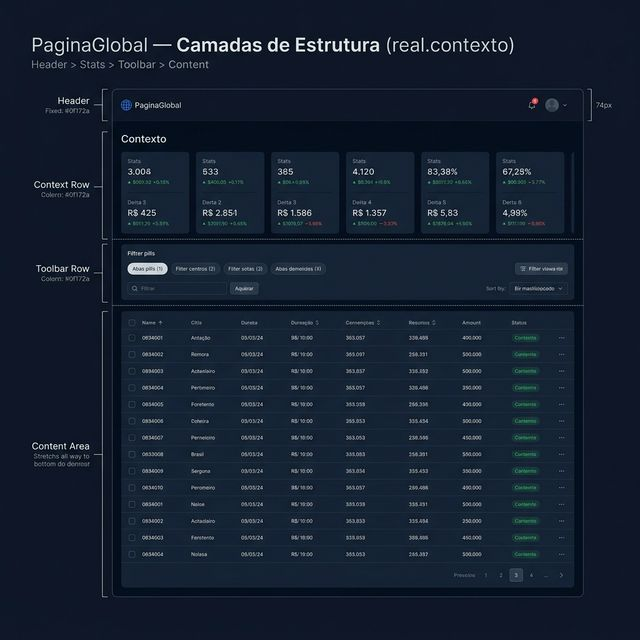
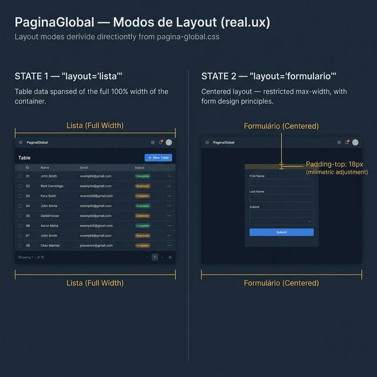
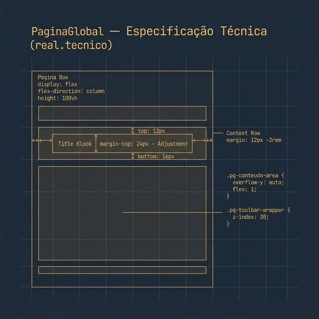

# Documentação Visual — PaginaGlobal

Referência visual baseada 100% no código `pagina-global.tsx` + `pagina-global.css`.

---

## 1. Camadas de Estrutura (Contexto)

Visualização da hierarquia de camadas da página:
1. **Header**: Área fixa do `CabecalhoGlobal`.
2. **Context Row**: Bloco de métricas e ações intermediárias.
3. **Toolbar**: Seção de filtros e abas.
4. **Content Area**: Container principal com scroll interno.

---

## 2. Modos de Layout (UX)

Diferenças entre casos de uso:
- **layout='lista'**: Ocupa 100% da largura, otimizado para tabelas.
- **layout='formulario'**: Centralizado com largura restringida e `padding-top: 18px` adicional.

---

## 3. Especificação Técnica

Blueprint das medidas estruturais:
- **Context Row**: `margin: 12px -2rem`, `padding: 12px 2rem 16px 2rem`.
- **Title Block**: Ajuste de **24px** de margem superior.
- **Main Area**: `overflow-y: auto`, `flex: 1`.

