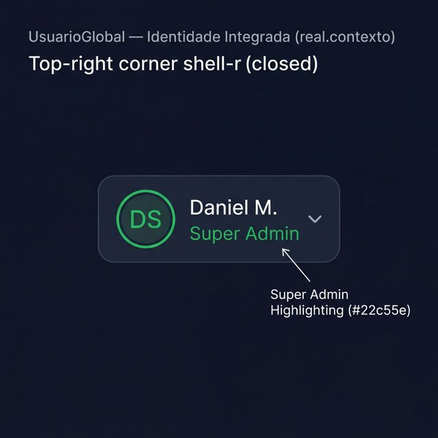
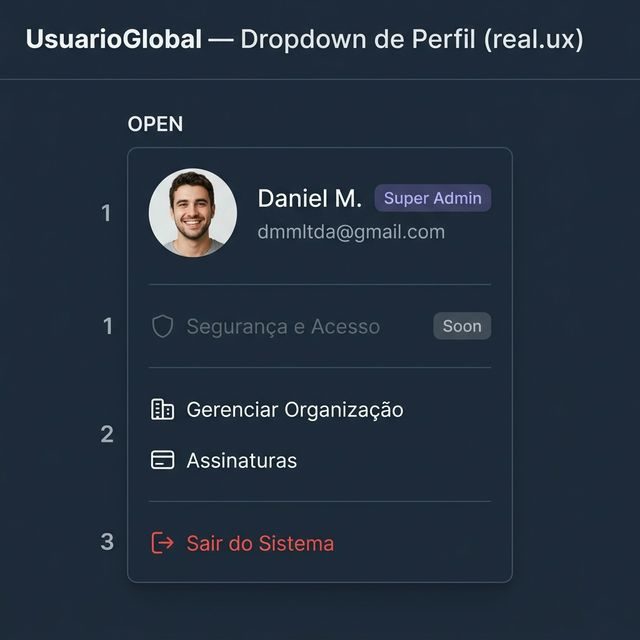
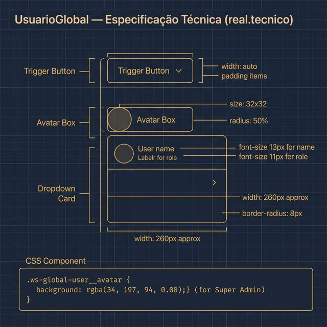

# Documentação Visual — UsuarioGlobal

Referência visual baseada 100% no código `UsuarioGlobal.tsx` e lógica de privilégios.

---

## 1. Identidade Integrada

Visualização do trigger de usuário no cabeçalho global.
- **Super Admin**: Destaque visual em **Verde Platinum** (`#22c55e`) para administradores de infraestrutura.
- **Avatar**: 32px com iniciais.

---

## 2. Dropdown de Perfil (UX)

Anatomia real do menu de preferências:
- **Hierarquia**: Cabeçalho com e-mail e badge de papel (Ex: Master).
- **Seções**: Grupos funcionais separados por divisores sutis.
- **Ações**: Cores semânticas (vermelho para Sair).

---

## 3. Especificação Técnica

Blueprint das medidas do sistema:
- **Shadow**: `box-shadow: 0 10px 25px` (profundo).
- **Tipografia**: Nome em 13px, Role em 11px.
- **Super Admin BG**: `rgba(34, 197, 94, 0.08)`.

