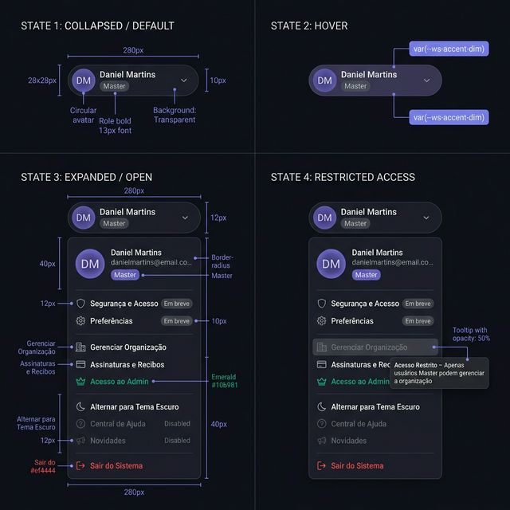
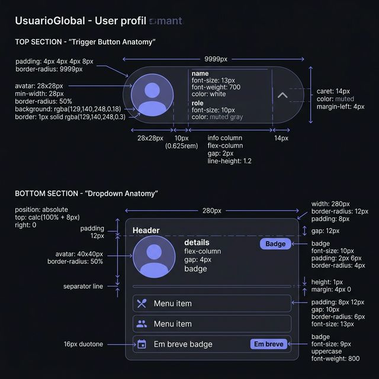
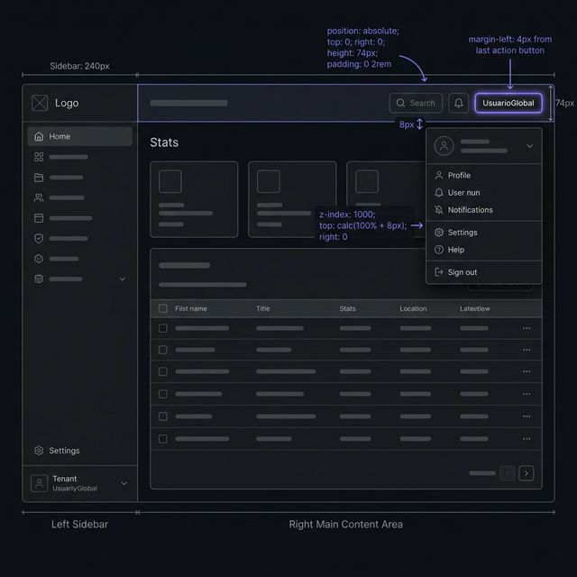

# Documentação Visual — UsuarioGlobal

Referência definitiva do menu de perfil de usuário (Padrão Workspace — Roxo).

## 1. Folha de Especificação Técnica de UX
Detalhamento de todos os estados do componente: botão compactado padrão e em hover, e a carta flutuante do dropdown com controle de acesso, perfis administrativos e variação visual ("Em breve", botões de perigo).



---

## 2. Especificação de Composição
Blueprint técnico do container `ws-global-user` tipo pill com gap de `10px`, medidas exatas para cada fonte e espaçamento no avatar de `28px`. Anatomia do `ws-profile-dropdown` (`280px` width) definindo os padding internos e separadores de bloco do menu 10-UX.



---

## 3. Composição de Ancoragem Global
Blueprint de posicionamento do componente dentro da barra de ações globais superior da interface.



| Regra de Ancoragem | Referência Técnica |
| :--- | :--- |
| **Referência Vertical (Y)** | Alinhado no topo (`top: 0`), margens zeradas, com `height: 74px`. |
| **Referência Horizontal (X)** | Em `position: absolute` encostado na direita (`right: 0`), posicionado dentro de `ws-global-actions`. |
| **Z-Index do Dropdown** | `z-index: 1000` para sempre sobrepor as tabelas e headers abaixo. |
| **Top do Dropdown** | `top: calc(100% + 8px)` calculado dinamicamente em relação ao botão-gatilho de avatar que controla seu estado (flutuação de **8px**). |

---

## Exemplo de Uso (Código)

```tsx
import { UsuarioGlobal } from '@nucleo/layout/usuario-global'

<UsuarioGlobal
  userName="Daniel Martins"
  userEmail="daniel@gravity.com"
  userInitials="DM"
  userRole="Master"
  isLight={isLightMode}
  onToggleTheme={() => setLightMode(!isLightMode)}
  onNavigateOrganizacao={() => navigate('/workspace/dados')}
  onNavigateAssinaturas={() => navigate('/workspace/planos')}
  onSignOut={() => auth.signOut()}
  isAdmin={usuario.possuiCargoAdmin}
  onNavigateAdmin={() => window.location.assign('/admin/dashboard')}
/>
```
