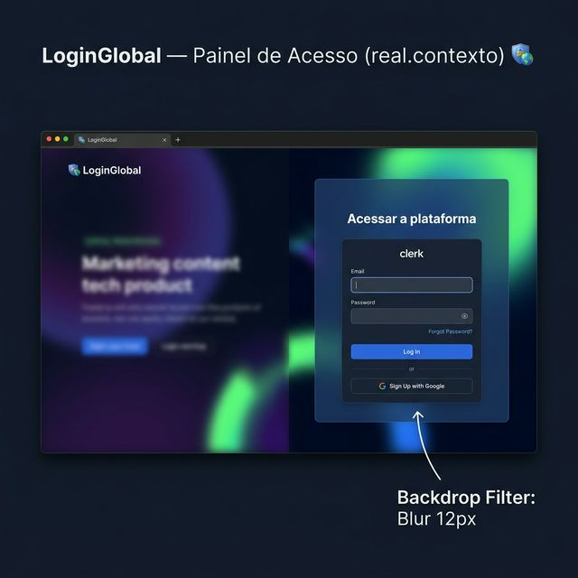
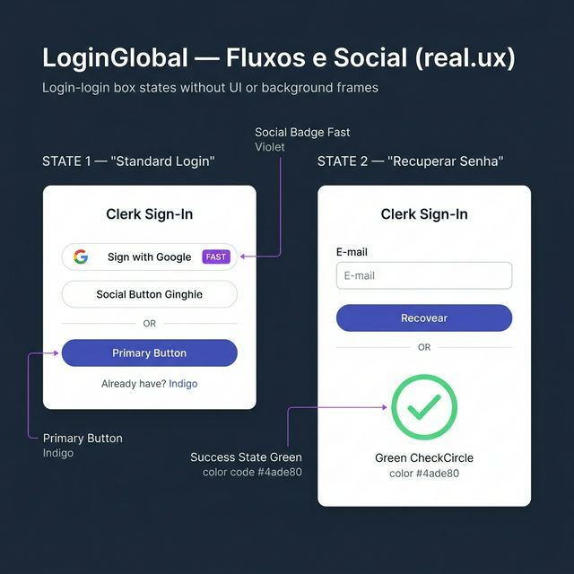
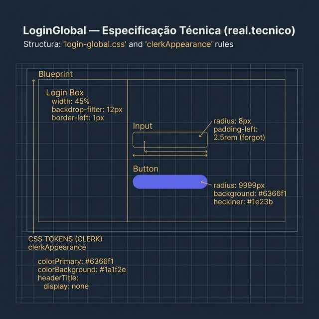

# Documentação Visual — LoginGlobal

Referência visual baseada 100% no código `LoginGlobal.tsx` + `login-global.css` + Integração Clerk.

---

## 1. Painel de Acesso (Contexto)

Visualização da tela de autenticação da plataforma.
- **Estrutura**: Painel lateral ocupando **45%** da largura total.
- **Fidelidade**: Fundo translúcido com `backdrop-filter: blur(12px)` e borda Indigo de apenas 8% de opacidade.

---

## 2. Fluxos e Social (UX)

Comportamento real dos logins Clerk Custom:
- **Botões Sociais**: Background `#2d3548`, borda realçada e o badge **FAST** em Violeta (`#7c3aed`) destacando a integração rápida.
- **Botão Primário**: Estilo pílula (`9999px`) em Indigo `#6366f1` com sombra suave.
- **Recuperar Senha**: Fluxo customizado com ícones Phosphor e estado de sucesso em Green `#4ade80`.

---

## 3. Especificação Técnica

Blueprint das medidas e tokens do sistema:
- **Card Clerk**: Shadow profundo `0 32px 64px` e borda de vidro (`1px solid rgba(255, 255, 255, 0.18)`).
- **Tipografia**: Título em **22px** (1.375rem) com peso 800 e spacing de `-0.02em`.
- **Inputs**: Radius de **8px**, fundo `#0f172a`.

