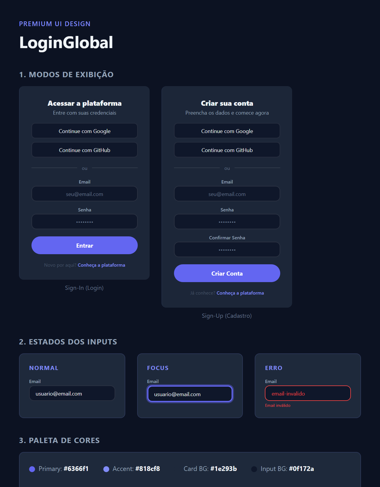
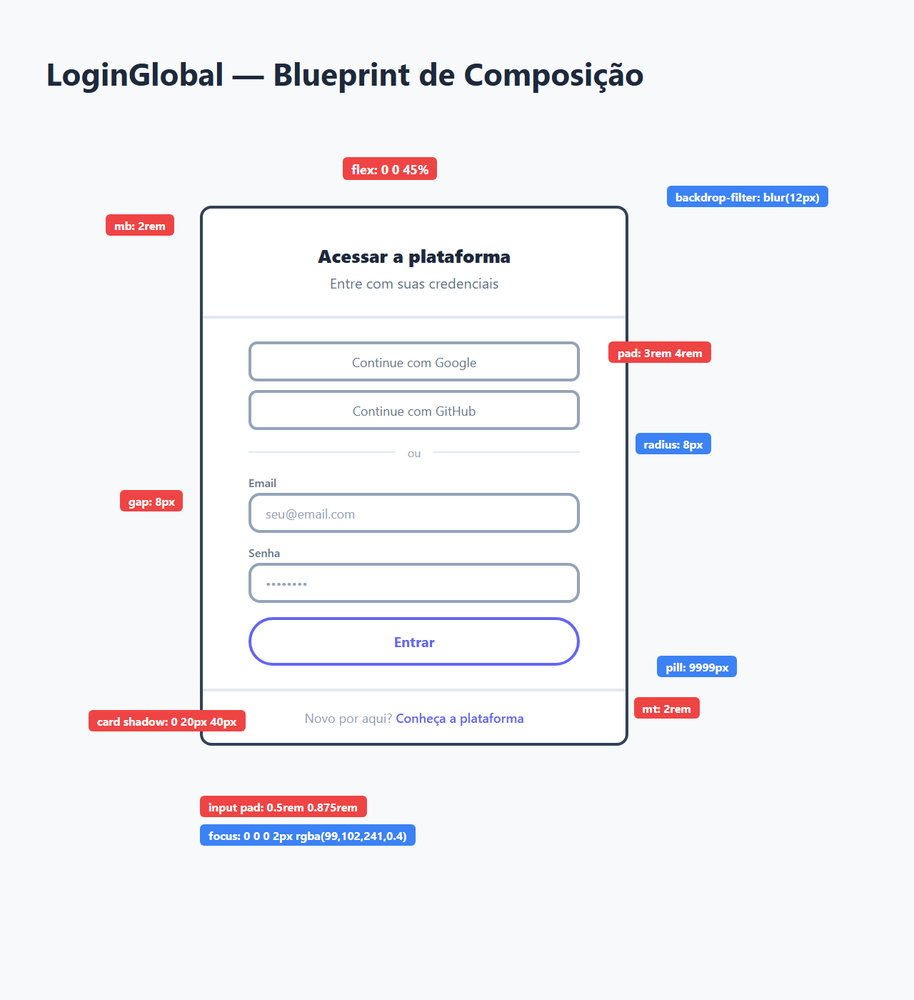
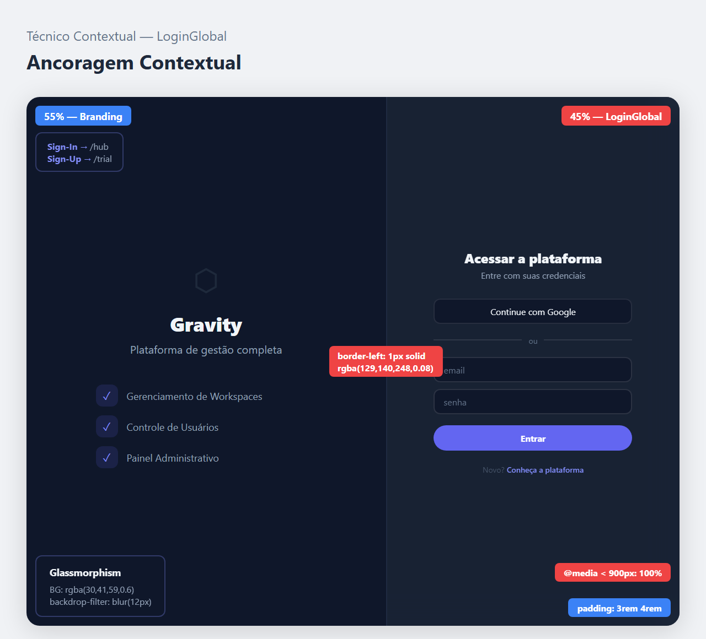

# Documentação Visual — LoginGlobal

Referência definitiva do painel de autenticação principal (Padrão Gravity — Indigo/Slate).

## 1. Folha de Especificação Técnica de UX
Detalhamento de estados visuais, cores e variações do painel de login: Sign-In, Sign-Up, estados dos inputs e botões Clerk.



---

## 2. Especificação de Composição
Blueprint técnico do painel com medidas, paddings, hierarquia de seções (Header → Clerk Card → Footer) e breakpoints responsivos.



---

## 3. Composição de Ancoragem Global
Blueprint de posicionamento do painel de login dentro da AuthPage (layout 55/45 split).



| Regra de Ancoragem | Referência Técnica |
| :--- | :--- |
| **Largura do Painel** | Fixo em **45%** do viewport (flex: 0 0 45%). |
| **Padding Interno** | **3rem 4rem** (48px × 64px). |
| **Borda Esquerda** | Separador `1px solid rgba(129, 140, 248, 0.08)`. |
| **Background** | Glassmorphism: `rgba(30, 41, 59, 0.6)` + `backdrop-filter: blur(12px)`. |
| **Breakpoint Mobile** | < **900px**: width 100%, padding 2rem 1.5rem, borda superior. |

---

## Exemplo de Uso (Código)

```tsx
import { LoginGlobal } from '@nucleo/login/login-global'

// Dentro de uma rota com react-router-dom e ClerkProvider
<Route path="/sign-in/*" element={<LoginGlobal />} />
<Route path="/sign-up/*" element={<LoginGlobal />} />
```
