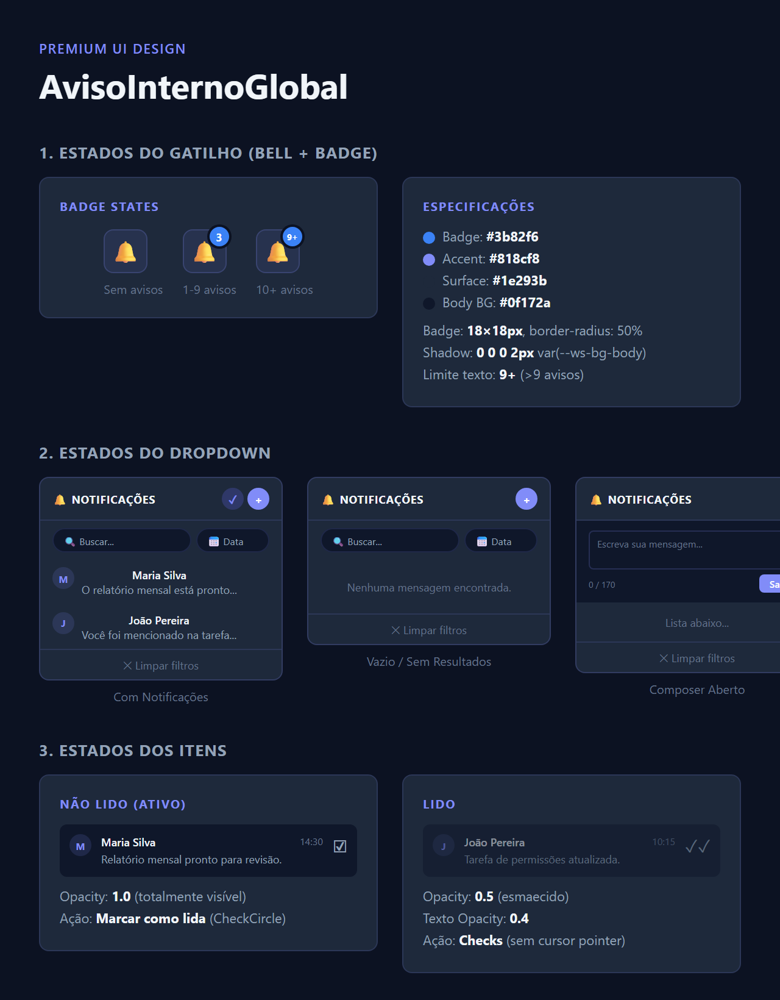
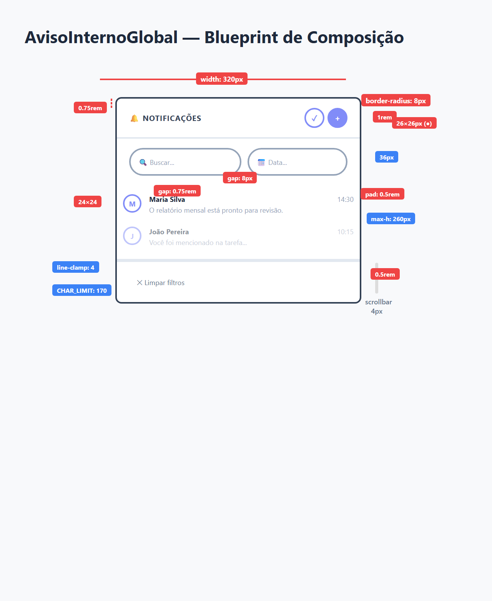
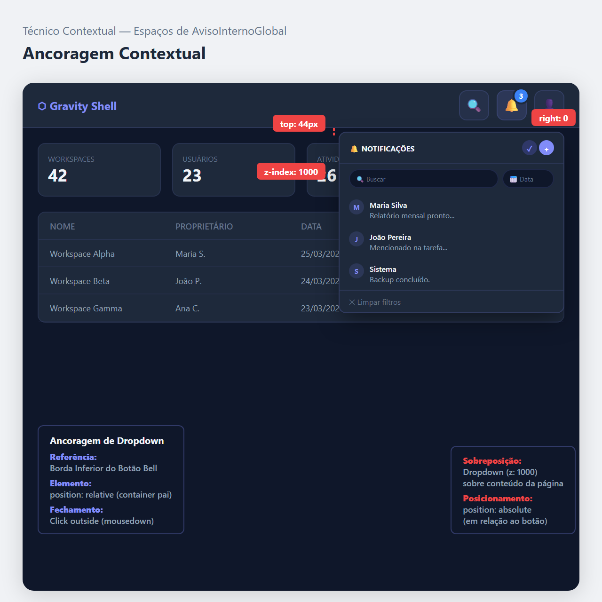

# Documentação Visual — MensageriaGlobal

Referência definitiva do painel de mensageria e notificações internas (Padrão Workspace — Roxo).

## 1. Folha de Especificação Técnica de UX
Detalhamento de estados, cores e anatomia do dropdown de notificações: badge, header, composer, lista e footer.



---

## 2. Especificação de Composição
Blueprint técnico do popover com medidas, gaps internos, hierarquia de seções e overflow da lista.



---

## 3. Composição de Ancoragem Global
Blueprint de posicionamento do dropdown em relação ao botão-gatilho (Bell) no Cabeçalho.



| Regra de Ancoragem | Referência Técnica |
| :--- | :--- |
| **Ponto Base (Y)** | Abaixo do botão-gatilho, a **44px** do topo do ícone Bell. |
| **Ponto Terminal (X)** | Alinhado à direita (`right: 0`) do contêiner relativo. |
| **Largura Fixa** | Dropdown sempre **320px** de largura. |
| **Altura Máxima da Lista** | Área de scroll com `max-height: 260px`. |
| **Z-Index** | Camada **1000** para sobrepor conteúdo da página. |

---

## Exemplo de Uso (Código)

```tsx
import { AvisoInternoGlobal } from '@nucleo/mensageria-global'

<AvisoInternoGlobal
  avisos={listaDeAvisos}
  onBuscar={handleBuscar}
  onMarcarLido={handleMarcarLido}
  onMarcarTodosLidos={handleMarcarTodos}
  onCriarAviso={handleCriarAviso}
  onFechar={handleFechar}
/>
```
