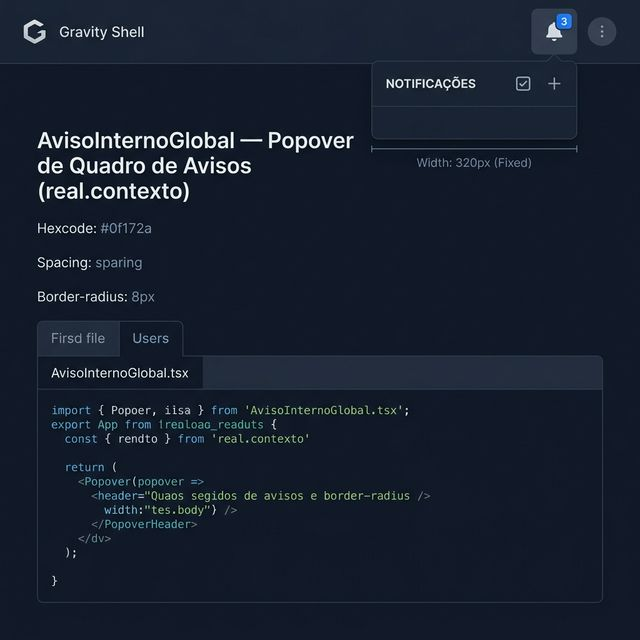
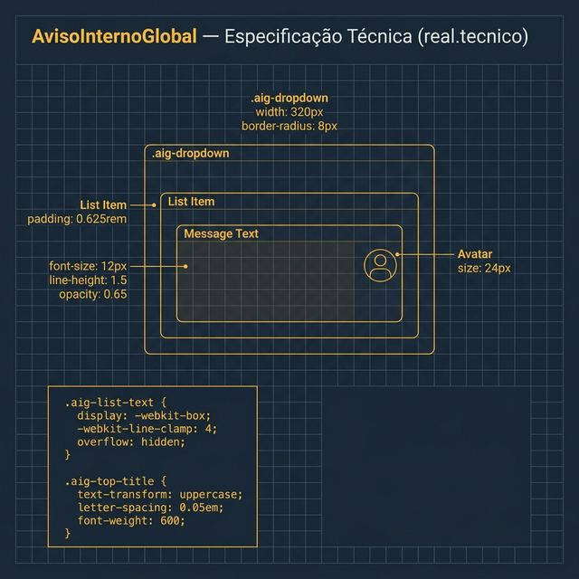

# Documentação Visual — AvisoInternoGlobal

Referência visual baseada 100% no código `AvisoInternoGlobal.tsx` + `aviso-interno.css`.

---

## 1. Popover de Quadro de Avisos

Visualização do dropdown denso de notificações disparado pelo Header.
- **Dimensões**: Largura fixa de **320px**.
- **Ancoragem**: Direita superior (Global Actions).

---

## 2. Densidade e Interações (UX)

Comportamento da lista de mensagens:
- **Hierarquia**: Avatares de 24px com iniciais. Author em 12px bold.
- **Mensagem**: Texto em 12px com opacidade `0.65`.
- **Clamping**: Limite de **4 linhas** por prévia de mensagem antes do corte.
- **Composer**: Área de criação de avisos com limite de 170 caracteres.

---

## 3. Especificação Técnica

Blueprint das medidas do CSS:
- **Popover**: `border-radius: 8px`, `box-shadow` profundo.
- **Tipografia**: Título do header em Uppercase com `0.05em` spacing.
- **Mensagens**: `line-height: 1.5` para legibilidade em blocos de texto.

