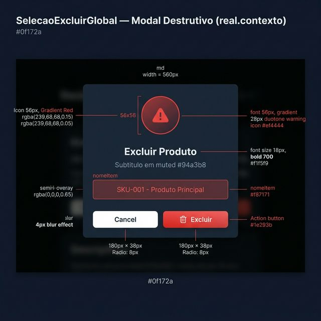
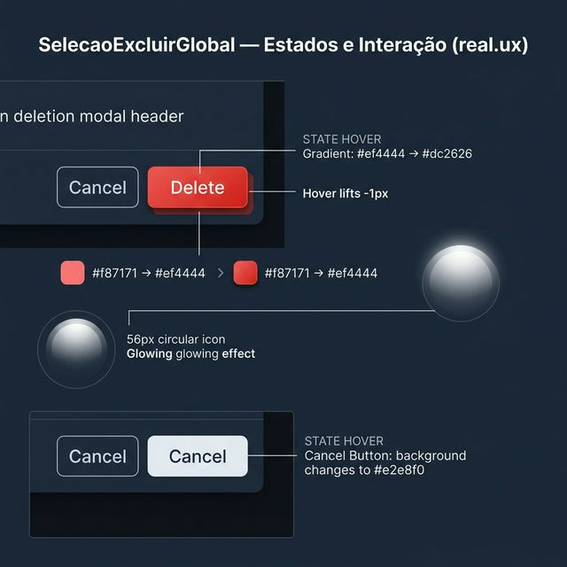
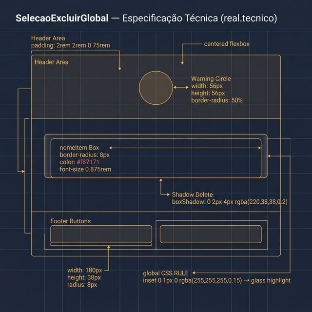

# Documentação Visual — SelecaoExcluirGlobal

Referência visual baseada 100% no código `selecao-excluir.tsx`.

---

## 1. Modal Destrutivo (Contexto)

Confirmação visual de exclusão com hierarquia clara e prevenção de erros.
- **Ícone**: Círculo de 56px com gradiente vermelho e ícone `Warning` (28px duotone) em #ef4444.
- **Layout**: Totalmente centralizado (coluna flexível).

---

## 2. Estados e Interação (UX)

Comportamento real dos botões de ação:
- **Botão Excluir**: Gradiente `#ef4444 → #dc2626`, eleva `-1px` no hover. Ícone `Trash`.
- **Botão Cancelar**: Fundo branco `#f8fafc`, escurece para `#e2e8f0` no hover.
- **nomeItem**: Caixa vermelha translúcida com radius 8px quando definido.

---

## 3. Especificação Técnica

Blueprint das medidas exatas:
- **Ícone**: `56×56px`, `border-radius: 50%`, glass highlight (`inset 0 1px 0 rgba(255,255,255,0.15)`).
- **Botões Footer**: `width: 180px`, `height: 38px`, `radius: 8px`, centralizados.

