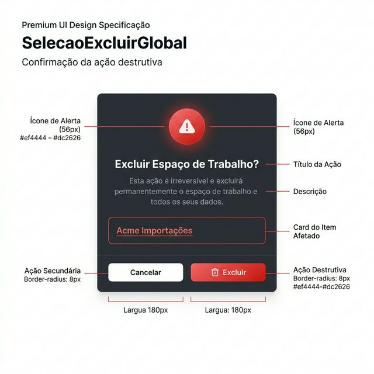
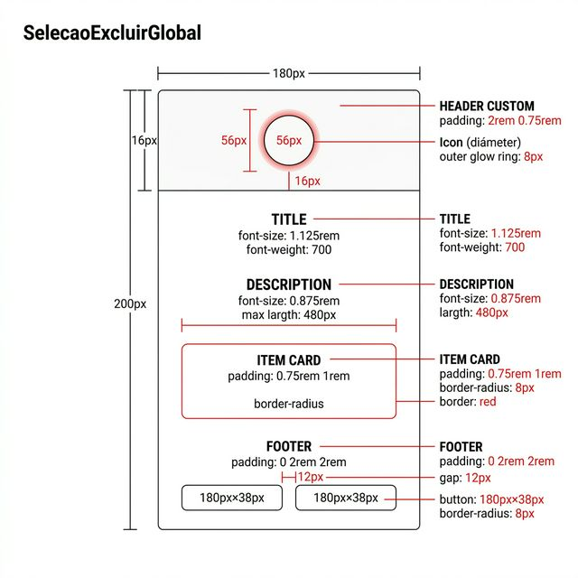
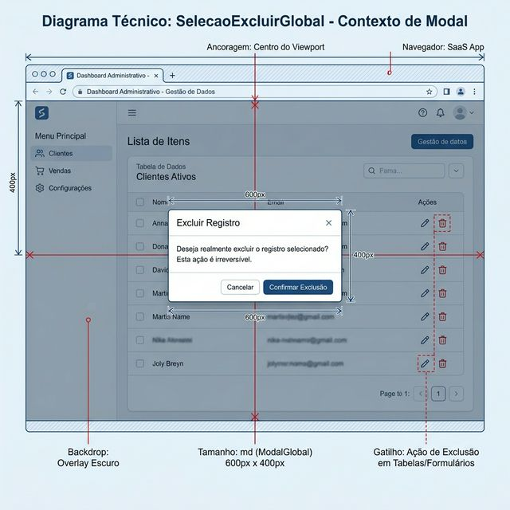

# Documentação Visual — SelecaoExcluirGlobal

Modal de confirmação de ações destrutivas (Exclusão) do Gravity Design System.

## 1. Folha de Especificação Técnica de UX
Layout do modal centralizado: ícone de alerta, título, descrição, card do item afetado e botões de ação.



---

## 2. Especificação de Composição
Anatomia técnica do modal de exclusão com medidas, gradientes e dimensões dos botões.



---

## 3. Composição de Ancoragem Global
Posicionamento de sobreposição central com backdrop escuro.



| Regra de Ancoragem | Referência Técnica |
| :--- | :--- |
| **Referência Vertical (Y)** | Centro do viewport do navegador. |
| **Referência Horizontal (X)** | Centro do viewport do navegador. |
| **Tamanho** | `md` (herança do ModalGlobal). |
| **Gatilho** | Ações de exclusão em tabelas, formulários ou cards. |

---

## Anatomia do Componente

| Área | Medida / Valor |
| :--- | :--- |
| **Ícone de Alerta** | Círculo de **56px**, gradiente vermelho `rgba(239,68,68,0.15)`, anel externo de 8px |
| **Título** | `font-size: 1.125rem`, `font-weight: 700`, cor primária |
| **Descrição** | `font-size: 0.875rem`, cor secundária, `max-width: 480px` |
| **Card do Item** | `padding: 0.75rem 1rem`, `border-radius: 8px`, borda vermelha `rgba(239,68,68,0.2)` |
| **Botão Cancelar** | `180px × 38px`, fundo `#f8fafc`, `border-radius: 8px` |
| **Botão Excluir** | `180px × 38px`, gradiente `#ef4444 → #dc2626`, ícone Trash 16px, borda `#b91c1c` |
| **Footer** | `padding: 0 2rem 2rem`, `gap: 12px`, alinhamento centralizado |

---

## Exemplo de Uso (Código)

```tsx
import { SelecaoExcluirGlobal } from '@nucleo/campo-selecao-excluir-global'

<SelecaoExcluirGlobal
  aberto={confirmarExclusao}
  titulo="Excluir Espaço de Trabalho?"
  descricao="Esta ação é irreversível. Todos os dados serão permanentemente removidos."
  nomeItem="Acme Importações"
  aoConfirmar={handleExcluir}
  aoCancelar={() => setConfirmarExclusao(false)}
/>
```
