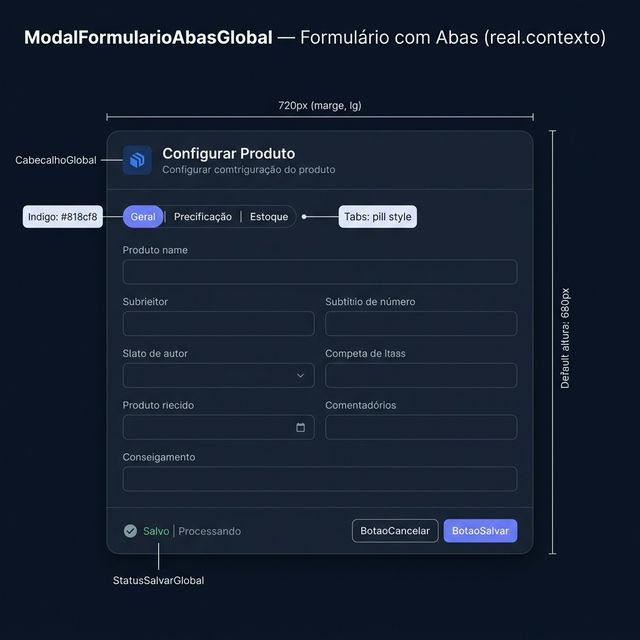
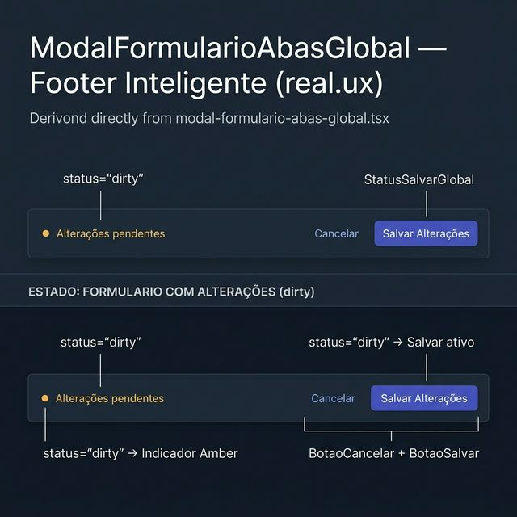
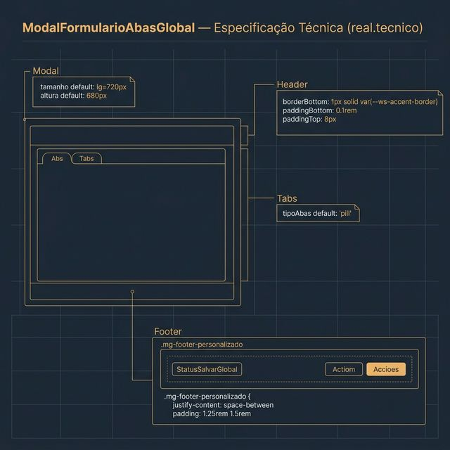

# Documentação Visual — ModalFormularioAbasGlobal

Referência visual baseada 100% no código `modal-formulario-abas-global.tsx`.

---

## 1. Formulário com Abas (Contexto)

Modal de edição rico com navegação por abas.
- **Dimensões Default**: `tamanho=lg (720px)`, `altura=680px`.
- **Header**: Usa `CabecalhoGlobal` com borda inferior e padding mínimo.

---

## 2. Footer Inteligente (UX)

Integração com o estado de edição do formulário:
- **Esquerda**: `StatusSalvarGlobal` em modo `dirty` (Amber) quando há alterações.
- **Direita**: `BotaoCancelar` + `BotaoSalvar` (Indigo ativo apenas se `dirty && podesSalvar`).

---

## 3. Especificação Técnica

Blueprint das medidas:
- **Abas**: `tipoAbas: 'pill'` por padrão.
- **Footer**: `.mg-footer-personalizado { justify-content: space-between; padding: 1.25rem 1.5rem; }`.

