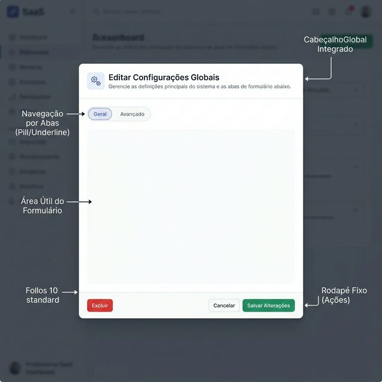
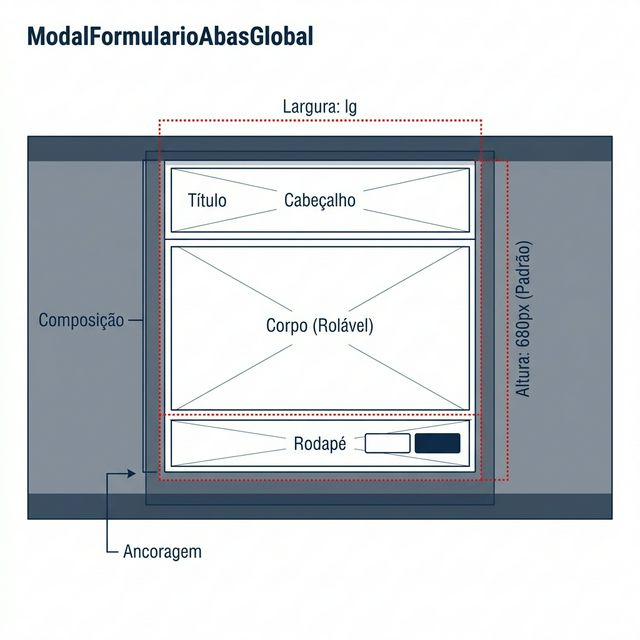

# Documentação Visual — ModalFormularioAbasGlobal

Este é o **Modal Principal Definitivo** do Gravity Design System. Ele consolida o padrão "UX 10" para todos os modais de criação/edição pesada do sistema.

## 1. Estrutura e Composição (Visual)



---

## 2. Blueprint de Layout (Specs)



| Propriedade | Valor Padrão / Referência |
| :--- | :--- |
| **Ancoragem (Contexto)** | Centralizado na tela sob um *backdrop* obscuro. |
| **Tamanho (Largura)** | Padrão `lg`. Variável via prop `tamanho` ("sm", "md", "lg", "xl", "full"). |
| **Altura** | Padrão `680px`. Fixo para garantir que o rodapé nunca saia da tela, forçando scroll interno no conteúdo. |
| **Composição Completa** | Cabeçalho (Fixo) + Abas (Fixas) + Corpo (Scroll) + Rodapé (Fixo). |

---

## Notas de Comportamento (UX/Interação)

- **Scroll Interno Protegido:** O design deste modal garante que o botão de "Salvar" no rodapé esteja **sempre visível**, independente do tamanho do formulário. Apenas o espaço entre as abas e o rodapé sofre rolagem (scroll).
- **Rodapé Inteligente:** O rodapé embute nativamente o componente de persistência (`StatusSalvarGlobal`).
- **Botão Excluir:** Se a propriedade `aoExcluir` for passada, um botão vermelho "Excluir" aparecerá automaticamente ancorado na **extrema esquerda** do rodapé, isolado dos botões de ação positiva (Salvar/Cancelar) que ficam na direita.

---

## Exemplo de Uso (Código)

### Modal Básico com Abas

```tsx
import { ModalFormularioAbasGlobal } from '@nucleo/modais/modal-formulario-abas-global'
import { HardDrives } from '@phosphor-icons/react'
import { useState } from 'react'

export function GestaoProdutoModal() {
  const [aberto, setAberto] = useState(false);

  const abasProduto = [
    {
      id: 'geral',
      rotulo: 'Informações Básicas',
      conteudo: <FormularioBasicoProjeto />
    },
    {
      id: 'avancado',
      rotulo: 'Configurações Avançadas',
      conteudo: <FormularioAvancadoProjeto />
    }
  ];

  return (
    <ModalFormularioAbasGlobal
      aberto={aberto}
      aoFechar={() => setAberto(false)}
      titulo="Novo Produto"
      subtitulo="Preencha os dados do produto que será vendido."
      icone={<HardDrives size={24} />}
      abas={abasProduto}
      textoSalvar="Criar Produto"
    />
  )
}
```

---

> [!CAUTION]
> **Descontinuação (Deprecation):** Não crie novos modais usando os antigos componentes `modal-global` genéricos ou `modal-sem-sessoes-global`. **Todos** os fluxos de criação no sistema devem migrar para o `ModalFormularioAbasGlobal`. Se seu modal não tiver abas, passe apenas um item no array `abas` com o rótulo "Geral".
