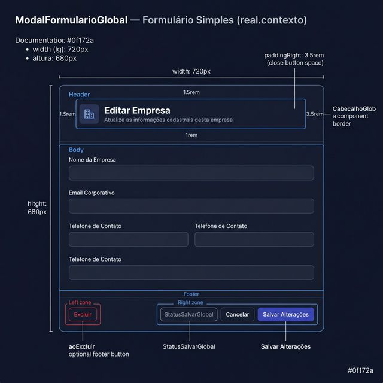
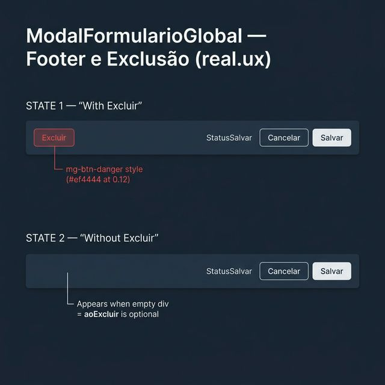
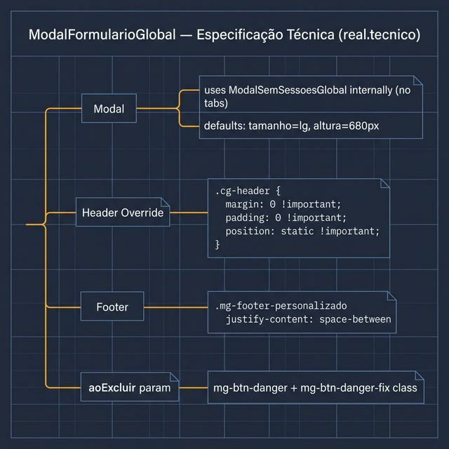

# Documentação Visual — ModalFormularioGlobal

Referência visual baseada 100% no código `modal-formulario-global.tsx`.

---

## 1. Formulário Simples (Contexto)

Modal de edição sem abas. Usa `ModalSemSessoesGlobal` internamente.
- **Header**: `CabecalhoGlobal` com margens zeradas via `!important` (adaptado para dentro do modal).
- **Padding**: `1.5rem` topo e lados, `3.5rem` à direita (espaço para o botão fechar).

---

## 2. Footer e Exclusão (UX)

Duas configurações possíveis do footer:
- **Com `aoExcluir`**: Botão destrutivo à esquerda + botões padrão à direita.
- **Sem `aoExcluir`**: Div vazio à esquerda (espaço preservado), botões à direita.

---

## 3. Especificação Técnica

Blueprint:
- **Override de CSS**: `.cg-header { margin: 0 !important; position: static !important; }`.
- **Botão Excluir**: `.mg-btn-danger` + `.mg-btn-danger-fix` para uniformidade de altura.

