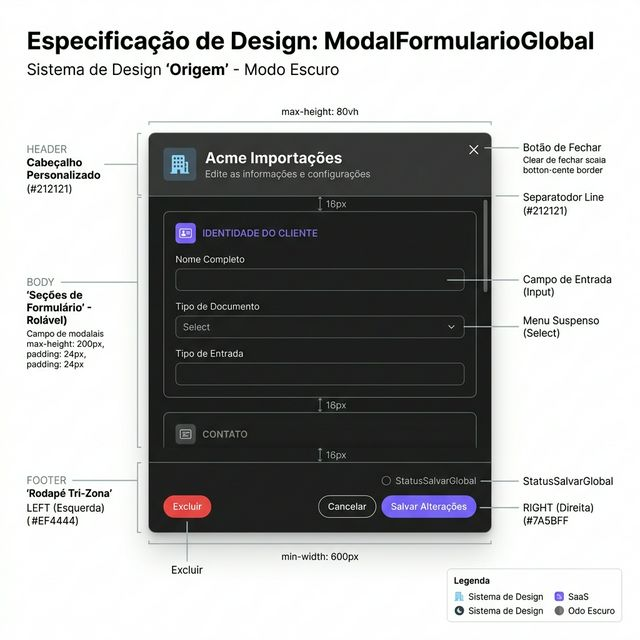
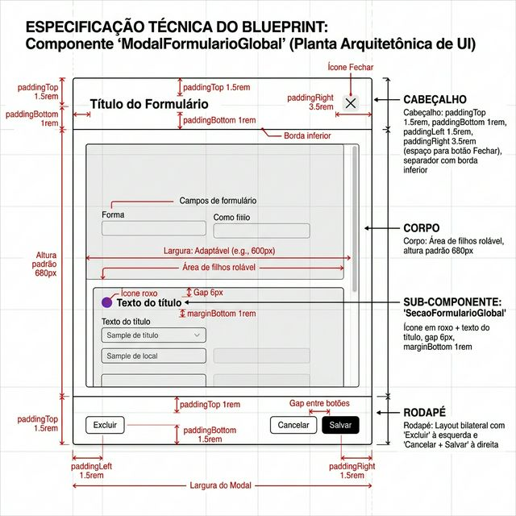
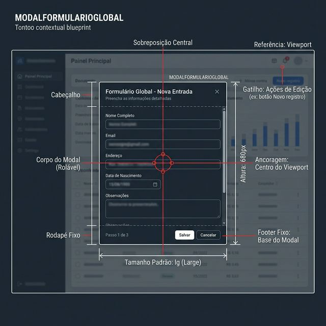

# Documentação Visual — ModalFormularioGlobal

Modal padrão de formulário (sem abas) do Gravity Design System.

## 1. Folha de Especificação Técnica de UX
Layout do modal com cabeçalho personalizado, corpo rolável com seções e rodapé tri-zona.



---

## 2. Especificação de Composição
Anatomia técnica do modal: padding do cabeçalho, altura padrão, footer bilateral e sub-componente SecaoFormularioGlobal.



---

## 3. Composição de Ancoragem Global
Posicionamento de sobreposição central com backdrop escuro.



| Regra de Ancoragem | Referência Técnica |
| :--- | :--- |
| **Referência Vertical (Y)** | Centro do viewport do navegador. |
| **Referência Horizontal (X)** | Centro do viewport do navegador. |
| **Tamanho Padrão** | `lg` (configurável: sm, md, lg, xl, full). |
| **Altura Padrão** | `680px` (configurável via prop `altura`). |

---

## Anatomia do Componente

| Área | Medida / Valor |
| :--- | :--- |
| **Cabeçalho** | `padding: 1.5rem 3.5rem 1rem 1.5rem`, `border-bottom: 1px solid var(--ws-accent-border)` |
| **Ícone + Título** | Via `CabecalhoGlobal` embutido (margens neutralizadas) |
| **Corpo (Body)** | Área rolável com children, `margin-bottom: 1.5rem` do cabeçalho |
| **Rodapé (Footer)** | Layout bilateral: Excluir (esquerda, opcional) vs Cancelar + Salvar (direita) |
| **StatusSalvarGlobal** | Indicador de estado dirty/idle entre os controles do rodapé |

---

## Sub-componente: SecaoFormularioGlobal

| Propriedade | Valor |
| :--- | :--- |
| **Classe CSS** | `ws-section-title` |
| **Layout** | Flex horizontal: ícone (cor `var(--ws-accent)`) + título, `gap: 6px` |
| **Margem Inferior** | `1rem` (configurável via `marginBottom`) |
| **Tooltip** | Opcional via `TooltipGlobal` sobre o título |

---

## Exemplo de Uso (Código)

```tsx
import { ModalFormularioGlobal, SecaoFormularioGlobal } from '@nucleo/modal-formulario-global'
import { Buildings, Globe } from '@phosphor-icons/react'

<ModalFormularioGlobal
  aberto={editarAberto}
  aoFechar={() => setEditarAberto(false)}
  aoSalvar={handleSalvar}
  aoExcluir={handleExcluir}
  icone={<Buildings size={20} />}
  titulo="Acme Importações"
  subtitulo="Edite as informações e configurações"
  dirty={formDirty}
  podesSalvar={formValido}
>
  <SecaoFormularioGlobal icone={<Globe size={14} />} titulo="ACESSO E WEB" />
  {/* Campos do formulário... */}
</ModalFormularioGlobal>
```
