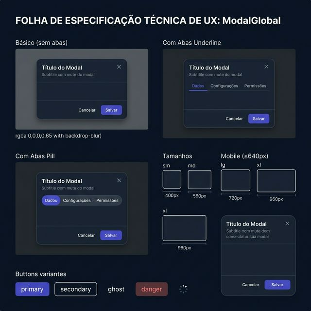
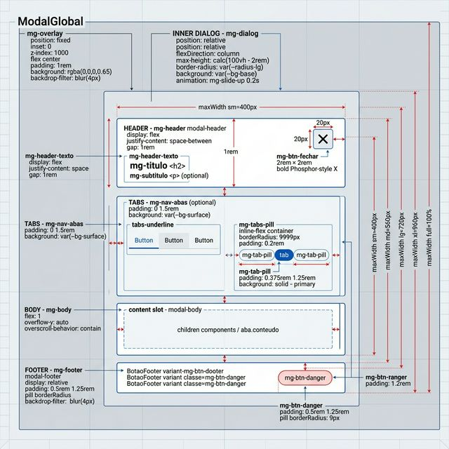
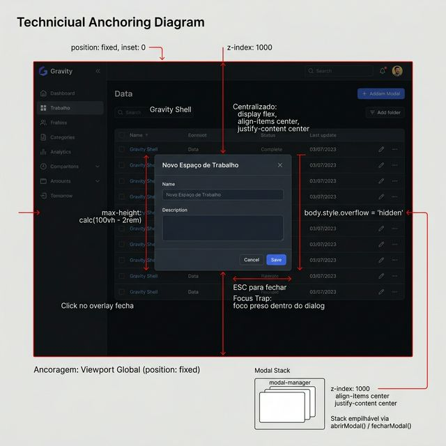

# Documentação Visual — ModalGlobal

Modal-base do Gravity Design System com overlay, header, abas (underline/pill), body scrollável, footer com botões, stack empilhável via modal-manager e responsividade mobile (bottom-sheet).

## 1. Folha de Especificação Técnica de UX
Configurações do componente: básico (sem abas), com abas underline, com abas pill, tamanhos (sm/md/lg/xl/full), mobile bottom-sheet e variantes de botão no footer.



---

## 2. Especificação de Composição
Anatomia técnica: overlay fixed → dialog flex-column (header → abas opcionais → body scrollável → footer) com slots de conteúdo e suporte a cabecalho personalizado.



---

## 3. Composição de Ancoragem Global
Posicionamento global sobre o viewport inteiro via `position: fixed`. Suporte a stack empilhável via `modal-manager` (pub-sub puro, sem context).



| Regra de Ancoragem | Referência Técnica |
| :--- | :--- |
| **Referência Vertical (Y)** | Centralizado verticalmente no viewport (`align-items: center`). |
| **Referência Horizontal (X)** | Centralizado horizontalmente (`justify-content: center`). |
| **Overlay** | `position: fixed`, `inset: 0`, `z-index: 1000`, `backdrop-filter: blur(4px)`. |
| **Max Height** | `calc(100vh - 2rem)` — garante margem mínima de `1rem` em todas as direções. |
| **Mobile (≤640px)** | Bottom-sheet: `align-items: flex-end`, `border-radius` só no topo, desliza de baixo. |

---

## Anatomia do Componente

| Propriedade | Valor / Descrição |
| :--- | :--- |
| **Overlay** | `.mg-overlay` — `position: fixed`, `inset: 0`, `z-index: 1000`, background `rgba(0,0,0,0.65)`, `backdrop-filter: blur(4px)` |
| **Dialog** | `.mg-dialog` — `flexDirection: column`, `background: var(--bg-base)`, `border-radius: var(--radius-lg)`, animação `mg-slide-up 0.2s` |
| **Tamanhos** | `sm: 400px` · `md: 560px` (padrão) · `lg: 720px` · `xl: 960px` · `full: 100%` |
| **Altura** | Dinâmica (fit-content) por padrão; fixa via prop `altura` (ex: `'680px'`) |
| **Header** | `.mg-header` — flex row, título `h2` + subtítulo opcional + botão X (`2rem × 2rem`, ícone `X` Phosphor bold 20px) |
| **Cabecalho Custom** | Prop `cabecalhoPersonalizado` substitui o header inteiro (mantém botão X se `semFechar=false`) |
| **Abas Underline** | `.tabs-underline` + `.tab-underline` — estilo padrão com indicador de linha ativa |
| **Abas Pill** | `.mg-tabs-pill` — inline-flex, `borderRadius: 9999px`, ativa com `var(--color-primary)` e texto escuro |
| **Body** | `.mg-body` — `flex: 1`, `overflow-y: auto`, `overscroll-behavior: contain` |
| **Footer** | `.mg-footer` — suporte a array de `botoes` (primary/secondary/ghost/danger) ou `renderizarFooter()` customizado |
| **Botão Danger** | `.mg-btn-danger` — fundo `rgba(239,68,68,0.12)`, cor `var(--danger)`, borda vermelha sutil |
| **Loading** | `.mg-btn-loading` — spinner CSS animado (`mg-spin 0.6s`), `pointer-events: none` |
| **Fechar** | ESC (desativável), click no overlay (desativável), botão X (ocultável via `semFechar`) |
| **Scroll Lock** | `body.style.overflow = 'hidden'` enquanto modal está aberto |
| **Focus Trap** | Foco automático no primeiro elemento focável ao abrir |
| **Acessibilidade** | `role="dialog"`, `aria-modal="true"`, `aria-labelledby` vinculado ao título |

---

## Arquitetura: Modal Manager (Stack)

| Módulo | Descrição |
| :--- | :--- |
| **`modal-manager.ts`** | Store pub-sub puro (sem Context/Zustand). Stack LIFO de modais. |
| **`abrirModal(id, props, dados?)`** | Empilha modal no stack (deduplica por ID). |
| **`fecharModal(id)`** | Remove modal específico do stack. |
| **`fecharUltimoModal()`** | Remove o modal mais recente (LIFO). |
| **`fecharTodosModais()`** | Limpa o stack inteiro. |
| **`useModal()`** | Hook de conveniência: `{ abrir, fechar, fecharUltimo, fecharTodos, isAberto }` |
| **`useModalLocal()`** | Hook para modal controlado localmente: `{ aberto, abrir, fechar, alternar }` |
| **`ModalProvider`** | Componente que renderiza todos os modais do stack. Montar uma única vez na raiz. |

---

## Exemplo de Uso (Código)

```tsx
import { ModalGlobal, useModalLocal, ModalProvider } from '@nucleo/modal-global'

// ─── Modo local (controlado pelo componente pai) ──────────────
const { aberto, abrir, fechar } = useModalLocal()

<button onClick={abrir}>Abrir Modal</button>

<ModalGlobal
  aberto={aberto}
  aoFechar={fechar}
  titulo="Editar Produto"
  subtitulo="Atualize os dados do produto"
  tamanho="lg"
  abas={[
    { id: 'dados', rotulo: 'Dados', conteudo: <FormDados /> },
    { id: 'config', rotulo: 'Configurações', conteudo: <FormConfig /> },
  ]}
  tipoAbas="pill"
  botoes={[
    { rotulo: 'Cancelar', variante: 'ghost', ao_clicar: fechar },
    { rotulo: 'Salvar', variante: 'primary', ao_clicar: handleSalvar, carregando: salvando },
  ]}
/>

// ─── Modo stack (via modal-manager) ──────────────────────────
import { abrirModal } from '@nucleo/modal-global'

abrirModal('confirmar-deletar', {
  titulo: 'Confirmar Exclusão',
  tamanho: 'sm',
  children: <p>Deseja realmente excluir?</p>,
  botoes: [
    { rotulo: 'Cancelar', variante: 'ghost', ao_clicar: () => fecharModal('confirmar-deletar') },
    { rotulo: 'Excluir', variante: 'danger', ao_clicar: handleExcluir },
  ],
})

// Na raiz (App.tsx): montar o provider uma única vez
<ModalProvider />
```
