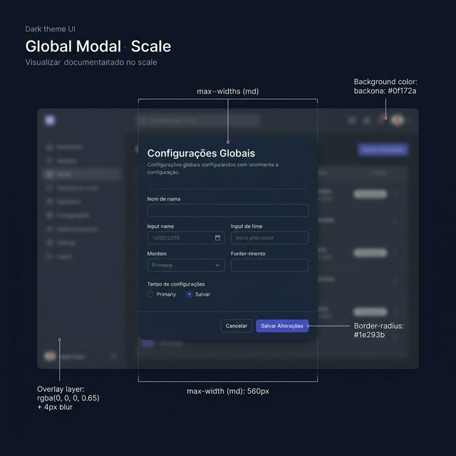
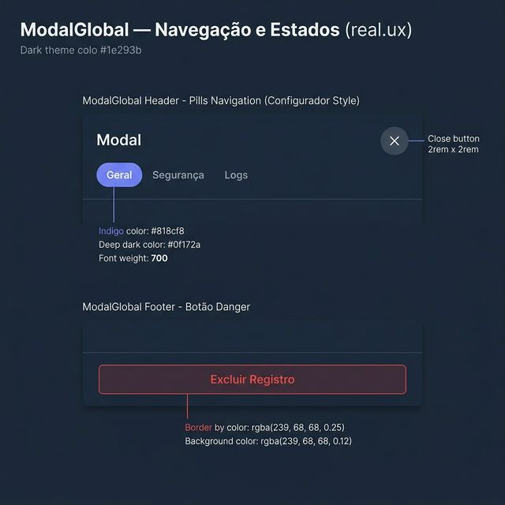
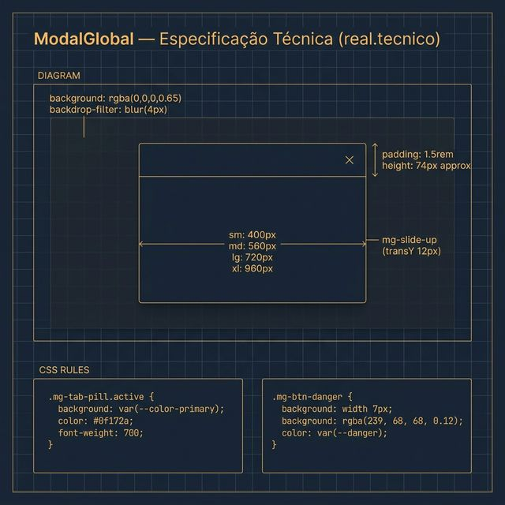

# Documentação Visual — ModalGlobal

Referência visual baseada 100% no código `modal-overlay.tsx` + `modal.css`.

---

## 1. Estrutura e Escalas (Contexto)

Visualização do componente aberto sobre a interface.
- **Camada de Fundo**: Overlay com `rgba(0, 0, 0, 0.65)` e **4px** de desfoque (`backdrop-filter`).
- **Escalabilidade**: Suporte a tamanhos fixos: `sm: 400px`, `md: 560px` (padrão), `lg: 720px`, `xl: 960px`.

---

## 2. Navegação e Estados (UX)

Comportamento real das interações no modal:
- **Abas Pill**: Estilo arredondado exclusivo para fluxos densos. Aba ativa em Indigo com texto escuro `#0f172a` e peso 700.
- **Ações Danger**: Botões de exclusão seguem o padrão de borda e fundo em vermelho translúcido (`rgba(239, 68, 68, 0.12)`).
- **Animação**: Slide suave de baixo para cima (`mg-slide-up`) com **12px** de deslocamento inicial.

---

## 3. Especificação Técnica

Blueprint das medidas do sistema:
- **Radius**: Bordas arredondadas padrão `var(--radius-lg)` no dialog.
- **Header**: Padding de `1.5rem` com título `text-h3`.
- **Close Button**: Área de toque de **32px** (2rem) com radius `var(--radius-md)`.

