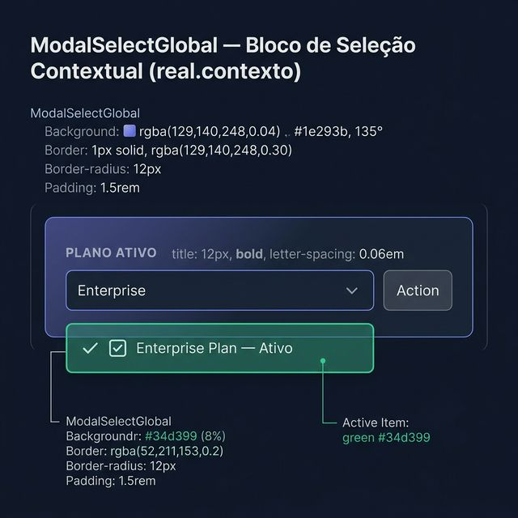
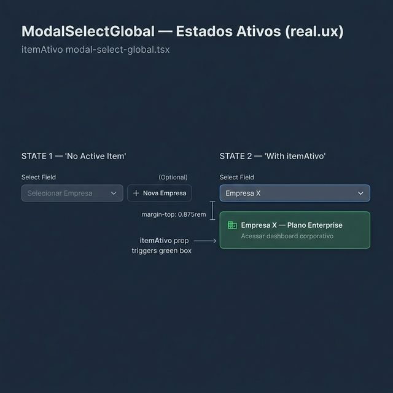
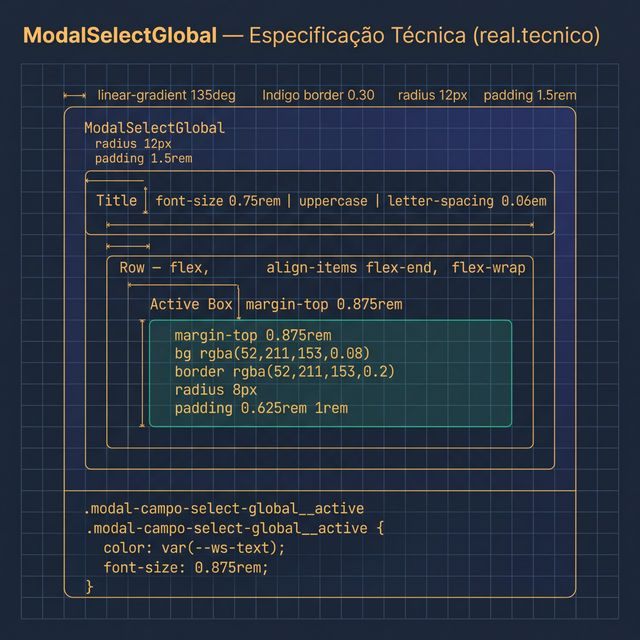

# Documentação Visual — ModalSelectGlobal

Referência visual baseada 100% no código `modal-select-global.tsx` + `modal-select-global.css`.

---

## 1. Bloco de Seleção Contextual (Contexto)

Componente de UI usado **dentro** de modais de formulário para seleção de entidades relacionadas.
- **Container**: Gradiente Indigo sutil + borda de **30% opacidade**, `border-radius: 12px`.
- **Título**: Uppercase, `0.06em` spacing, 12px.

---

## 2. Estados do Item Ativo (UX)

Indicação visual de seleção confirmada:
- **Sem `itemAtivo`**: Apenas o select e botão de ação.
- **Com `itemAtivo`**: Caixa verde (`rgba(52, 211, 153, 0.08)`, borda 0.2) exibindo o item selecionado.

---

## 3. Especificação Técnica

Blueprint das medidas CSS:
- **Active Box**: `margin-top: 0.875rem`, `padding: 0.625rem 1rem`, `border-radius: 8px`.
- **Subtexto**: `font-size: 0.8125rem`, cor muted.

