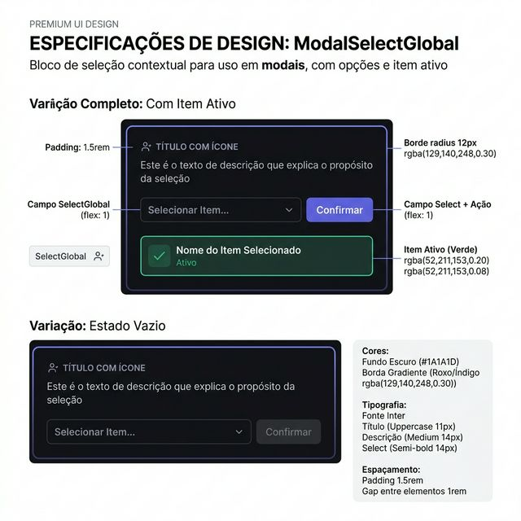
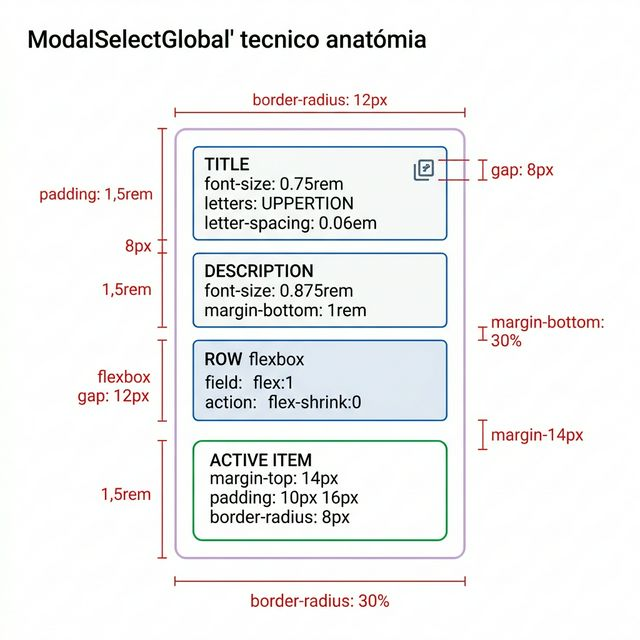
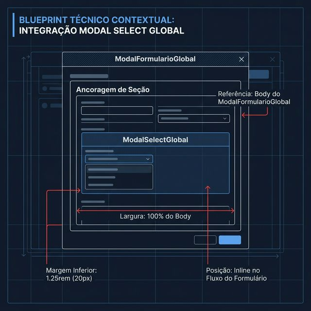

# Documentação Visual — ModalSelectGlobal

Bloco de seleção contextual para uso dentro de modais de formulário do Gravity Design System.

## 1. Folha de Especificação Técnica de UX
Layout do bloco: título com ícone, descrição, campo select com ação lateral e indicador de item ativo (verde).



---

## 2. Especificação de Composição
Anatomia técnica do card: border-radius 12px, borda roxa, padding 1.5rem e stack vertical interno.



---

## 3. Composição de Ancoragem Global
Posicionamento inline dentro do body do ModalFormularioGlobal.



| Regra de Ancoragem | Referência Técnica |
| :--- | :--- |
| **Referência Vertical (Y)** | Fluxo inline do body do modal pai. |
| **Referência Horizontal (X)** | Largura **100%** do container do modal. |
| **Margem Inferior** | **1.25rem** (20px) entre blocos consecutivos. |
| **Contexto** | Sempre dentro de um `ModalFormularioGlobal` ou `ModalFormularioAbasGlobal`. |

---

## Anatomia do Componente

| Área | Medida / Valor |
| :--- | :--- |
| **Card Wrapper** | `border-radius: 12px`, `padding: 1.5rem`, borda `rgba(129,140,248,0.30)` |
| **Background** | Gradiente sutil `rgba(129,140,248,0.04)` para `var(--ws-surface)` |
| **Título** | `font-size: 0.75rem`, uppercase, `letter-spacing: 0.06em`, `gap: 8px` com ícone |
| **Descrição** | `font-size: 0.875rem`, `line-height: 1.6`, cor `var(--ws-muted)` |
| **Row (Select + Ação)** | Flexbox, `gap: 12px`, campo `flex: 1`, ação `flex-shrink: 0` |
| **Item Ativo** | `padding: 10px 16px`, `border-radius: 8px`, fundo verde `rgba(52,211,153,0.08)`, borda `rgba(52,211,153,0.2)` |

---

## Exemplo de Uso (Código)

```tsx
import { ModalSelectGlobal } from '@nucleo/modal-campo-select-global'
import { SelectGlobal } from '@nucleo/campo-select-global'
import { Buildings, Plus } from '@phosphor-icons/react'

<ModalSelectGlobal
  icone={<Buildings size={14} />}
  titulo="ORGANIZAÇÃO VINCULADA"
  descricao="Selecione a organização que será proprietária deste espaço."
  labelContext="Organização"
  selectElement={
    <SelectGlobal
      valor={orgSelecionada}
      opcoes={organizacoes}
      aoMudarValor={setOrgSelecionada}
      placeholder="Selecione..."
    />
  }
  botoesAcao={<BotaoGlobal icone={<Plus />}>Nova</BotaoGlobal>}
  itemAtivo={orgAtiva ? {
    icone: <Buildings size={16} />,
    texto: orgAtiva.nome,
    subtexto: orgAtiva.cnpj
  } : null}
/>
```
